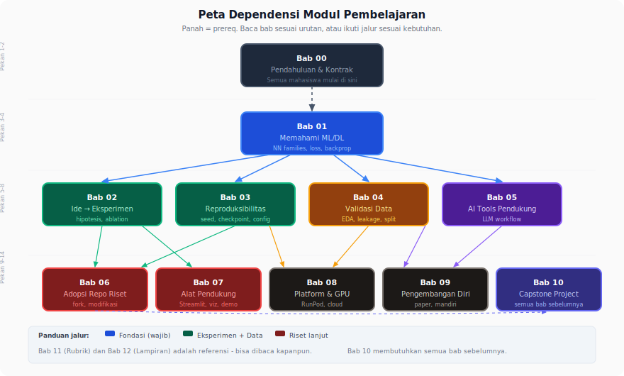
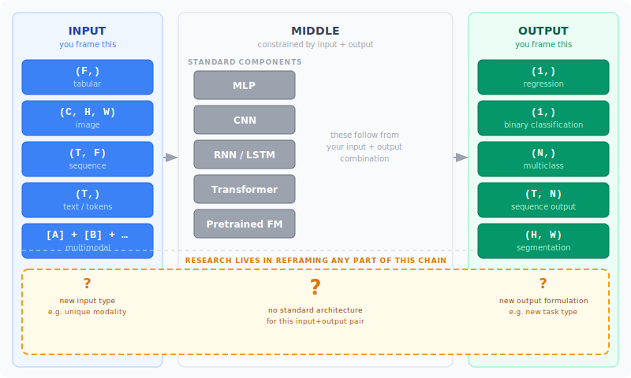

📂 Navigasi Modul (klik untuk buka)

| #    | Modul                                                                                  | Minggu |
| ---- | -------------------------------------------------------------------------------------- | ------ |
| ▶ 00 | Pendahuluan                                                                            | 1      |
| 00a  | [Prasyarat Modul](00a_Prasyarat.md)                                                    | –      |
| 01   | [W1 - Tabular & Output Heads](01_W1_Tabular_Output_Heads.md)                           | 1      |
| 02   | [W2 - Images, CNN & Smoke Test](02_W2_Images_CNN_Smoke_Test.md)                        | 2      |
| 03   | [W3 - Loss, Optimizer & Evaluasi](03_W3_Loss_Optimizer_Evaluasi.md)                    | 3      |
| 04   | [W4 - Reproducibility & Experiment Matrix](04_W4_Reproducibility_Experiment_Matrix.md) | 4      |
| 05   | [W5 - Sequences: RNN & LSTM](05_W5_Sequences_RNN_LSTM.md)                              | 5      |
| 06   | [W6 - Representations & Temporal Leakage](06_W6_Representations_Temporal_Leakage.md)   | 6      |
| 07   | [W7 - Text, Transformers & Repo Adoption](07_W7_Text_Transformers_Repo_Adoption.md)    | 7      |
| 08   | [W8 - Foundation Models](08_W8_Foundation_Models.md)                                   | 8      |
| 09   | [W9 - Multimodal Reasoning](09_W9_Multimodal_Reasoning.md)                             | 9      |
| 10   | [W10 - Paper Reading & Implementation](10_W10_Paper_Reading.md)                        | 10     |
| 11   | [W11 - Research Framing](11_W11_Research_Framing.md)                                   | 11     |
| 12   | [Capstone - Proyek Riset](12_Capstone.md)                                              | 12-15  |
| 13   | [Rubrik Penilaian](13_Rubrik_Penilaian.md)                                             | –      |
| 14   | [Lampiran](14_Lampiran.md)                                                             | –      |
| 15   | [Panduan Instruktur](15_Panduan_Instruktur.md)                                         | –      |

---

# 00 · Pendahuluan

> *Riset yang baik berawal dari keberanian bertanya. Modul ini mengajak Anda melihat setiap instruksi bukan sebagai jawaban akhir, melainkan sebagai pintu masuk untuk menyelidiki lebih jauh.*

> [!TIP]
> Sebelum membuka W1, luangkan 20 menit untuk membaca [Prasyarat Modul](00a_Prasyarat.md): notasi shape tensor, konvensi huruf, kalkulus mini, dan primer PyTorch. Jika sudah terbiasa dengan PyTorch dan NumPy, cukup baca bagian glosarium singkat di sana lalu lanjut ke §1 di bawah.

---

## 1. Satu Email dari Dosen Pembimbing

Bayangkan Anda baru bergabung di laboratorium riset sebagai asisten. Pada hari ketiga, Anda menerima pesan singkat:

> "Tolong uji focal loss dan freeze blok awal pada backbone. Bandingkan dengan baseline yang adil, lalu kirim ringkasan hasil hari Kamis."

Email dua kalimat ini terdengar sederhana, tetapi setiap fragmen menyimpan keputusan yang tidak disebut: focal loss versi apa, nilai `gamma` berapa, blok awal mana yang di-freeze, baseline seperti apa yang adil, metrik mana yang menentukan, bagaimana memastikan dua run tidak berbeda hanya karena seed acak, dan kapan angka layak dilaporkan.

Semua keputusan itu ada di tangan Anda. Modul ini dirancang untuk melatih Anda membuat keputusan-keputusan tersebut secara sistematis, sehingga email semacam itu menjadi titik awal eksperimen yang terstruktur, bukan sumber kepanikan.

---

## 2. Target Hasil

Di akhir bootcamp ini, Anda diharapkan mampu menguasai dua pilar utama riset: mengeksekusi eksperimen dengan presisi tinggi sesuai standar industri, sekaligus merumuskan pertanyaan riset dari sebuah permasalahan umum.

### 1. Ketajaman Teknis & Rigor Eksperimen

Anda akan mampu memetakan tipe data ke arsitektur model yang tepat, merancang eksperimen terkontrol yang *reproducible*, memilih *loss function* berdasarkan karakteristik output, hingga melakukan *fine-tuning* serta adaptasi *pretrained model* maupun repositori eksternal.

### 2. Diagnosis & Kemandirian

Anda dibekali kemampuan untuk membaca sinyal selama proses *training*, melakukan audit data guna mendeteksi *leakage*, serta mampu mengadopsi dan mempelajari repositori baru secara mandiri.

### 3. Perancangan Riset (*Research Framing*)

Anda akan mahir menguraikan masalah kompleks menjadi beberapa kandidat hipotesis penelitian, melakukan validasi temporal maupun kausal, menyisir literatur untuk menemukan celah (*gap*) riset yang nyata, hingga merumuskan argumen yang kuat untuk mempertahankan ide tersebut dalam diskusi ilmiah.

**Mengapa ini penting?** Keterampilan ini jarang diajarkan secara eksplisit. Dengan menguasai fondasi ini sekarang, Anda akan lebih maju 3-5 tahun dibandingkan tanpa arahan terstruktur.

---

## 3. Cara Membaca Modul Ini

Modul ini adalah **bootcamp 11 minggu + capstone 4 minggu** yang disusun sebagai urutan linier W1 → W11. Gambaran besar hubungan antar bab:

**Big Map** adalah kerangka berpikir yang mengalir dari W1 sampai W11: setiap minggu menjawab pertanyaan yang sama - *tensor shape apa yang masuk, shape apa yang keluar, dan keluarga model apa yang cocok?* Peta ini bertambah lengkap setiap minggu sehingga deep learning terlihat sebagai satu lanskap, bukan banyak teknik terputus. Tabel rangkuman Big Map ada di [Lampiran C.17](14_Lampiran.md#c17-big-map).

Dua alur lain berjalan senyap di balik setiap minggu: **Alur Praktik Riset** memperkenalkan satu kebiasaan riset baru per minggu yang tetap dipakai setelahnya (tabel kebiasaan per minggu di [Lampiran C.18](14_Lampiran.md#c18-kebiasaan-riset)); **Representation Choice** mencatat pilihan representasi yang berubah dari minggu ke minggu dan sering menentukan kualitas eksperimen.

Lab inti memakai basis kode dan dataset yang sama lalu bertambah kompleks dari W1 sampai W10. Lab breadth (MLP numpy, Transformer-mini, Autoencoder) memenuhi Kontrak Belajar poin breadth. Setiap minggu bergantung pada kebiasaan minggu sebelumnya - hindari melompat. Detail lab, tabel empat jalur Komponen Mandiri, dan peta prasyarat antar minggu ada di [Lampiran C.20-C.21](14_Lampiran.md#c20-indeks-lab).

---

## 4. Sembilan Kompetensi Inti

Email pembuka tadi tidak berdiri sendiri; ia bergantung pada sembilan kompetensi yang menjadi tulang punggung modul. Sembilan kompetensi itu mengelompok dalam tiga gelombang yang saling menumpu.

**Gelombang pertama (W1-W4)** melatih cara memahami sistem ML/DL dalam praktiknya, menerjemahkan instruksi terbuka menjadi eksperimen konkret, dan menjalankan eksperimen yang bisa direproduksi orang lain. Tanpa fondasi ini, kompetensi berikutnya kehilangan pijakan - sulit mengaudit data jika belum bisa membaca kurva loss, sulit menilai foundation model jika belum pernah merancang ablation yang adil.

**Gelombang kedua (W6-W8)** menambahkan kewaspadaan terhadap data dan kemampuan membaca pekerjaan orang lain: validasi data dan deteksi leakage, pemakaian LLM dan coding copilot dengan tanggung jawab, adopsi repositori riset yang belum dikenal, serta literasi foundation model beserta strategi adaptasinya (frozen, LoRA, full fine-tuning).

**Gelombang ketiga (W9-W11)** mengarah ke kemandirian riset: penalaran multimodal (strategi fusion, ablation per modalitas, fallback saat modalitas hilang), pembacaan paper terarah, dan perancangan eksperimen lanjutan beserta pre-registration-nya. Bahkan dosen pun mengasah kompetensi terakhir ini sepanjang karier.

> [!TIP]
> Daftar lengkap sembilan kompetensi dengan deskripsi per kompetensi tersedia di [Lampiran C.16](14_Lampiran.md#c16-sembilan-kompetensi). Tidak perlu khawatir kalau kompetensi gelombang kedua dan ketiga belum terbayang sekarang - modul disusun bertahap, setiap minggu bertumpu pada kebiasaan minggu sebelumnya.

---

## 5. Empat Sikap Riset

Kompetensi teknis cepat tumpul kalau tidak dibiasakan bersama sikap riset yang tepat. Empat sikap berikut ditanamkan sepanjang modul lewat pilihan contoh dan pertanyaan refleksi, sering kali tanpa disebut secara eksplisit.

**Curiosity** - rasa ingin tahu yang tak kenal lelah. Ketika angka akurasi meloncat dari 78% ke 80% setelah Anda mengganti loss, sikap ini yang bertanya: "apakah kenaikan ini konsisten jika aku jalankan tiga kali dengan seed berbeda, atau sekadar kebetulan?" Curiosity menuntun Anda ke eksperimen tambahan sebelum menulis laporan.

**Rigor** - disiplin dalam prosedur. Bukan sekadar "rapi", tetapi taat pada aturan seperti: satu variabel berubah pada satu waktu, seluruh konfigurasi disimpan bersama checkpoint, setiap angka di laporan dapat dilacak kembali ke run mana. Rigor melelahkan di awal dan menyelamatkan Anda berjam-jam di akhir.

**Skepticism** - kesediaan untuk tidak mempercayai angka sendiri. Akurasi 99% pada hari pertama bukan kabar baik, itu lampu merah. Hampir selalu ada *leakage*, label yang bocor, atau data test yang tercampur dengan training. Skeptisisme memaksa Anda memeriksa sebelum berbangga.

**Ownership** - rasa memiliki yang melampaui alat. LLM mungkin menulis separuh kode Anda; repositori orang lain mungkin menyediakan arsitektur; RunPod mungkin menjalankan training. Tetapi saat dosen bertanya mengapa pilihan tertentu diambil, jawabannya tetap tanggung jawab Anda. Ownership berarti Anda bisa menjelaskan setiap keputusan yang nama Anda tercantum padanya.

Keempat sikap tidak diajarkan sebagai doktrin. Sikap-sikap itu muncul dalam pitfall yang dibahas, dalam checklist yang diulang, dan dalam pertanyaan refleksi di akhir tiap bab.

---

## 6. Kontrak Belajar

Modul ini paling efektif jika tiga komitmen berikut dipegang sepanjang bootcamp.

**Komitmen waktu dan ritme.** Lab dikerjakan pada minggu yang sama dengan bacaannya - menundanya berarti menunda pemahaman, dan minggu berikutnya akan terasa seperti deretan istilah yang tidak tersambung. Mulai W4, satu Komponen Mandiri mingguan dipilih dari empat jalur (Implementasi, Analisis, Desain, Arsitektur Baru), dicatat di `notebooks/portofolio_mandiri.ipynb`, lalu dipresentasikan 10 menit di awal sesi berikutnya. Selesaikan tugas mingguan sebelum sesi berikutnya.

**Akuntabilitas pemikiran.** Catatan eksperimen ditulis sendiri, bukan disalin dari output - menjawab apa yang dijalankan, apa yang terjadi, apa arti hasilnya, dan langkah berikutnya. LLM, coding copilot, dan pencarian web boleh dipakai dengan tanggung jawab: kode yang tidak Anda mengerti dibaca baris demi baris sebelum di-commit. Pertanyaan yang dirumuskan dengan cermat adalah kompetensi yang dinilai di rubrik; jika sesuatu terasa kabur setelah dua bacaan, tulis pertanyaan seringkas mungkin dan bawa ke sesi. Eksperimen yang gagal tetapi didokumentasikan dengan baik dinilai setara dengan yang berhasil - yang dievaluasi adalah kualitas pemikiran, bukan apakah hipotesis terkonfirmasi.

**Breadth dan urutan belajar.** Sebelum Capstone, tunjukkan forward pass berjalan dari empat dari lima keluarga arsitektur (MLP, CNN, RNN/LSTM, Transformer, Autoencoder) - ini memastikan Anda lulus sebagai asisten yang bisa mengenali dan memodifikasi keluarga NN yang muncul di paper lintas domain, bukan hanya spesialis CIFAR-10. Modul memperkenalkan ide melalui run konkret terlebih dahulu, baru topangan teori; derivasi berat seperti backprop manual ada di Lampiran A untuk dibaca setelah Anda punya hasil konkret untuk diinterpretasi.

> [!TIP]
> Delapan klausul Kontrak Belajar dalam bentuk checklist (cocok untuk dicetak dan ditempel) tersedia di [Lampiran C.19](14_Lampiran.md#c19-kontrak-belajar).

> [!WARNING]
> Empat kebiasaan yang paling sering menghambat kemajuan:
> - **Lab hanya sampai kode jalan** - selesai bukan saat tidak error, tetapi saat hasilnya bisa dijelaskan. Jika hasil mengejutkan, itu sinyal untuk berhenti dan menyelidiki.
> - **Kode LLM tanpa dibaca** - ketika kodenya benar, Anda melewatkan pemahaman; ketika salah nanti, Anda tidak tahu cara mencarinya. Protokol verifikasi LLM dibahas di W7.
> - **Catatan eksperimen ditunda** - memori tidak bisa merekam dua puluh run ablation yang serupa. Jika ditunda, Anda terpaksa menjalankan ulang eksperimen hanya untuk mengingat hasilnya.
> - **Data langsung di-train tanpa diperiksa** - W6 menunjukkan contoh konkret ketika kelalaian seperti ini memaksa pengulangan berbulan-bulan.

---

## 7. Refleksi

Sebelum melangkah ke W1, luangkan waktu sepuluh menit untuk menulis jawaban singkat atas tiga pertanyaan berikut. Simpan di catatan pribadi Anda; kita akan merujuknya kembali di Minggu 14.

1. Dari sembilan kompetensi, mana yang Anda duga paling belum dikenal? Apa yang Anda harapkan berubah pada akhir bootcamp?
2. Dari empat sikap riset, mana yang sudah Anda rasakan secara alami, dan mana yang terasa paling sulit untuk Anda lakukan secara konsisten?
3. Saat Anda menerima email PI seperti di pembuka bab ini *hari ini*, apa tiga langkah pertama yang akan Anda ambil? Bandingkan dengan jawaban Anda nanti di minggu 14.

---

## 8. Bacaan Lanjutan

- **Andrej Karpathy - *A Recipe for Training Neural Networks*** (blog, 2019). Esai pendek tentang bagaimana seorang peneliti berpengalaman memulai proyek. Relevan sebelum W2 karena menanamkan ritme "verify everything before you scale".
- **Goodfellow, Bengio, Courville - *Deep Learning*** (Bab 1 & 5). Fondasi konseptual yang sengaja tidak diulang di modul ini; baca bab 1 untuk konteks sejarah, bab 5 untuk kerangka pikir machine learning.
- **The Turing Way - *A Handbook for Reproducible Research*** (bagian *Reproducibility*). Dibaca ringan minggu 1-2; penuh analogi yang akan kembali di W4.

---

## Lanjut ke W1

Setelah menyelesaikan refleksi, buka [W1 - Tabular & Output Heads](01_W1_Tabular_Output_Heads.md). Bab tersebut memperkenalkan MLP sebagai pengubah bentuk tensor, output head + loss matching, dan ritme observasi sebelum interpretasi - bukan sebagai daftar definisi, melainkan sebagai keputusan desain yang dimulai dari pertanyaan: data seperti apa yang sedang kita olah, dan struktur apa yang paling cocok untuk data itu?
