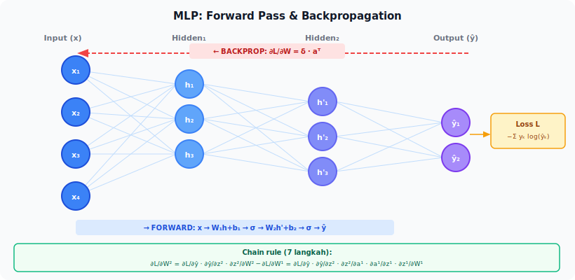

<details>
<summary>📂 Navigasi Modul (klik untuk buka)</summary>

| # | Modul | Minggu |
|---|-------|--------|
| 00 | [Pendahuluan](00_Pendahuluan.md) | 1 |
| ▶ 01 | W1 - Tabular & Output Heads | 1 |
| 02 | [W2 - Images, CNN & Smoke Test](02_W2_Images_CNN_Smoke_Test.md) | 2 |
| 03 | [W3 - Loss, Optimizer & Evaluasi](03_W3_Loss_Optimizer_Evaluasi.md) | 3 |
| 04 | [W4 - Reproducibility & Experiment Matrix](04_W4_Reproducibility_Experiment_Matrix.md) | 4 |
| 05 | [W5 - Sequences: RNN & LSTM](05_W5_Sequences_RNN_LSTM.md) | 5 |
| 06 | [W6 - Representations & Temporal Leakage](06_W6_Representations_Temporal_Leakage.md) | 6 |
| 07 | [W7 - Text, Transformers & Repo Adoption](07_W7_Text_Transformers_Repo_Adoption.md) | 7 |
| 08 | [W8 - Foundation Models](08_W8_Foundation_Models.md) | 8 |
| 09 | [W9 - Multimodal Reasoning](09_W9_Multimodal_Reasoning.md) | 9 |
| 10 | [W10 - Paper Reading & Implementation](10_W10_Paper_Reading.md) | 10 |
| 11 | [W11 - Research Framing](11_W11_Research_Framing.md) | 11 |
| 12 | [Capstone - Proyek Riset](12_Capstone.md) | 12-15 |
| 13 | [Rubrik Penilaian](13_Rubrik_Penilaian.md) | – |
| 14 | [Lampiran](14_Lampiran.md) | – |
| 15 | [Panduan Instruktur](15_Panduan_Instruktur.md) | – |

</details>

---

# 01 · W1 - Tabular Foundations dan Output Heads

> *Sebelum membahas arsitektur yang rumit, kita mulai dari pertanyaan yang paling sederhana: shape apa yang masuk, dan shape apa yang harus keluar?*

**Baris peta besar:** `(F,) -> (1,)`, `(1,)`, `(N,)`
**Kebiasaan riset:** Observasi sebelum kesimpulan
**Dataset:** Tabular bersama sintetis yang mendukung regresi, klasifikasi biner, dan multiclass dari input yang sama
**Lab utama:** Lab 0 ([lab_w1_tabular_heads.ipynb](https://colab.research.google.com/github/muhammad-zainal-muttaqin/ModulePembelajaran/blob/main/ModulePembelajaran/template_repo/notebooks/lab_w1_tabular_heads.ipynb))

---

## 0. Peta Bab

W1 adalah pintu masuk bootcamp. Bab ini memperkenalkan tiga ide fondasi: **MLP sebagai pengubah bentuk tensor**, **kecocokan output head dan loss**, dan **observasi sebelum kesimpulan**. Anda mengerjakan tiga tugas (regresi, klasifikasi biner, multiclass) pada satu dataset tabular yang sama, sehingga perbedaan antar tugas terlihat **bukan dari datanya**, melainkan dari pilihan output head dan loss. Pada akhir minggu, Anda punya satu training end-to-end yang berhasil dan kebiasaan menuliskan apa yang Anda *amati* sebelum apa yang Anda *simpulkan*.

---

## 1. Mengapa Tabular Lebih Dulu?

Tabular adalah konteks paling langsung untuk memperkenalkan deep learning. Tidak ada augmentasi gambar, tidak ada tokenisasi teks, tidak ada timestep yang bergerak. Hanya satu vektor fitur masuk, satu prediksi keluar. Inilah kondisi paling minim distraksi untuk melatih satu refleks yang akan dipakai sepanjang bootcamp:

> Saat Anda melihat tugas baru, identifikasi **shape input** dan **shape output**, lalu pilih **keluarga model** yang secara alami memetakan keduanya.

Empat alasan tabular dipakai sebagai pintu masuk:

1. **Pipeline minimum.** Tidak perlu transformasi gambar; satu DataFrame sudah cukup.
2. **Tiga perumusan tugas pada satu data.** Anda bisa mengamati perbedaan output head tanpa harus mengganti dataset.
3. **Ketidakcocokan loss dan head terlihat jelas.** Salah satu cara paling cepat memahami kenapa CrossEntropy butuh logits dan MSE butuh output kontinu adalah dengan sengaja salah-pasangkan keduanya, lalu mengamati training gagal total.
4. **Tidak ada distraksi domain.** Anda fokus pada mekanik training, bukan pada pertanyaan "kenapa augmentasi flip horizontal masuk akal untuk CIFAR".

---

## 2. Konsep Inti

### 2.1 MLP sebagai Pengubah Bentuk Tensor

Multilayer Perceptron (MLP) sederhana mengambil vektor `(F,)` dan menghasilkan vektor `(D_out,)`. Setiap layer `Linear(in, out)` menjalankan transformasi affine `y = W x + b`, lalu diikuti aktivasi non-linear seperti ReLU.



```text
input (F,) -> Linear(F, 64) -> ReLU -> Linear(64, 32) -> ReLU -> Linear(32, D_out) -> output (D_out,)
```

Perhatikan bahwa `D_out` ditentukan oleh **tugas**, bukan oleh data:

- regression scalar: `D_out = 1`
- binary classification: `D_out = 1` (logit) atau `D_out = 2` (logits dua kelas)
- multiclass dengan N kelas: `D_out = N`

Inilah maksud "MLP sebagai pengubah bentuk tensor": tubuh model tetap sama, kepala (head) berubah sesuai tugas.

#### 2.1.1 Linear Layer: Mekanik dan Gambaran

Bayangkan MLP sebagai pabrik kecil. Input mentah masuk lewat pintu depan; setiap layer adalah meja kerja yang mengubah bentuk barang sebelum dilewatkan ke meja berikutnya. Output keluar dari ujung pabrik.

Apa sebenarnya yang dilakukan satu meja kerja `Linear(in=3, out=2)`? Secara matematis, ia mengambil vektor input 3 elemen dan mengeluarkan vektor 2 elemen lewat perkalian matriks dan penambahan bias:

```
y = W x + b

W berukuran (2, 3), b berukuran (2,)
```

Contoh konkret dengan angka kecil. Anggap `W = [[1, 0, -1], [2, 1, 0]]` dan `b = [0.5, -1.0]`. Untuk input `x = [3, 4, 2]`:

```
y[0] = 1*3 + 0*4 + (-1)*2 + 0.5  = 1.5
y[1] = 2*3 + 1*4 +   0*2 + (-1)  = 9.0
```

Jadi `Linear(3, 2)` dengan parameter di atas memetakan `[3, 4, 2]` ke `[1.5, 9.0]`. Dalam praktik, `W` dan `b` dipelajari otomatis lewat training; nilainya bukan ditebak manual.

**Kenapa butuh ReLU (atau aktivasi non-linear lain)?** Stack dua `Linear` tanpa aktivasi sama dengan satu `Linear`: `W₂(W₁ x + b₁) + b₂ = (W₂ W₁) x + (W₂ b₁ + b₂)`. Walaupun lebih dalam secara struktur, kapasitas representasi tidak naik. Aktivasi non-linear menyisipkan "tekuk" di antara layer, sehingga komposisi dua layer bisa membentuk decision boundary lengkung.

`ReLU(x) = max(0, x)` adalah aktivasi paling sederhana: lewatkan input positif apa adanya, ubah input negatif menjadi nol. Visualnya menyerupai patahan di titik nol:

```
ReLU(x)
   |
 3 |          /
   |         /
 2 |        /
   |       /
 1 |      /
   |     /
 0 |____/_______________ x
  -3  -2  -1  0  1  2  3
```

Kombinasi `Linear → ReLU → Linear → ReLU → ...` adalah resep MLP standar. Kedalaman menambah kapasitas representasi, ReLU menjaga aliran gradient tetap stabil lewat banyak layer.

#### 2.1.2 Body dan Head: Struktur Dua Bagian

Konsep "body" dan "head" memudahkan refleks ketika menghadapi tugas baru. **Body** adalah bagian model yang sama untuk semua tugas pada data ini: ekstraksi fitur generik dari input. **Head** adalah lapisan akhir yang spesifik untuk tugas: berapa output, dengan aktivasi seperti apa.

```
                  Body (shared)                      Head (per-task)
input  ──►  Linear(F, 64) ──► ReLU ──► Linear(64, 32) ──► ReLU ──► Linear(32, D_out) ──►  output
   (F,)                                                                    │
                                                       D_out berubah sesuai tugas:
                                                          regression  → 1
                                                          binary      → 1 (logit) atau 2 (logits)
                                                          multiclass(N) → N
```

Pada model pretrained (W7-W8), prinsip ini lebih jelas: backbone CNN/Transformer pretrained menjadi body yang di-freeze, dan hanya head kecil yang dilatih untuk tugas baru. Memisahkan body dan head sejak W1 memudahkan transisi ke pola adaptasi tersebut.

### 2.2 Output Head + Loss Matching

Setiap tugas (regression, binary, multiclass) butuh kombinasi head dan loss yang spesifik. Sebelum melihat tabel ringkasan di akhir section, kita pahami tiga pasangan utama lewat satu contoh angka kecil masing-masing.

#### 2.2.1 Regression: MSE dan Jarak Kuadrat

Tugas regression: prediksi angka kontinu (harga rumah, suhu besok, kadar glukosa). Output head: `Linear(D, 1)` tanpa aktivasi. Loss: **Mean Squared Error**:

```
MSE = (1/N) Σ (ŷ - y)²
```

Untuk satu sampel dengan prediksi `ŷ = 0.9` dan target `y = 1.0`, MSE per-sampel = `(0.9 - 1.0)² = 0.01`. Loss ini menghukum prediksi yang jauh secara kuadratis: prediksi yang meleset 0.5 menyumbang loss `0.25`, prediksi yang meleset 1.0 menyumbang loss `1.0` (4× lebih besar, bukan 2×). Sifat ini membuat MSE peka terhadap outlier; kalau dataset penuh outlier, **Mean Absolute Error** (`MAE = |ŷ - y|`) sering lebih stabil.

#### 2.2.2 Binary Classification: BCE dan Sigmoid

Tugas binary: prediksi ya/tidak, positif/negatif. Output head: `Linear(D, 1)` menghasilkan satu **logit** (angka real, bukan probabilitas). Loss: **Binary Cross-Entropy with Logits**:

```
BCE = -[y log(σ(z)) + (1 - y) log(1 - σ(z))]
σ(z) = 1 / (1 + e^(-z))            # sigmoid: peras logit ke (0, 1)
```

**Sigmoid** memetakan logit `z = 0` ke probabilitas 0.5, `z = 2` ke ~0.88, `z = -2` ke ~0.12. Kalau target `y = 1` dan model output logit `z = 2` (yakin benar), loss kecil ≈ 0.13. Kalau target `y = 1` tetapi model output `z = -2` (yakin salah), loss besar ≈ 2.13. Inilah yang dimaksud "log menghukum yang salah-confident": penalti naik tajam saat prediksi makin yakin di sisi yang salah.

PyTorch menyediakan `BCEWithLogitsLoss` yang menggabung sigmoid + log dalam satu langkah numerik stabil. Hindari `Sigmoid` lalu `BCELoss` terpisah; bisa underflow saat logit ekstrem.

#### 2.2.3 Multiclass: CrossEntropy dan Softmax

Tugas multiclass dengan N kelas: prediksi salah satu dari N kategori (misal: anjing/kucing/kelinci, N=3). Output head: `Linear(D, N)` menghasilkan **vektor logit** panjang N. Loss: **Cross-Entropy**:

```
CE = -log(softmax(z)[y])
softmax(z)[i] = e^(z_i) / Σ_j e^(z_j)
```

**Softmax** memetakan vektor logit ke distribusi probabilitas (jumlahnya 1). Misal logit `z = [2.0, 1.0, 0.5]`. Softmax-nya kira-kira `[0.62, 0.23, 0.15]`. Kalau target benar adalah kelas 0, loss = `-log(0.62) ≈ 0.48`. Kalau target benar adalah kelas 2, loss = `-log(0.15) ≈ 1.90`.

`CrossEntropyLoss` di PyTorch menggabung `LogSoftmax + NLLLoss` agar numerik stabil. Anda harus melempar **logit mentah**, bukan probabilitas. Kesalahan paling umum pemula: tambahkan `softmax` di akhir model lalu kirim ke `CrossEntropyLoss`. Hasilnya: gradient mengecil tidak wajar dan training tidak konvergen.

> [!IMPORTANT]
> **Logit mentah** adalah output `Linear` terakhir tanpa aktivasi. `BCEWithLogitsLoss` dan `CrossEntropyLoss` keduanya mengharapkan logit mentah; sigmoid/softmax dilakukan di dalam loss function untuk stabilitas numerik.

#### 2.2.4 Tabel Ringkasan Pasangan Head-Loss

Setelah memahami ketiga pasangan di atas, gunakan tabel berikut sebagai rujukan cepat. Cetak dan tempel di samping monitor.

| Tugas | Output head | Aktivasi akhir | Loss yang cocok | Bentuk target |
|---|---|---|---|---|
| Regression scalar | `Linear(D, 1)` | tidak ada (linear) | MSE atau MAE | `float` |
| Binary classification | `Linear(D, 1)` | tidak ada (logit raw) | `BCEWithLogitsLoss` | `float` 0/1 |
| Binary classification (alt) | `Linear(D, 2)` | tidak ada (logits) | `CrossEntropyLoss` | `int64` 0/1 |
| Multiclass (N kelas) | `Linear(D, N)` | tidak ada (logits raw) | `CrossEntropyLoss` | `int64` 0..N-1 |
| Multilabel | `Linear(D, N)` | tidak ada (logits raw) | `BCEWithLogitsLoss` | `float` vektor 0/1 |

### 2.3 Backpropagation: Gambaran Tanpa Derivasi

MLP belajar lewat **backpropagation**: setelah loss dihitung di output, gradient dari loss terhadap setiap parameter dirambatkan **mundur** melalui chain rule, lalu optimizer (mis. AdamW) memperbarui parameter ke arah penurunan loss.

Bayangkan jaringan sebagai rantai operasi: `x → Linear₁ → ReLU₁ → Linear₂ → ReLU₂ → Linear₃ → loss`. Saat `loss.backward()` dipanggil, PyTorch berjalan mundur lewat rantai ini, menghitung kontribusi setiap parameter terhadap loss melalui chain rule (rantai turunan; lihat §4 di [Prasyarat Modul](00a_Prasyarat.md)). Setiap layer memiliki turunan untuk operasinya sendiri; library autograd menggabungkannya menjadi gradient utuh untuk seluruh model. Setelah gradient siap, `optimizer.step()` menggeser parameter sedikit ke arah `-gradient` (penurunan loss).

Itu sudah cukup sebagai gambaran W1. Anda **tidak perlu** menurunkan chain rule manual minggu ini. Derivasi 7-langkah yang ketat (`MSE loss + sigmoid` pada dua-layer MLP) tersedia di [Lampiran A.1](14_Lampiran.md#a1-backpropagation-derivasi-manual) untuk dibaca setelah Anda sudah punya gambaran training dari beberapa run sukses. Lab 1c (MLP numpy from-scratch) juga tersedia sebagai breadth lab opsional kapan saja, dan menerapkan backprop secara konkret pada MNIST.

> [!NOTE]
> Modul lama menempatkan derivasi backprop di awal, sebelum lab pertama. Revisi ini menggesernya ke lampiran karena banyak trainee menerima materi yang terlalu padat dalam waktu singkat. Jika Anda sudah merasa nyaman dengan kalkulus chain rule, baca Lampiran A.1 paralel dengan W1; jika belum, biarkan dulu, dan kembali setelah W3 ketika Anda sudah punya beberapa loss curve untuk diinterpretasi.

### 2.4 Pipeline Praktis: Tensor, Batch, Dataloader, Split

Sebelum menjalankan training, Anda harus memahami ritme data: input per-sampel berbentuk tensor `(F,)` dikelompokkan menjadi batch `(B, F)` untuk efisiensi - loss dihitung sebagai rata-rata atas seluruh batch, bukan per sampel. Dataloader membungkus dataset, melakukan shuffling, dan menyediakan iterator yang menghasilkan batch. Data kemudian dibagi menjadi `train` (melatih parameter), `val` (*early stopping* dan tuning hyperparameter), dan `test` (hanya disentuh sekali di akhir untuk angka final).

Aturan paling penting: **statistik preprocessing (mean, std) dihitung dari train saja**, lalu diterapkan ke val dan test. Tidak boleh sebaliknya. Pelanggaran aturan ini disebut *preprocessing leakage* dan akan dibahas mendalam di W6.

### 2.5 Snippet PyTorch End-to-End

Sebelum membuka notebook lab dan menjumpai kode lengkap dengan utilitas dan logging, lihat dulu pola minimum training MLP di PyTorch dalam ~15 baris. Ini bukan kode siap-jalankan untuk Lab 0, melainkan ringkasan yang menggabungkan semua konsep §2.1-§2.4 dalam satu tempat.

```python
import torch
import torch.nn as nn

# Body + head MLP untuk multiclass 3 kelas (lihat §2.1.2)
model = nn.Sequential(
    nn.Linear(10, 64), nn.ReLU(),     # body layer 1: 10 fitur -> 64 hidden
    nn.Linear(64, 32), nn.ReLU(),     # body layer 2: 64 -> 32 hidden
    nn.Linear(32, 3),                 # head: 32 -> 3 logit
)

criterion = nn.CrossEntropyLoss()                   # logit mentah, target int (lihat §2.2.3)
optimizer = torch.optim.AdamW(model.parameters(), lr=3e-4)

for epoch in range(10):
    for x, y in train_loader:                       # x: (B, 10) float, y: (B,) int64
        logits = model(x)                           # forward: (B, 3)
        loss = criterion(logits, y)                 # skalar
        optimizer.zero_grad()                       # reset gradient lama
        loss.backward()                             # chain rule mundur (§2.3)
        optimizer.step()                            # geser parameter
```

Lima baris kunci yang perlu Anda kenali setiap kali melihat kode training PyTorch:

1. **`logits = model(x)`** - forward pass; shape input `(B, F)`, shape output sesuai tugas.
2. **`loss = criterion(logits, y)`** - hitung loss; perhatikan target shape harus cocok dengan loss yang dipakai (lihat tabel §2.2.4).
3. **`optimizer.zero_grad()`** - tanpa ini, gradient batch sebelumnya menumpuk dan training kacau.
4. **`loss.backward()`** - autograd jalan mundur, isi `.grad` di setiap parameter.
5. **`optimizer.step()`** - update parameter pakai gradient yang baru dihitung.

Lima baris di atas adalah pola yang berulang sepanjang modul, dari W1 (tabular) sampai W11 (capstone). Apa yang berubah hanyalah definisi `model`, pilihan `criterion`, dan bagaimana `train_loader` dibangun.

---

## 3. Worked Example: Tiga Tugas pada Satu Dataset

Lab 0 menyiapkan dataset tabular sintetis sederhana dengan 10 fitur. Dari fitur yang sama, kita membuat tiga target:

- `y_regression` = kombinasi linear dari fitur + noise (kontinu)
- `y_binary` = sign dari kombinasi linear (0/1)
- `y_multiclass` = bucketize ke 3 kuantil (kelas 0/1/2)

Dengan demikian, **input** identik, tetapi **output head** dan **loss** berubah. Anda menjalankan tiga konfigurasi:

```yaml
# configs/mlp_tabular.yaml - ubah field di bawah untuk mengganti tugas
data.task: regression   # atau binary, multiclass
loss.name: mse          # atau binary_cross_entropy, cross_entropy
model.num_classes: 1    # atau 2, 3
```

Catat untuk setiap run:

- train loss akhir
- val loss akhir
- satu metrik yang sesuai: MAE (regression), accuracy (binary), accuracy + macro-F1 (multiclass)
- pengamatan: apa yang Anda *lihat* di kurva, sebelum apa yang Anda *simpulkan*

---

## 4. Pitfalls dan Miskonsepsi

**Ketidakcocokan loss dan head bisa merusak training tanpa pesan jelas.** Jika Anda memberi target `int` ke MSE, atau target `float` ke CrossEntropy, pesan error PyTorch sering kabur. Ciri training rusak: loss konstan dari epoch pertama, atau berubah dengan cara yang tidak masuk akal. Sebelum mendebug arsitektur, periksa pasangan loss, head, dan target.

**Mengira "lebih dalam = lebih bagus".** MLP dengan 5 layer tersembunyi sering lebih buruk daripada 2 layer pada tabular kecil. Tabular bukan domain di mana kedalaman selalu menang. Mulai dari yang dangkal.

**Menyamakan accuracy dengan kualitas.** Pada multiclass dengan kelas tidak seimbang, accuracy bisa menyesatkan. W3 akan membahas confusion matrix dan macro-F1 secara serius. Untuk W1, sudah cukup mencatat accuracy + ukuran tiap kelas.

**Menulis "kesimpulan" sebelum "observasi".** Kebiasaan paling penting di W1: pisahkan apa yang Anda *amati* (angka, bentuk kurva) dari apa yang Anda *simpulkan* (interpretasi, hipotesis). Pemisahan ini akan menyelamatkan Anda dari overclaiming sepanjang semester.

---

## 5. Lab 0 - Tabular Output Heads

**File:** [lab_w1_tabular_heads.ipynb](https://colab.research.google.com/github/muhammad-zainal-muttaqin/ModulePembelajaran/blob/main/ModulePembelajaran/template_repo/notebooks/lab_w1_tabular_heads.ipynb)
**Estimasi waktu:** 3-4 jam.

**Langkah:**

1. **Smoke test.** Jalankan dengan `--dry-run` untuk memastikan pipeline hidup tanpa error.
2. **Jalankan regresi.** Set `task=regression`, `loss=mse`, `num_classes=1`. Latih 20 epoch. Catat MAE val.
3. **Jalankan klasifikasi biner.** Set `task=binary`, `loss=cross_entropy`, `num_classes=2`. Catat accuracy val.
4. **Jalankan klasifikasi multikelas.** Set `task=multiclass`, `loss=cross_entropy`, `num_classes=3`. Catat accuracy + macro-F1 val.
5. **Eksperimen mismatch secara sengaja.** Jalankan satu run dengan kombinasi salah (mis. binary task tapi loss=mse). Amati kegagalan. Tuliskan dalam 2 kalimat apa yang gagal.
6. **Tulisan observasi vs interpretasi.** Tulis 1 paragraf observasi murni (apa yang dilihat di angka), 1 paragraf interpretasi (apa yang menurut Anda terjadi).

**Luaran:**

- 3 konfigurasi run (regression, binary, multiclass) di `experiments/`
- 1 notebook lab0 dengan output sel terisi
- 1 tulisan `observasi_vs_interpretasi.md` (template di [Lampiran C.6](14_Lampiran.md#c6-template-entri-portofolio))
- Smoke test repositori berhasil

---

## 6. Refleksi

Tulis jawaban singkat (1-2 paragraf masing-masing) untuk tiga pertanyaan berikut. Simpan di `notebooks/portofolio_mandiri.ipynb` sebagai entri pra-W4 (tidak masuk hitungan portofolio resmi tapi melatih kebiasaan).

1. **Output head yang sama, loss berbeda.** Ada situasi di mana binary classification dijalankan dengan `Linear(D, 1) + BCEWithLogitsLoss` dan situasi lain dengan `Linear(D, 2) + CrossEntropyLoss`. Apa konsekuensi praktisnya? Mana yang Anda pilih untuk Lab 0, dan mengapa?
2. **Observasi vs interpretasi.** Sebutkan satu pengamatan dari Lab 0 yang tergoda Anda interpretasikan terlalu cepat. Apa pertanyaan tambahan yang seharusnya Anda ajukan sebelum menyimpulkan?
3. **Peta besar awal.** Tulis dua baris peta besar dalam catatan Anda: satu untuk regresi Lab 0 dan satu untuk multiclass Lab 0. Apa bentuk input, bentuk output, dan keluarga model? Tambahkan baris baru pada setiap minggu berikutnya.

---

## 7. Bacaan Lanjutan

- **PyTorch Documentation - *torch.nn.CrossEntropyLoss*** (halaman resmi). Baca subbagian "shape" dan "input is expected to contain raw, unnormalized scores". Internalisasi bahwa input harus logits.
- **Andrej Karpathy - *A Recipe for Training Neural Networks*** (blog, 2019). Bacaan singkat yang sudah disebut di Bab 00. Setelah Lab 0, kembali ke esai ini; banyak kalimatnya akan terasa berbeda setelah Anda punya satu run sukses.
- **Goodfellow, Bengio, Courville - *Deep Learning*** (Bab 6 §6.2: *Output Units*). Bagian pendek yang merangkum kenapa pasangan output head + loss yang dipelajari di W1 adalah pasangan kanonik.

---

## Lanjut ke W2

Setelah Lab 0 selesai, buka [W2 - Images, CNN & Smoke Test Ritual](02_W2_Images_CNN_Smoke_Test.md). Bab tersebut memperkenalkan tensor citra `(C, H, W)`, cara kerja CNN sebagai pendeteksi pola lokal, dan smoke test tiga level sebagai kebiasaan debugging utama.
