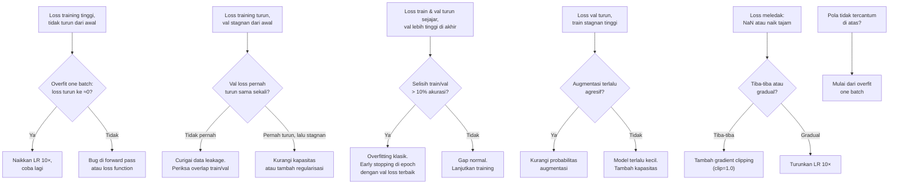
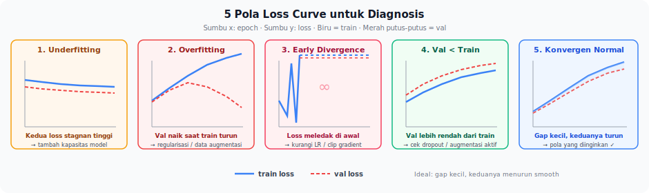

📂 Navigasi Modul (klik untuk buka)

| # | Modul | Minggu |
|---|-------|--------|
| 00 | [Pendahuluan](00_Pendahuluan.md) | 1 |
| 01a | [Fondasi Neural Network](01a_Fondasi_Neural_Network.md) | 2 |
| ▶ 01b | Loss, Optimizer & Evaluasi | 3 |
| 02 | [Ide ke Eksperimen](02_Ide_Ke_Eksperimen.md) | 4 |
| 03 | [Eksperimen Reproduksibel](03_Eksperimen_Reproduksibel.md) | 5–6 |
| 04 | [Validasi Data](04_Validasi_Data.md) | 7 |
| 05 | [AI Tools Sebagai Pendukung](05_AI_Tools_Sebagai_Pendukung.md) | 8 |
| 06 | [Adopsi Repo Riset](06_Adopsi_Repo_Riset.md) | 9 |
| 07 | [Alat Pendukung Ringan](07_Alat_Pendukung_Ringan.md) | 10 |
| 08 | [Platform & Tool Baru](08_Platform_Dan_Tool_Baru.md) | 11 |
| 09 | [Pengembangan Mandiri](09_Pengembangan_Mandiri.md) | 12 |
| 10 | [Capstone Project](10_Capstone_Project.md) | 13–14 |
| 11 | [Rubrik Penilaian](11_Rubrik_Penilaian.md) | – |
| 13 | [Panduan Dosen](13_Panduan_Dosen.md) | – |
| 12 | [Lampiran](12_Lampiran.md) | – |

---

# 01b · Loss, Optimizer, dan Evaluasi

> *Training selesai, kurva loss muncul di layar. Inilah momen di mana banyak pemula berhenti karena tidak tahu harus membaca apa. Loss curve bukan sekadar "turun = bagus, naik = buruk" - ia adalah sinyal diagnostik yang bisa memberi tahu apa yang salah bahkan sebelum Anda memeriksa kode.*

---

## 0. Peta Bab

Bab ini (Minggu 3) menuntaskan fondasi sistem ML/DL:

- **2.1** Loss sebagai pilihan - bukan bawaan default
- **2.2** Optimizer dan weight decay
- **2.3** Evaluasi: bukan satu angka
- **2.4** Tiga strategi representasi fitur
- **2.5** Diagnosis loss curve - capstone bab ini

**Recap Minggu 2:** Anda sudah memahami pasangan tensor input → output, backpropagation MLP, empat keluarga arsitektur, dan peran normalisasi/aktivasi. Bab ini membangun di atasnya.

---

## 1. Motivasi: Ketika Training Terasa Aneh

Anda menjalankan SimpleCNN 20 epoch. Loss training turun mulus. Lalu Anda bandingkan dengan loss validasi - ia stagnan sejak epoch 4. Apa yang salah? Atau: loss tiba-tiba melompat ke `NaN` di epoch ke-8. Atau: loss training tidak bergerak sama sekali dari epoch pertama.

Tiga skenario di atas bukan pengecualian - mereka adalah rutinitas riset sehari-hari. Bab ini memberi Anda bahasa untuk menamai masalah-masalah tersebut dan langkah sistematis untuk menanganinya.

---

## 2. Konsep Inti

### 2.1 Loss sebagai Pilihan

Loss menentukan *apa yang dianggap salah oleh model*. Mengganti loss berarti mengubah arah yang dianggap model sebagai "perbaikan".

**Untuk klasifikasi:**
- *Cross-entropy*: pilihan default. Mengukur jarak antara distribusi probabilitas prediksi dan label.
- *Focal loss* (Lin et al., 2017): memodifikasi cross-entropy dengan faktor `(1-p)^γ` yang menurunkan bobot sampel mudah dan menaikkan bobot sampel sulit. Berguna pada kelas sangat tidak seimbang.
- *Label smoothing*: mengganti label one-hot dengan distribusi sedikit kabur, mencegah model terlalu percaya diri.

**Untuk regresi:**
- *MSE*: hukuman kuadratik - sensitif terhadap outlier, cocok ketika residu kecil sudah bermasalah.
- *MAE*: linear, lebih robust tetapi kurang tajam di sekitar nol.
- *Huber loss*: menggabungkan keduanya - kuadratik untuk residu kecil, linear untuk outlier besar.

Pertanyaan yang selalu relevan sebelum mengganti loss: *apa jenis kesalahan yang paling mahal di aplikasi Anda?* Jika false negative pada kelas minor lebih mahal, focal loss atau pembobotan kelas langsung membantu. Mengganti loss tanpa alasan jelas menambah satu variabel yang harus dijelaskan di laporan.

### 2.2 Optimizer: Bagaimana Langkah Diputuskan

Optimizer mengubah gradient menjadi langkah konkret pada parameter.

- **SGD (+ momentum).** Tertua, paling sederhana, sering paling kuat hasilnya setelah tuning yang tekun. Membutuhkan *learning rate schedule* yang dirancang hati-hati. Banyak paper *state-of-the-art* di visi komputer tetap memakai SGD.
- **Adam dan AdamW.** Adaptif - setiap parameter mendapat learning rate yang disesuaikan. Sangat cepat konvergen di epoch awal. AdamW memperbaiki Adam dengan memisahkan *weight decay* dari gradient momentum.
- **LAMB.** Varian untuk *batch size* besar (ribuan sampel). Relevan di pre-training besar (BERT, GPT), jarang diperlukan di proyek kuliah.

> **Catatan: `weight_decay` di AdamW bukan L2 regularisasi.** Pada SGD, menambahkan L2 regularisasi (`λ ||w||²` ke loss) ekuivalen dengan mengurangkan `λw` dari setiap parameter. Pada Adam, hal ini **tidak berlaku**: Adam membagi gradient dengan estimasi variansi, sehingga penalti L2 yang ditambahkan ke loss mendapat efek yang tidak proporsional antar parameter. AdamW memperbaiki ini dengan mengaplikasikan weight decay *langsung* ke parameter (bukan lewat gradient). Akibat praktisnya: `weight_decay=0.01` di AdamW memberi efek regularisasi yang lebih konsisten daripada nilai yang sama di Adam biasa.

Dipasangkan dengan optimizer adalah *scheduler*: mekanisme menurunkan (atau menaikkan lalu menurunkan) learning rate selama training. `OneCycleLR`, `CosineAnnealingLR`, dan `ReduceLROnPlateau` adalah tiga pola yang paling sering Anda jumpai.

### 2.3 Evaluasi: Bukan Satu Angka

Satu kesalahan klasik: membanggakan akurasi 95% tanpa menyadari kelas positif hanya muncul 5% di data - sehingga *dummy classifier* yang selalu memprediksi "negatif" juga mencapai 95%.

| Metrik | Kapan dipakai | Kelemahan |
| --- | --- | --- |
| Accuracy | Kelas seimbang | Menyesatkan pada imbalance |
| Precision / Recall / F1 | Kelas imbalance, fokus satu kelas | Perlu memilih ambang batas |
| ROC-AUC | Evaluasi probabilistik binary | Tidak mencerminkan performa pada ambang tertentu |
| PR-AUC | Imbalance ekstrem | Lebih sulit diinterpretasikan non-teknis |
| Perplexity | Model bahasa | Hanya bermakna relatif antar model |

Di samping metrik, Anda juga perlu strategi validasi:

- **Hold-out split.** Train/val/test sekali; val untuk tuning, test untuk pengukuran final. Cepat tetapi sensitif terhadap keberuntungan pembagian.
- **K-fold cross-validation.** Bagi data menjadi k bagian; training k kali dengan tiap bagian jadi validasi bergantian. Estimasi lebih stabil, biaya k kali training.
- **Stratified split/fold.** Distribusi kelas sama di setiap bagian; wajib untuk klasifikasi dengan imbalance.

### 2.4 Representasi Fitur: Tiga Pilihan Desain

Salah satu keputusan yang paling sering menentukan *seberapa baik* model bekerja bukan pilihan arsitektur, melainkan pilihan representasi - diambil jauh sebelum training dimulai. Pada modalitas dan tugas yang sama, representasi yang berbeda kerap menghasilkan selisih performa lebih besar dari mengganti arsitektur.

**Engineered.** Fitur dirancang manusia dengan pengetahuan domain - statistik agregat, transformasi matematis, atau fitur klasik. Di gambar: histogram warna, HOG, SIFT. Di sinyal CGM: mean, koefisien variasi, *time-in-range*. Representasi *engineered* murah secara komputasi, mudah diinterpretasi, dan sering menjadi baseline yang mengejutkan kuat ketika data latih terbatas.

**Extracted.** Fitur diambil dari *hidden layer* model *pretrained* yang di-freeze. Di visi: *hidden states* dari CNN atau ViT pretrained pada ImageNet. Di teks: token `[CLS]` atau mean pooling dari BERT. Kompromi menarik: representasi kaya dari model besar tanpa biaya training penuh, dengan syarat domain target tidak terlalu jauh dari domain pretraining.

**Learned.** Representasi dipelajari langsung dari data melalui training *end-to-end* atau *self-supervised*. Fine-tuning BERT, melatih 1D CNN dari nol pada sinyal ECG, atau me-fine-tune ResNet pada dataset medis semuanya termasuk kategori ini. Biasanya paling kuat ketika data latih memadai, tetapi paling haus data dan paling mahal dilatih.

| Domain | Engineered | Extracted | Learned |
| --- | --- | --- | --- |
| Gambar | Histogram warna, HOG, SIFT | Hidden states CNN/ViT pretrained (frozen) | CNN di-fine-tune end-to-end |
| Teks | TF-IDF, n-gram | `[CLS]` / mean pooling BERT (frozen) | BERT di-fine-tune untuk task hilir |
| Sinyal CGM | Mean, CV, TIR, TBR | Hidden states Chronos/TimesFM (frozen) | 1D CNN/Transformer dari nol |
| Audio | MFCC, spectral centroid | Embedding Wav2Vec2/AST (frozen) | CNN di atas spektrogram, end-to-end |

Setelah memilih jalur utama, beberapa keputusan turunan segera mengikuti: apakah model *pretrained* di-freeze penuh atau sebagian? Layer mana yang dibuka? Bagaimana mereduksi *hidden states* menjadi satu vektor - token `[CLS]`, mean pooling, atau konkatenasi beberapa layer?

Taksonomi ini akan penting di Bab 02 saat merumuskan variabel eksperimen. Membandingkan "BERT frozen + head kecil" dengan "BERT fine-tune penuh" bukan sekadar membandingkan dua model - Anda membandingkan dua strategi representasi dengan tingkat kebebasan yang sangat berbeda.

### 2.5 Membaca Sinyal: Diagnosis dari Loss Curve

Lima pola yang paling sering ditemui, masing-masing dengan hipotesis dan langkah test. Diagram di bawah adalah peta navigasi cepat; jika Anda baru pertama kali mendiagnosis, mulai dari pertanyaan di simpul paling atas dan ikuti cabang sesuai kondisi Anda.

**Pola 1: Loss training tinggi, tidak turun dari awal.**
Model tidak belajar sama sekali. Hipotesis: (a) learning rate terlalu kecil, atau (b) bug di forward pass. Langkah test: jalankan *overfit one batch* - ambil 4-8 sampel, jalankan ratusan iterasi hanya pada sampel itu. Jika loss tidak turun mendekati nol, ada bug di arsitektur atau loss function. Jika turun, model sehat - masalahnya di tempat lain. Naikkan LR 10× dan lihat apakah kurva mulai bergerak.

**Pola 2: Loss training turun, tapi loss validasi stagnan atau lebih tinggi sejak awal.**
Overfitting sangat cepat. Hipotesis: dataset terlalu kecil relatif terhadap kapasitas model, atau ada data leakage. Langkah test: kurangi kapasitas model atau tambah regularisasi. Jika val loss tidak membaik sama sekali, curigai leakage.

**Pola 3: Loss training dan validasi turun sejajar, tetapi val jauh di atas train di akhir.**
Overfitting klasik. Langkah test: identifikasi epoch terbaik dari kurva val (sebelum titik divergen) dan gunakan *early stopping*.

**Pola 4: Loss validasi turun tapi loss training stagnan di angka tinggi.**
*Underfitting* - model terlalu kecil atau LR terlalu rendah. Paradoksnya val bisa lebih baik dari train jika val set kebetulan lebih mudah. Langkah test: periksa apakah augmentasi terlalu agresif.

**Pola 5: Loss meledak - tiba-tiba `NaN` atau naik tajam.**
Gradient explosion. Hipotesis: (a) LR terlalu besar, atau (b) tidak ada gradient clipping. Langkah test: kurangi LR 10× atau tambahkan `grad_clip = 1.0`. Untuk RNN dan Transformer, gradient clipping hampir selalu diperlukan.

**Overfit satu batch** adalah alat diagnosis terpenting untuk membedakan bug kode dari masalah hiperparameter. Karpathy menyebutnya sebagai *"the most important debugging tool"*.

Jika loss curve Anda tidak cocok dengan kelima pola di atas, jangan menebak. Kembali ke simpul paling atas diagram: overfit satu batch. Hasil tes itu - apakah loss turun ke nol atau tidak - akan memisahkan bug kode dari masalah hiperparameter dan mengarahkan Anda ke cabang diagnosis yang tepat.

---

## 3. Worked Example: Evaluasi yang Jujur

Setelah training SimpleCNN dari [01a](01a_Fondasi_Neural_Network.md), tiga pemeriksaan sebelum menulis angka di laporan:

1. **Overfitting?** Bandingkan train accuracy dengan val accuracy. Selisih > 10% biasanya sinyal overfitting.
2. **Akurasi per kelas.** Pada CIFAR-10, kelas `cat` vs `dog` biasanya lebih sulit. Confusion matrix menunjukkan pola kesalahan.
3. **Sampel yang salah.** Visualisasikan 10 gambar paling *confident* salah. Sering kali ada pola yang bisa dijelaskan.

---

## 4. Pitfalls & Miskonsepsi

**"Loss turun berarti model membaik."** Turunnya training loss tanpa validation yang terpantau bisa berarti model menghafal, bukan belajar.

**"Mengganti loss pasti meningkatkan performa jika diimplementasi benar."** Tidak ada loss yang unggul secara universal. Focal loss membantu pada imbalance ekstrem tetapi bisa memperburuk performa pada kelas seimbang karena menurunkan sinyal dari mayoritas sampel.

**"Loss validasi sedikit di atas loss training itu normal."** Benar untuk gap kecil. Tapi jika val loss tidak pernah turun atau mulai naik sementara train loss terus turun, itu bukan "sedikit" - itu sinyal yang perlu ditangani.

---

## 5. Lab

### Lab 1 - Baseline CNN (selesai Minggu 3)

Buka `notebooks/lab1_baseline_cnn.ipynb`. Selesaikan empat tugas:

1. Lengkapi training loop dengan evaluasi pada validation set setiap epoch.
2. Simpan `train_loss`, `val_loss`, `train_acc`, `val_acc` per epoch, lalu plotkan.
3. Hitung dan plot confusion matrix pada test set.
4. Pilih 10 kesalahan paling *confident*, visualisasikan, tulis 3-4 kalimat amatan tentang pola kesalahan.

**Checklist verifikasi:**
- [ ] Train accuracy ≥ 75%, val accuracy ≥ 70% setelah 20 epoch.
- [ ] Selisih train - val accuracy dilaporkan; jika > 10% dijelaskan.
- [ ] Confusion matrix tersimpan sebagai gambar di `experiments/lab1/`.
- [ ] Notebook dapat dijalankan ulang dari atas ke bawah tanpa error.

### Lab 1b - Membandingkan Tiga Strategi Representasi (opsional, sangat dianjurkan)

Buka `notebooks/lab1b_representasi.ipynb`. Pada CIFAR-10 yang sama, bandingkan tiga strategi:

1. **Engineered**: HOG manual + MLP kecil (tanpa pretrained weights apapun).
2. **Extracted**: ResNet-18 pretrained pada ImageNet, di-freeze seluruhnya - hanya linear probe.
3. **Learned**: ResNet-18 pretrained, di-fine-tune penuh.

Pertanyaan yang dijawab setelah lab: Pada dataset terbatas (500 sampel per kelas), strategi mana yang paling menguntungkan? Pada dataset penuh, apakah jawabannya berubah?

---

## 6. Refleksi

1. Saat Anda mengganti `CrossEntropyLoss` menjadi `FocalLoss`, apa saja variabel yang *secara implisit* juga berubah walaupun Anda tidak menyentuhnya? (Petunjuk: pikirkan learning rate efektif, tekanan pada kelas minor, stabilitas awal training.) Bagaimana ini memengaruhi cara Anda merancang perbandingan?
2. Anda ditugaskan membangun klasifikasi kualitas biji kopi dari foto *close-up* dengan hanya 300 gambar per kelas untuk empat kelas. Bandingkan tiga strategi representasi secara singkat. Manakah yang paling masuk akal dicoba terlebih dahulu dan mengapa? Pada penambahan data sejumlah berapa Anda akan mempertimbangkan berpindah strategi?
3. **Koneksi ke Capstone.** Saat membuka Bab 10 nanti, Anda akan diminta memilih topik dan membangun baseline. Dari kerangka tensor input → output, empat keluarga arsitektur, dan tiga strategi representasi, tuliskan satu kalimat: *"Saat membaca repo Capstone nanti, pertanyaan pertama yang akan saya tanyakan ke diri sendiri adalah ..."*.

---

## 7. Bacaan Lanjutan

- **Andrej Karpathy - *A Recipe for Training Neural Networks*** (2019). Bagian "overfit a single batch" dan "visualize just before the net" adalah checklist diagnosis yang sangat praktis.
- **Lin et al. - *Focal Loss for Dense Object Detection*** (ICCV 2017). Baca bagian 3 untuk intuisi; lewati eksperimen detection.
- **The Deep Learning Book (Goodfellow et al.), Bab 8.** Optimizer secara lebih mendalam.

---

## Lanjut ke Bab 02

Anda sudah memiliki kerangka lengkap untuk memahami dan membangun sistem ML/DL dari tensor input sampai diagnosis loss curve. Bab 02 mengubah fokus dari *memahami sistem* menjadi *merancang eksperimen*: bagaimana menerjemahkan instruksi seperti "coba ubah loss ke focal, freeze conv1" menjadi rancangan konkret dengan variabel, baseline, hipotesis, dan metrik sukses.

Buka [Bab 02 - Ide ke Eksperimen](02_Ide_Ke_Eksperimen.md) ketika siap.
