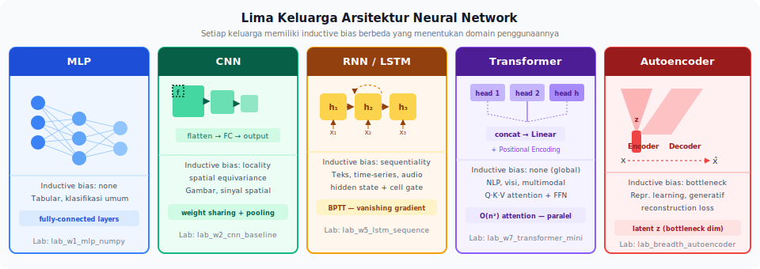
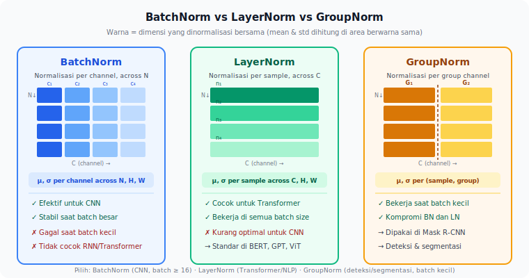

<details>
<summary>📂 Navigasi Modul (klik untuk buka)</summary>

| # | Modul | Minggu |
|---|-------|--------|
| 00 | [Pendahuluan](00_Pendahuluan.md) | 1 |
| 01 | [W1 - Tabular & Output Heads](01_W1_Tabular_Output_Heads.md) | 1 |
| ▶ 02 | W2 - Images, CNN & Smoke Test | 2 |
| 03 | [W3 - Loss, Optimizer & Evaluasi](03_W3_Loss_Optimizer_Evaluasi.md) | 3 |
| 04 | [W4 - Reproducibility & Experiment Matrix](04_W4_Reproducibility_Experiment_Matrix.md) | 4 |
| 05 | [W5 - Sequences: RNN & LSTM](05_W5_Sequences_RNN_LSTM.md) | 5 |
| 06 | [W6 - Representations & Temporal Leakage](06_W6_Representations_Temporal_Leakage.md) | 6 |
| 07 | [W7 - Text, Transformers & Repo Adoption](07_W7_Text_Transformers_Repo_Adoption.md) | 7 |
| 08 | [W8 - Foundation Models](08_W8_Foundation_Models.md) | 8 |
| 09 | [W9 - Multimodal Reasoning](09_W9_Multimodal_Reasoning.md) | 9 |
| 10 | [W10 - Paper Reading & Implementation](10_W10_Paper_Reading.md) | 10 |
| 11 | [W11 - Research Framing & Capstone Proposal](11_W11_Research_Framing.md) | 11 |
| 12 | [Capstone 3 Minggu](12_Capstone_3_Minggu.md) | 12-14 |
| 13 | [Rubrik Penilaian](13_Rubrik_Penilaian.md) | – |
| 14 | [Lampiran](14_Lampiran.md) | – |
| 15 | [Panduan Dosen](15_Panduan_Dosen.md) | – |

</details>

---

# 02 · W2 - Images, CNN & Smoke Test Ritual

> *Arsitektur bukan daftar definisi untuk dihafalkan. Ia adalah keputusan desain yang berangkat dari pertanyaan: bentuk apa yang melekat pada data Anda, dan struktur apa yang paling alami mengikutinya?*

**Big Map row:** `(C, H, W) -> (N,)`
**Rigor habit:** Three-level smoke test
**Dataset:** CIFAR-10 (image classification)
**Lab utama:** Lab 1 (`lab1_baseline_cnn.ipynb`)

---

## 0. Peta Bab

W2 memperkenalkan tensor citra, arsitektur CNN, dan tiga kebiasaan debugging terpenting yang dipakai sepanjang bootcamp. Bab ini menampilkan run yang belajar, run yang tidak belajar, dan smoke test yang menangkap error sebelum training berjam-jam.

- **2.1** Peta Besar: tensor masuk dan tensor keluar
- **2.2** Empat keluarga arsitektur sebagai asumsi tentang data (CNN sebagai contoh utama)
- **2.3** Three-Level Smoke Test Ritual
- **2.4** Galeri Runs: sebelum membaca teori
- **2.5** Layer sebagai transformasi: inisialisasi, normalisasi, aktivasi
- **Lampiran A.1** Backpropagation derivasi manual (opsional, tersedia setelah W2)

Setelah W2, lanjut ke [W3](03_W3_Loss_Optimizer_Evaluasi.md) untuk loss, optimizer, evaluasi, dan diagnosis loss curve.

**Lab minggu ini:** Lab 1c (MLP numpy, breadth opsional) dan Lab 1 (baseline CNN, mulai di W2, selesai di W3).

---

## 1. Motivasi: Tiga Dataset di Meja Anda

Seorang rekan mengirim tiga dataset sekaligus: *"coba klasifikasi dulu, pakai arsitektur yang menurut Anda paling masuk akal"*.

- **A**: tabel medis - 20 kolom hasil lab darah pasien, target diabetes ya/tidak.
- **B**: 10.000 gambar daun sawit berlabel *sehat* atau *terkena penyakit*, resolusi 224×224.
- **C**: 30.000 review produk berbahasa Indonesia, target sentimen positif/negatif.

Tanpa membuka paper apapun, Anda sudah bisa menebak keluarga arsitektur yang cocok. Dataset A punya struktur *flat* - feed-forward network sudah masuk akal. Dataset B berupa grid piksel 2D dengan *translation invariance* - CNN alami di sini. Dataset C berupa urutan kata dengan ketergantungan jangka panjang - Transformer atau RNN yang cocok.

Poinnya: setiap keluarga arsitektur dibangun dengan *asumsi tertentu* tentang bentuk data. Memilih arsitektur berarti memilih asumsi mana yang paling tepat.

---

## 2. Konsep Inti

### 2.1 Peta Besar: Tensor Masuk, Tensor Keluar

Satu kerangka berpikir yang menyederhanakan hampir setiap keputusan desain dalam deep learning: setiap masalah dapat dipahami dengan menjawab dua pertanyaan - *bentuk tensor apa yang masuk*, dan *bentuk apa yang keluar*. Segala sesuatu di antaranya - MLP, CNN, RNN, Transformer - hanyalah mesin transformasi yang memetakan satu bentuk ke bentuk lain.

Saat membaca kode repositori yang belum dikenal, hal pertama yang perlu Anda perhatikan adalah bentuk batch di `DataLoader` dan bentuk tensor tepat sebelum fungsi loss. Dari dua angka itu saja, Anda sudah bisa menebak keluarga arsitektur yang masuk akal. Sebaliknya, ketika merancang eksperimen untuk domain baru, menuliskan pasangan tensor input → output di kertas - sebelum satu baris kode pun ditulis - sering kali mempersempit pilihan dari "semua model di dunia" menjadi "satu atau dua keluarga yang masuk akal".


| Domain | Contoh Data | Tensor Input | Tensor Output | Contoh Tugas |
| --- | --- | --- | --- | --- |
| Tabular | Umur, tekanan darah, kolesterol | `(F,)` - vektor fitur | `(N,)` | Klasifikasi risiko penyakit |
| Gambar | Foto RGB 224×224 | `(C, H, W)` | `(N,)` | Klasifikasi kucing vs anjing |
| Gambar | Foto kebun / jalan | `(C, H, W)` | `(G, G, 5+N)` | Deteksi objek |
| Teks | Ulasan produk | `(T,)` - urutan token | `(N,)` | Klasifikasi sentimen |
| Teks | Kalimat berita | `(T,)` - urutan token | `(T, N)` | Token classification |
| Deret waktu | Sinyal sensor per detik | `(T, F)` - waktu × fitur | `(1,)` | Prediksi nilai berikutnya |
| Deret waktu | Data glukosa dari waktu ke waktu | `(T, F)` | `(T', 1)` | Prediksi urutan masa depan |
| Multimodal | Foto produk + deskripsi teks | `(C,H,W)` dan `(T,)` | `(N,)` | Klasifikasi produk |


Perhatikan bahwa output tidak selalu `(N,)`: deteksi objek menghasilkan tensor tiga dimensi karena setiap sel grid memprediksi beberapa kotak dan kelas. Transisi dari "tugas apa yang ingin saya selesaikan" ke "bentuk output yang benar" adalah keputusan yang perlu diselesaikan sebelum memilih arsitektur.

### 2.2 MLP dan Backpropagation: Ide Utama

Semua keluarga arsitektur neural network, pada level komputasi, adalah **MLP dengan batasan tambahan**: CNN adalah MLP yang dipaksa berbagi bobot antar lokasi spasial, Transformer adalah MLP yang memproses setiap posisi dengan bobot sama, RNN adalah MLP yang dipanggil berulang sepanjang waktu.

Model belajar lewat **backpropagation**: setelah loss dihitung di output, gradient dari loss terhadap setiap parameter dirambatkan mundur via chain rule, lalu optimizer memperbarui parameter ke arah penurunan loss. `loss.backward()` di PyTorch mengerjakan ini secara otomatis.

Dua fenomena penting yang sering disebut paper:

- **Vanishing gradient** - gradient melemah saat merambat mundur melewati banyak layer; ReLU adalah solusi paling umum.
- **Exploding gradient** - gradient meledak saat bobot besar; *gradient clipping* adalah solusinya.

> [!NOTE]
> Derivasi 7-langkah chain rule untuk MLP (MSE loss + sigmoid) tersedia lengkap di [Lampiran A.1](14_Lampiran.md#a1-backpropagation-derivasi-manual). Bacanya setelah W3 ketika Anda sudah punya beberapa run sukses untuk diinterpretasi. Lab 1c (MLP numpy from-scratch) tersedia sebagai breadth lab opsional dan menurunkan backprop secara konkret pada MNIST.

### 2.3 Three-Level Smoke Test Ritual

Sebelum training berjam-jam, jalankan tiga tes ini berurutan. Jika satu tes gagal, hentikan dan perbaiki sebelum lanjut.

**Level 1 - Import test.** `import model; model.eval()`. Gagal berarti ada typo, missing dependency, atau shape mismatch di definisi layer.

**Level 2 - Dummy forward pass.** Buat tensor random dengan shape yang benar, umpankan ke model, periksa output shape.

```python
x = torch.randn(2, 3, 32, 32)  # batch=2, RGB, 32x32
logits = model(x)
assert logits.shape == (2, 10), f"got {logits.shape}"
```

**Level 3 - Overfit one batch.** Ambil 4-8 sampel dari dataset nyata. Jalankan 50-100 iterasi hanya pada sampel itu. Jika loss tidak mendekati nol, ada bug di training loop atau loss function, bukan masalah hyperparameter.

```python
x, y = next(iter(train_loader))  # satu batch kecil
for i in range(100):
    optimizer.zero_grad()
    loss = criterion(model(x), y)
    loss.backward()
    optimizer.step()
    if i % 20 == 0:
        print(f"iter {i}: loss={loss.item():.4f}")
# Expected: loss turun dari ~2.3 menuju ~0.0 dalam 100 iterasi
```

> [!IMPORTANT]
> Overfit one batch adalah tes paling diagnostik. Jika gagal: ada bug di kode Anda, bukan di hyperparameter. Jika berhasil: model sehat, masalah performa berasal dari data, augmentasi, atau regularisasi.

### 2.4 Galeri Runs: Sebelum Membaca Teori

Sebelum mendalami arsitektur, lihat empat run nyata dan tanyakan diri sendiri: *apa yang berbeda?*

- **Run A:** Loss training dan val turun sejajar, keduanya mencapai angka rendah di epoch 20. Ini run yang sehat.
- **Run B:** Loss training turun mulus tapi loss val stagnan sejak epoch 4. Sesuatu sudah salah di sini - apa?
- **Run C:** Loss training tidak bergerak sama sekali dari epoch pertama. Apakah ini masalah learning rate atau bug?
- **Run D:** Loss meledak ke `NaN` di epoch ke-8 setelah awalnya turun normal.

Jangan baca jawabannya dulu. Tuliskan hipotesis Anda untuk setiap run dalam satu kalimat. Kita akan kembali ke empat run ini di W3 dengan kerangka diagnosis yang lengkap.

### 2.6 Arsitektur sebagai Asumsi tentang Data

Empat keluarga yang paling sering muncul di paper dan repositori riset.

**Feed-Forward Neural Network (FFN/MLP).** Lapisan linear berturut-turut dengan non-linearitas di antaranya. Asumsi: tidak ada struktur khusus pada fitur input - urutan kolom tidak bermakna, tidak ada kedekatan spasial atau temporal. Cocok untuk data tabular dan embedding yang sudah diproses. Kelemahan: tidak efisien ketika data punya struktur yang bisa dimanfaatkan.

**Convolutional Neural Network (CNN).** Satu *filter* kecil digeser ke seluruh input, berbagi bobot di semua lokasi. Asumsi: pola relevan dapat muncul di lokasi manapun (*translation invariance*) dan bersifat lokal. Komponen khas: `Conv2d → BatchNorm → ReLU → MaxPool`. Kekuatan: sangat efisien parameter untuk gambar dan data grid. Kelemahan: asumsi lokalitas gagal ketika pola penting menyebar luas.

**Recurrent Neural Network (RNN), LSTM, GRU.** Memproses urutan satu langkah waktu demi satu, menyimpan *hidden state* yang merangkum masa lalu. Asumsi: urutan penting, informasi langkah sebelumnya membantu prediksi berikutnya. LSTM dan GRU memperkenalkan *gate* untuk mengatasi *vanishing gradient* pada RNN polos. Kelemahan: komputasi sekuensial (tidak bisa diparalelkan sepanjang urutan), ketergantungan sangat panjang tetap sulit ditangkap.

**Transformer.** Menggantikan rekursi dengan *self-attention*: setiap elemen urutan secara langsung melihat semua elemen lain. Komponen utama: `Multi-Head Attention`, `Positional Encoding`, `Feed-Forward` per posisi. Dominan di NLP modern (BERT, GPT), kini juga di visi (ViT) dan audio. Biaya utama: self-attention kuadratik terhadap panjang urutan.



Setiap keluarga di atas dapat Anda baca sebagai "MLP + asumsi spesifik domain". Ketika asumsi cocok dengan data, model belajar lebih efisien.

### 2.7 Layer sebagai Transformasi Representasi

Setiap layer adalah *fungsi* yang mengubah representasi data menjadi bentuk yang lebih berguna bagi layer berikutnya. Di CNN, layer awal belajar detail kecil (tepi, tekstur), layer dalam menggabungkannya menjadi konsep lebih tinggi. Dalam praktiknya: saat *fine-tune* model pretrained, layer awal biasanya aman di-*freeze*, layer akhir perlu beradaptasi dengan domain baru.

**Inisialisasi bobot: titik awal yang sering diabaikan.** Memilih nol atau nilai terlalu besar menghancurkan sinyal gradient sejak iterasi pertama.

- **Kaiming (He) initialization** - untuk layer dengan aktivasi ReLU: σ² = 2/fan\_in. PyTorch menerapkannya otomatis untuk `nn.Conv2d` dan `nn.Linear`.
- **Xavier (Glorot) initialization** - untuk aktivasi simetris (Tanh, Sigmoid): σ² = 2/(fan\_in + fan\_out). Sering dipakai di Transformer.

Anda jarang perlu menginisialisasi sendiri. Tapi ketika mendefinisikan layer kustom atau mendebug model yang tidak mau belajar dari epoch pertama, ini relevan:

```python
def init_weights(m):
    if isinstance(m, (nn.Conv2d, nn.Linear)):
        nn.init.kaiming_normal_(m.weight, nonlinearity='relu')
        if m.bias is not None:
            nn.init.zeros_(m.bias)

model.apply(init_weights)
```

**Normalisasi: BatchNorm, LayerNorm, GroupNorm.** Ketiganya berbeda pada sumbu yang dinormalisasi:

| Normalisasi | Normalisasi melewati... | Butuh batch size besar? | Domain khas |
| --- | --- | --- | --- |
| BatchNorm | seluruh batch di tiap channel | Ya (minimal 16-32) | CNN visi |
| LayerNorm | seluruh fitur di tiap sampel | Tidak | Transformer, RNN |
| GroupNorm | grup channel di tiap sampel | Tidak | CNN batch kecil (segmentasi 3D) |

BN menghitung statistik dari seluruh batch; batch kecil membuat statistik bising dan training tidak stabil. Itulah alasan Transformer yang dilatih dengan batch kecil hampir selalu memakai LayerNorm. Alasan lebih dalam: setiap token harus punya normalisasi yang tidak bergantung token lain di batch - LayerNorm memberi jaminan ini, BN tidak.



**Aktivasi: ReLU, GELU, SiLU.**

- **ReLU** (`max(0, x)`): default untuk CNN dan MLP. Murah, turunan 0 atau 1. Risiko: *dead ReLU* - neuron yang tidak pernah menyala bisa mati permanen.
- **GELU** (`x · Φ(x)`): default untuk Transformer modern (BERT, GPT). Lebih halus dekat nol.
- **SiLU/Swish** (`x · σ(x)`): dipakai di MobileNet v3, EfficientNet, LLaMA. Kinerja mirip GELU, lebih murah dihitung.

Aturan praktisnya: pakai default yang disebut paper yang Anda replikasi. Mengganti aktivasi tanpa alasan kuat adalah variabel tambahan yang harus dijelaskan di laporan.

![Kurva fungsi aktivasi ReLU, GELU, dan SiLU pada rentang [-3, 3]](./figures/fig01e_activation_functions.svg)

---

## 3. Worked Example: SimpleCNN pada CIFAR-10

Tujuan: membangun CNN minimal yang dapat training penuh, menjelaskan setiap keputusan desain.

### 3.1 Definisi Model

```python
import torch
import torch.nn as nn

class SimpleCNN(nn.Module):
    def __init__(self, num_classes: int = 10):
        super().__init__()
        # Blok 1: 3 channel input (RGB) -> 32 channel; resolusi 32 -> 16
        self.block1 = nn.Sequential(
            nn.Conv2d(3, 32, kernel_size=3, padding=1),
            nn.BatchNorm2d(32),
            nn.ReLU(inplace=True),
            nn.MaxPool2d(2),
        )
        # Blok 2: 32 -> 64 channel; resolusi 16 -> 8
        self.block2 = nn.Sequential(
            nn.Conv2d(32, 64, kernel_size=3, padding=1),
            nn.BatchNorm2d(64),
            nn.ReLU(inplace=True),
            nn.MaxPool2d(2),
        )
        self.classifier = nn.Sequential(
            nn.Flatten(),
            nn.Linear(64 * 8 * 8, 256),
            nn.ReLU(inplace=True),
            nn.Dropout(0.3),
            nn.Linear(256, num_classes),
        )

    def forward(self, x: torch.Tensor) -> torch.Tensor:
        x = self.block1(x)
        x = self.block2(x)
        return self.classifier(x)
```

Alasan tiap pilihan: `padding=1` mempertahankan dimensi spasial; BatchNorm sebelum ReLU menstabilkan distribusi input; `MaxPool2d(2)` memperluas *receptive field*; `Dropout(0.3)` regularisasi ringan; classifier tidak memakai `Softmax` karena `CrossEntropyLoss` PyTorch sudah melakukan log-softmax secara numerik stabil.

### 3.2 Setup Training Minimal

```python
from torch.utils.data import DataLoader
from torchvision import datasets, transforms

transform_train = transforms.Compose([
    transforms.RandomCrop(32, padding=4),
    transforms.RandomHorizontalFlip(),
    transforms.ToTensor(),
    transforms.Normalize((0.4914, 0.4822, 0.4465),
                         (0.2470, 0.2435, 0.2616)),
])

trainset = datasets.CIFAR10(root='./data', train=True,
                            download=True, transform=transform_train)
trainloader = DataLoader(trainset, batch_size=128, shuffle=True, num_workers=2)

device = 'cuda' if torch.cuda.is_available() else 'cpu'
model = SimpleCNN().to(device)
criterion = nn.CrossEntropyLoss()
optimizer = torch.optim.AdamW(model.parameters(), lr=3e-4, weight_decay=1e-4)
```

Augmentasi hanya pada training set; normalisasi dengan statistik CIFAR-10 yang sama di val/test; batch size 128 cukup stabil untuk BatchNorm; `device` otomatis agar kode jalan di laptop dan server.

---

## 4. Pitfalls & Miskonsepsi

**"Arsitektur yang lebih dalam selalu lebih baik."** Tidak. Tanpa data cukup banyak, model dalam cenderung overfitting. Mulai dari arsitektur sederhana yang konvergen, tingkatkan kedalaman hanya jika bottleneck terbukti adalah kapasitas model.

**"Adam selalu lebih baik dari SGD."** Pada banyak tugas, Adam konvergen lebih cepat di epoch awal tetapi SGD (dengan momentum dan schedule yang tepat) sering menang di akhir. Bergantung pada tugas.

**"Accuracy 99% berarti model hebat."** Selalu periksa baseline naif - *dummy classifier* yang memprediksi kelas mayoritas. Jika akurasinya juga tinggi, Anda sedang mengukur kesamaan dengan distribusi kelas.

---

## 5. Lab

### Lab 1 - Baseline CNN (Lab utama W2, selesai di W3)

Buka `notebooks/lab1_baseline_cnn.ipynb`. Di W2:

1. Jalankan tiga level smoke test (import, dummy forward, overfit one batch).
2. Build SimpleCNN, latih baseline dari scratch.
3. Build pretrained fine-tune baseline (ResNet-18 frozen backbone).
4. Dokumentasikan: di level mana smoke test akan menangkap setiap jenis error.

Selesaikan evaluasi dan error analysis setelah membaca [W3](03_W3_Loss_Optimizer_Evaluasi.md).

**Checklist W2:**
- [ ] Tiga level smoke test selesai dan terdokumentasi.
- [ ] SimpleCNN forward pass jalan dengan shape yang benar.
- [ ] Overfit one batch berhasil (loss turun ke <0.1 dalam 100 iterasi).
- [ ] Training loop berjalan 5 epoch tanpa error.

### Lab 1c - MLP dari Nol (breadth opsional, kapan saja)

Buka `notebooks/lab1c_mlp_numpy.ipynb`. Tersedia sebagai breadth lab untuk Breadth Check (MLP family). Implementasi backpropagation 7-langkah manual dalam numpy + finite-difference gradient check + parity check vs PyTorch.

---

## 6. Refleksi

1. Anda diberi dataset baru: 500 sinyal EKG satu dimensi, panjang masing-masing 5000 titik, target empat kelas aritmia. Keluarga arsitektur apa yang paling masuk akal untuk Anda coba pertama kali, dan mengapa? Pilihan kedua Anda apa, dan di kondisi apa ia lebih cocok?
2. Bayangkan Anda sudah training SimpleCNN dan mendapat train accuracy 95% tetapi val accuracy 68%. Tanpa melihat kodenya, sebutkan tiga hipotesis paling mungkin tentang penyebabnya, lalu tiga eksperimen pendek yang bisa membedakan satu hipotesis dari yang lain.
3. Seorang kolaborator mengirim dataset baru: rekaman suara tangisan bayi sepanjang tiga detik pada *sampling rate* 16 kHz, dilabeli empat kategori. Tuliskan pasangan tensor input → output yang paling alami, lalu ajukan satu alternatif representasi input (misalnya mel-spektrogram 2D) dan diskusikan bagaimana perubahan bentuk itu menggeser pilihan keluarga arsitektur.

---

## 7. Bacaan Lanjutan

- **Andrej Karpathy - *A Recipe for Training Neural Networks*** (2019). Ritme kerja peneliti berpengalaman; bagian "overfit a single batch" sangat berguna untuk mendebug loop training.
- **Christopher Olah - *Understanding LSTM Networks*** (blog, 2015). Penjelasan visual paling jelas tentang mekanisme gate LSTM.
- **The Deep Learning Book (Goodfellow et al.), Bab 6 & 9.** Bab 6 untuk FFN, Bab 9 untuk CNN.

---

## Lanjut ke W3

Fondasi sudah berdiri. Bab berikutnya (W3) menuntaskan: loss sebagai pilihan, optimizer sebagai mekanisme langkah, evaluasi yang jujur, tiga strategi representasi fitur, dan cara membaca loss curve untuk mendiagnosis masalah training - dimulai dari galeri run konkret sebelum teori.

Buka [W3 - Loss, Optimizer & Evaluasi](03_W3_Loss_Optimizer_Evaluasi.md) ketika siap.
