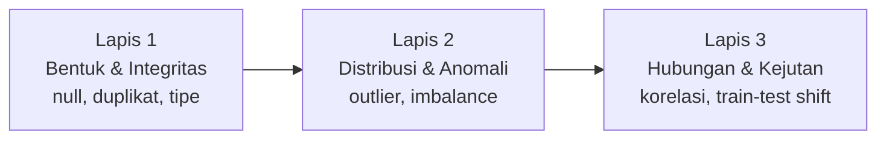
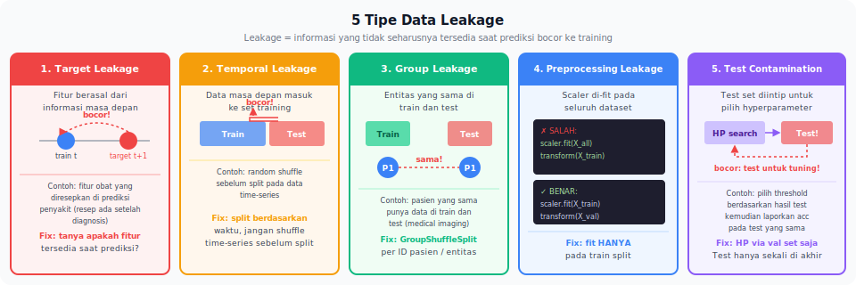

<details>
<summary>📂 Navigasi Modul (klik untuk buka)</summary>

| # | Modul | Minggu |
|---|-------|--------|
| 00 | [Pendahuluan](00_Pendahuluan.md) | 1 |
| 01 | [W1 - Tabular & Output Heads](01_W1_Tabular_Output_Heads.md) | 1 |
| 02 | [W2 - Images, CNN & Smoke Test](02_W2_Images_CNN_Smoke_Test.md) | 2 |
| 03 | [W3 - Loss, Optimizer & Evaluasi](03_W3_Loss_Optimizer_Evaluasi.md) | 3 |
| 04 | [W4 - Reproducibility & Experiment Matrix](04_W4_Reproducibility_Experiment_Matrix.md) | 4 |
| 05 | [W5 - Sequences: RNN & LSTM](05_W5_Sequences_RNN_LSTM.md) | 5 |
| ▶ 06 | W6 - Representations & Temporal Leakage | 6 |
| 07 | [W7 - Text, Transformers & Repo Adoption](07_W7_Text_Transformers_Repo_Adoption.md) | 7 |
| 08 | [W8 - Foundation Models](08_W8_Foundation_Models.md) | 8 |
| 09 | [W9 - Multimodal Reasoning](09_W9_Multimodal_Reasoning.md) | 9 |
| 10 | [W10 - Paper Reading & Implementation](10_W10_Paper_Reading.md) | 10 |
| 11 | [W11 - Research Framing](11_W11_Research_Framing.md) | 11 |
| 12 | [Capstone - Proyek Riset](12_Capstone.md) | 12-15 |
| 13 | [Rubrik Penilaian](13_Rubrik_Penilaian.md) | – |
| 14 | [Lampiran](14_Lampiran.md) | – |
| 15 | [Panduan Instruktur](15_Panduan_Instruktur.md) | – |

</details>

---

# 06 · W6 - Representations & Temporal Leakage

> *Akurasi 99% bukan prestasi - ia adalah alarm. Hampir selalu ada penjelasan yang lebih membosankan daripada "model kami sangat pintar": data yang bocor, label yang salah, atau pipeline yang memberi model informasi yang seharusnya tidak ia lihat. Skeptisisme terhadap angka sendiri adalah sikap yang memisahkan peneliti dari operator model.*

**Baris peta besar:** `(T, F) -> (1,)`, `(N,)`, `(T'', 1)` (lanjutan W5, fokus representasi + validasi)
**Kebiasaan riset:** Validate preprocessing dan prevent temporal leakage
**Dataset:** Sensor atau time-series dataset
**Lab utama:** Lab W6 - Temporal Leakage (`lab_w6_temporal_leakage.ipynb`) + EDA (`lab_w6_eda_leakage.ipynb`)

---

## 0. Peta Bab

W6 menggabungkan dua tema yang saling terkait erat:

- **0.5** Representasi Fitur: Recap dari W3 (konteks baru sequence/sensor)
- **0.6** Temporal Leakage: Contoh Konkret yang Menipu
- **2.1** EDA sebagai investigasi
- **2.2** Data leakage - tiga jenis
- **2.3** Kualitas label dan audit manual
- **2.4** Pipeline pra-pemrosesan yang aman
- **2.5** Domain shift
- **2.6** Etika data dan bias

Setelah W6, Anda memeriksa setiap pipeline preprocessing dengan pertanyaan: "Apakah ada informasi masa depan yang bocor ke training?"

---

## 0.5 Representasi Fitur dalam Konteks Sequence dan Sensor

Di W3, Anda belajar tiga strategi representasi fitur: **engineered**, **extracted**, dan **learned**. Di W6, ketiga strategi ini muncul dalam konteks yang berbeda - domain sensor dan time series - di mana pilihannya jauh lebih kritis karena ada dimensi temporal yang perlu dijaga.

| Strategi | Contoh di sensor/time-series | Kekuatan | Risiko leakage |
|---|---|---|---|
| **Engineered** | Mean, variance, spektrum FFT dari window | Interpretable, ringan | Tinggi jika window melampaui batas temporal |
| **Extracted** | Hidden states dari Chronos/TimesFM frozen | Kaya, tidak butuh label | Sedang; cek apakah pretrained model dilatih pada data yang overlap |
| **Learned** | LSTM end-to-end dari raw signal | Paling fleksibel | Rendah jika split temporal diimplementasikan dengan benar |

Thread **Representation Choice** yang berjalan sejak W3 kini punya dimensi baru: dalam time series, pilihan representasi tidak hanya memengaruhi performa model, tetapi juga *apakah hasil Anda valid secara temporal*. Engineered features yang tampak netral bisa membawa informasi dari masa depan tanpa Anda sadari.

## 0.6 Temporal Leakage: Contoh Konkret yang Menipu

Berikut skenario yang sering terjadi. Anda punya data sensor suhu sebuah mesin industri dengan label "failure/no-failure". Anda membuat fitur rolling mean 24 jam:

```python
df['rolling_mean_24h'] = df['temperature'].rolling(window=24).mean()
```

Lalu Anda split data:

```python
# WRONG - split acak, bukan temporal
from sklearn.model_selection import train_test_split
X_train, X_test = train_test_split(df, test_size=0.2, shuffle=True)
```

**Masalah 1 - Random split.** Sampel dari jam 14:00 bisa masuk train, dan sampel jam 13:00 dari hari yang sama masuk test. Model "melihat" data setelah titik test ketika training.

**Masalah 2 - Rolling feature melampaui batas.** Nilai `rolling_mean_24h` pada titik ke-T dihitung dari T-23 hingga T. Jika salah satu titik T-23..T-1 ada di test set tetapi T ada di train set, fitur training mengandung informasi test.

**Hasil yang Anda lihat:** akurasi F1 = 0.92. Kelihatan bagus. Tapi saat dipakai di produksi, model hanya mencapai F1 = 0.63. Inilah angka yang menipu akibat temporal leakage.

**Solusi yang benar:**

```python
# BENAR - temporal split
cutoff = df['timestamp'].quantile(0.8)  # 80% data awal untuk training
train = df[df['timestamp'] <= cutoff]
test = df[df['timestamp'] > cutoff]

# Pastikan rolling features dihitung dengan cara causal
# - Tidak ada data dari masa depan dalam window
# - Window tidak melampaui batas cutoff
```

**Demonstrasi inflasi:** Lab 6 akan menunjukkan delta ini secara eksplisit: F1 dengan leakage vs F1 tanpa leakage pada dataset yang sama. Angka leaky akan terlihat lebih menarik, dan itulah persis bahayanya.

> [!WARNING]
> Leakage temporal seringkali tidak menghasilkan F1 = 1.0 yang jelas mencurigakan. Ia menghasilkan angka "bagus" seperti 0.88 yang "masuk akal" - cukup untuk meyakinkan Anda dan reviewer bahwa modelnya valid. Yang salah bukan angkanya; yang salah adalah cara mendapatkannya.

---

## 1. Motivasi: Data yang Terlihat Baik Bisa Membohongi

Seorang mahasiswa pascasarjana melatih model klasifikasi citra medis untuk mendeteksi penyakit paru-paru dari rontgen dada. Akurasi validasi: 97%. Saat review, seorang kolega bertanya: "apakah model belajar mengenali penyakit, atau belajar mengenali rumah sakitnya?" Ternyata setiap rumah sakit memakai mesin rontgen berbeda dengan ciri visual khas di sudut gambar; data positif dan negatif berasal dari sumber yang berbeda. Model tidak pernah melihat paru-paru - ia mengklasifikasi *sumber*. Enam bulan kerja diulang.

Kewaspadaan terhadap data bukan tugas tambahan. Tanpanya, seluruh eksperimen bergantung pada dasar yang rapuh.

---

## 2. Konsep Inti

### 2.1 EDA sebagai Investigasi

*Exploratory Data Analysis* sering diajarkan sebagai daftar langkah: "jalankan `df.describe()`, plot histogram, hitung korelasi, selesai". Praktik yang benar adalah sebaliknya - EDA dipandu oleh pertanyaan, bukan daftar. Setiap angka atau plot yang Anda lihat harus memicu pertanyaan baru, bukan tanda centang.

Kerangka kerja yang produktif: tiga lapis pertanyaan yang mengalir secara berurutan - dari integritas dasar, ke distribusi, ke hubungan tersembunyi.



**Lapis 1 - Bentuk dan integritas.**
- Berapa banyak baris dan kolom?
- Apakah ada nilai hilang? Di kolom mana, berapa proporsinya?
- Apakah tipe data tiap kolom sesuai ekspektasi?
- Apakah ada duplikasi baris? Apakah duplikasi masuk akal (sah) atau mencurigakan?
- Untuk data gambar/audio: apakah semua file dapat dibaca? Apakah dimensi seragam?

**Lapis 2 - Distribusi dan anomali.**
- Distribusi tiap kolom numerik (histogram, box plot). Apakah ada outlier ekstrem?
- Distribusi kolom kategorikal (value counts). Apakah ada kelas dengan frekuensi terlalu rendah?
- Distribusi target: imbalanced? Jika ya, seberapa parah?
- Apakah ada nilai yang "tidak masuk akal" (umur negatif, suhu 999, tanggal di masa depan)?

**Lapis 3 - Hubungan dan kejutan.**
- Korelasi antar fitur numerik.
- Korelasi fitur dengan target. Adakah fitur dengan korelasi *sangat* tinggi (>0.95)? Ini patut diselidiki - sering tanda leakage.
- Apakah distribusi fitur sama antara train dan test? Jika berbeda, mengapa?
- Apakah ada pola temporal yang tidak diharapkan?

Alat pembantu EDA:

```python
import pandas as pd
import matplotlib.pyplot as plt
import seaborn as sns

df = pd.read_csv('data/train.csv')

# Lapis 1
print(df.shape)
print(df.info())
print(df.isna().sum())
print(df.duplicated().sum())

# Lapis 2
df.describe()
df['target'].value_counts(normalize=True)  # proporsi kelas

# Lapis 3
corr = df.select_dtypes('number').corr()
sns.heatmap(corr, annot=True, fmt='.2f')
plt.show()
```

Untuk dataset besar, `pandas-profiling` (sekarang `ydata-profiling`) menghasilkan laporan otomatis yang mencakup lapis 1 dan 2:

```python
from ydata_profiling import ProfileReport
ProfileReport(df, title='EDA Report').to_file('eda.html')
```

Ingat: laporan otomatis adalah titik awal, bukan akhir. Ia menunjukkan *apa*; Anda yang bertanya *mengapa*.

### 2.2 Jenis-Jenis Data Leakage

*Data leakage* adalah masuknya informasi ke training yang seharusnya tidak tersedia pada waktu prediksi. Lima jenis yang paling umum:

**1. Target leakage.** Fitur yang dihitung *setelah* atau *dari* target. Contoh: `total_payments` di prediksi default kredit - jumlah pembayaran hanya tersedia setelah pinjaman berakhir, jadi tidak bisa ada di data training untuk model prediksi awal.

**2. Train-test contamination.** Baris yang sama ada di train dan test. Ini sering terjadi saat split dilakukan setelah proses yang menciptakan duplikasi, misalnya agregasi yang meniru baris.

**3. Temporal leakage.** Data masa depan masuk ke prediksi masa lalu. Umum di time series - pemisahan train/test dengan random split padahal data punya urutan waktu. Solusinya: split berdasarkan waktu, bukan acak.

**4. Group leakage.** Data dari subjek yang sama ada di train dan test. Contoh: pasien yang sama punya beberapa rontgen; satu masuk train, satu masuk test. Model bisa belajar mengenali pasien, bukan penyakit. Solusinya: split berdasarkan grup (pasien, pengguna, sesi).

**5. Preprocessing leakage.** Statistik untuk normalisasi (mean, std) dihitung dari seluruh dataset termasuk test. Ini memberi model informasi agregat test. Solusinya: fit preprocessing hanya pada train, transform train+test dengan parameter yang sudah di-fit.



Tabel deteksi:

| Jenis | Tanda-tanda awal | Tes cepat |
|---|---|---|
| Target leakage | Satu fitur punya korelasi ekstrem dengan target | Uji "model dengan fitur ini saja" - jika akurasi sudah tinggi, curigai |
| Train-test contamination | Akurasi validasi dekat atau melebihi train | Hitung overlap ID/hash antara split |
| Temporal leakage | Performa turun drastis di data masa depan | Pisah berdasarkan waktu dan bandingkan |
| Group leakage | Val acc tinggi tetapi performa di pasien baru rendah | Group split, retrain |
| Preprocessing leakage | Efek kecil tetapi konsisten | Refactor: fit hanya pada train |

### 2.3 Audit Label: Kualitas Data yang Sering Diabaikan

Label yang salah 5% tidak akan membatasi akurasi di 95%, tetapi akan menyesatkan pilihan arsitektur dan loss. Model yang "gagal" mencapai 100% pada data noisy sebenarnya sedang benar-benar mengenali pola; Anda menghukumnya karena gagal menghafal kesalahan.

Protokol audit label untuk dataset klasifikasi:

1. **Periksa distribusi label.** `value_counts()`. Kelas dengan frekuensi sangat rendah (< 1%) mungkin tidak praktis untuk model klasifikasi biasa - pertimbangkan menggabung ke kelas lain atau memakai pendekatan *few-shot*.
2. **Periksa ejaan/konsistensi kategori.** `df['label'].unique()`. Sering ditemukan 'Positif', 'positif', 'Positive', 'POS' yang seharusnya satu kelas.
3. **Sampel inspeksi manual.** Ambil 50 sampel acak, periksa labelnya dengan pemahaman domain. Jika Anda bukan ahli domain, minta bantuan.
4. **Inspeksi kesalahan model sebagai audit tambahan.** Setelah baseline training, ambil 20 "kesalahan paling percaya diri" - prediksi di mana model yakin tetapi salah. Sering kali *labelnya* yang salah, bukan modelnya.

Contoh pada dataset gambar:

```python
# Prediksi model pada val set
import torch

model.eval()
with torch.no_grad():
    preds = []
    confs = []
    for xb, yb in val_loader:
        logits = model(xb.to(device))
        probs = torch.softmax(logits, dim=1)
        conf, pred = probs.max(dim=1)
        preds.append(pred.cpu())
        confs.append(conf.cpu())
preds = torch.cat(preds)
confs = torch.cat(confs)
targets = torch.tensor([y for _, y in val_loader.dataset])

# Kesalahan yang paling percaya diri
wrong = preds != targets
conf_wrong = confs[wrong]
indices = torch.where(wrong)[0][conf_wrong.argsort(descending=True)[:20]]

# Inspeksi 20 gambar teratas secara manual
for idx in indices:
    show_image(val_loader.dataset[idx])
    print(f"true: {targets[idx]}, predicted: {preds[idx]}, conf: {confs[idx]:.3f}")
```

Proses ini sering mengejutkan. Saya pernah menemukan 15% label pada dataset publik "kucing vs anjing" salah karena ditandai oleh *crowd worker* yang tergesa-gesa.

### 2.4 Verifikasi Pipeline: Pemisahan yang Ketat

Pipeline pra-pemrosesan harus *fit pada training set saja*, lalu *transform train, val, dan test* dengan parameter yang sudah di-fit. Ini mencegah kebocoran statistik test ke training.

> [!IMPORTANT]
> **Gambaran preprocessing leakage.** Kalau Anda hitung `mean` dan `std` dari **semua data** (train + val + test) sebelum split, statistik tersebut sudah "tahu" sesuatu tentang val/test - misalnya distribusi outlier di test set akan menggeser mean. Saat training, model menerima input yang sudah dinormalisasi memakai informasi agregat test. Walau label test tidak bocor, **distribusi fitur test sudah bocor**. Efeknya kecil di dataset besar yang distribusinya stabil, tetapi nyata di dataset kecil atau heterogen. Aturan: `fit` hanya pada train; `transform` train + val + test memakai parameter yang sama.

Salah:

```python
# JANGAN LAKUKAN INI
scaler = StandardScaler()
X_all_scaled = scaler.fit_transform(X_all)  # fit pakai seluruh data
X_train, X_test = train_test_split(X_all_scaled, ...)
```

Benar:

```python
X_train, X_test = train_test_split(X_all, ...)
scaler = StandardScaler()
X_train = scaler.fit_transform(X_train)     # fit HANYA train
X_test = scaler.transform(X_test)            # transform test
```

Untuk pipeline multi-langkah, `sklearn.pipeline.Pipeline` memastikan fit/transform dilakukan dengan benar:

```python
from sklearn.pipeline import Pipeline
from sklearn.impute import SimpleImputer
from sklearn.preprocessing import StandardScaler
from sklearn.compose import ColumnTransformer

num_cols = ['age', 'salary']
cat_cols = ['city', 'role']

num_pipe = Pipeline([
    ('impute', SimpleImputer(strategy='median')),
    ('scale', StandardScaler()),
])
cat_pipe = Pipeline([
    ('impute', SimpleImputer(strategy='most_frequent')),
    ('encode', OneHotEncoder(handle_unknown='ignore')),
])
preprocess = ColumnTransformer([
    ('num', num_pipe, num_cols),
    ('cat', cat_pipe, cat_cols),
])

preprocess.fit(X_train)
X_train_t = preprocess.transform(X_train)
X_test_t = preprocess.transform(X_test)

# Simpan untuk reproduksibilitas
import joblib
joblib.dump(preprocess, 'experiments/lab4/preprocess.pkl')
```

Untuk model PyTorch yang memakai augmentasi, prinsip sama: augmentasi hanya di training `Dataset`, tidak di validation/test.

### 2.5 Domain Shift dan Distribusi yang Berubah

Data di dunia nyata sering berbeda dari data training. Tiga bentuk perubahan:

**Covariate shift** - distribusi fitur `P(x)` berubah, tetapi hubungan fitur→target `P(y|x)` tetap. Model masih bisa di-deploy kalau fitur baru tidak terlalu jauh dari yang dilihat saat training.
- *Contoh konkret:* model klasifikasi daun penyakit dilatih di musim kemarau (warna lebih kekuningan), dipakai di musim hujan (warna lebih gelap dan basah). Pola visual penyakit yang sama, tetapi distribusi warna pixel bergeser.
- *Deteksi:* histogram per-channel train vs deploy berbeda; uji KS pada distribusi fitur.

**Label shift** - distribusi target `P(y)` berubah, tetapi `P(x|y)` tetap. Mengetahui shift jenis ini penting karena solusinya berbeda dari covariate shift.
- *Contoh konkret:* model deteksi spam dilatih saat spam = 5% dari email, di-deploy saat campaign besar membuat spam = 30%. Tampilan spam tetap sama; hanya proporsinya berubah. Threshold default akan menghasilkan banyak false negative.
- *Deteksi:* bandingkan `value_counts` label di sample produksi (ground-truth atau proxy lemah) vs train.

**Concept drift** - `P(y|x)` itu sendiri berubah. Hubungan fitur→target tidak lagi yang sama. Paling sulit ditangani; biasanya butuh re-training periodik.
- *Contoh konkret:* model prediksi churn pelanggan dilatih sebelum app rilis fitur baru. Setelah rilis, pengguna yang sebelumnya churn karena fitur kurang sekarang loyal - dengan fitur input identik, label berubah.
- *Deteksi:* metrik di production turun walau distribusi fitur stabil; bandingkan akurasi window sliding bulanan.

Diagnosis awal: bandingkan histogram tiap fitur antara train dan test/produksi. Jika histogram berbeda signifikan, Anda menghadapi shift. Uji statistik seperti Kolmogorov-Smirnov dapat membuatnya lebih formal.

Di proyek kuliah, shift sering sengaja diperkenalkan sebagai latihan. Lab 4 akan memindahkan model yang dilatih di CIFAR-10 ke dataset medis PathMNIST - *domain shift* yang akan membuat akurasi turun drastis, memberi Anda kesempatan menyaksikan dan mendeteksinya.

### 2.6 Etika Data dan Bias

Sejauh ini kita membahas validasi data dari sudut teknis - leakage, label, pipeline, domain shift. Ada satu dimensi lagi yang sama pentingnya: dimensi etis. Data yang valid secara teknis belum tentu adil secara etis. Sebagai asisten riset, Anda tidak hanya bertanggung jawab pada akurasi model, tetapi juga pada dampak dari model yang Anda bangun.

> [!NOTE]
> Bagian §2.6.1 (bias dataset), §2.6.2 (fairness), dan §2.6.4 (tanggung jawab asisten) adalah **pendalaman opsional** untuk W6. Yang **wajib** dibaca dan diterapkan adalah §2.6.3 (negative results) karena terkait langsung dengan reproducibility dari W4. Dua bagian opsional dimasukkan ke `<details>` collapsible di bawah; buka kalau Anda ingin pendalaman, atau lewati di first-pass dan kembali sebelum capstone.

<details>
<summary><strong>§2.6.1 Bias Dataset (Pendalaman Opsional)</strong></summary>

#### 2.6.1 Bias Dataset - Lebih dari Sekadar Imbalance

Ketidakseimbangan kelas bukan satu-satunya bentuk bias dalam dataset. Empat jenis bias yang harus Anda kenali sebelum melangkah ke training:

**Selection bias.** Data training tidak merepresentasikan populasi target. Contoh klasik: dataset wajah yang 90%-nya adalah etnis tertentu; model akan berkinerja buruk pada etnis lain. Contoh lain: model penyakit mata yang dilatih pada gambar berkualitas klinik, lalu gagal di lapangan karena gambar dari ponsel. Deteksi awal: bandingkan demografi atau properti sampel dataset Anda dengan populasi target yang diklaim.

**Measurement bias.** Fitur atau label mengukur konstruk yang berbeda dari yang dimaksud. Contoh terkenal: model prediksi "risiko kriminal" COMPAS (ProPublica, 2016) - label "residivis" ternyata sangat berkorelasi dengan intensitas patroli polisi di lingkungan tertentu, bukan risiko aktual. Pertanyaan yang harus diajukan: "apakah yang kita ukur benar-benar merepresentasikan konstruk yang kita klaim?"

**Label bias.** Bias manusia pemberi label tercermin dalam *ground truth*. Contoh: dataset klasifikasi teks "toxic" di mana komentar dalam dialek tertentu (AAVE) diberi label toxic lebih sering daripada komentar serupa dalam bahasa Inggris standar. Deteksi awal: periksa apakah distribusi label berbeda signifikan antar subgrup yang seharusnya mirip.

**Historical bias.** Ketidaksetaraan yang sudah ada di dunia nyata tercermin dalam data. Contoh: dataset *resume screening* yang dilatih pada data historis perekrutan di masa lalu akan mewarisi bias gender atau ras pada keputusan perekrutan masa itu. Ini berbeda dari label bias karena *dunia nyata memang bias*, bukan pemberi label yang keliru.

Keempat jenis bias tidak selalu bisa "diperbaiki" di level data. Beberapa memerlukan perubahan di level metrik evaluasi, desain model, atau bahkan keputusan untuk tidak membangun model sama sekali. Minimum yang bisa Anda lakukan: **dokumentasikan bias yang Anda sadari di audit data Anda**, di samping leakage dan label quality. Bias yang tidak diketahui akan diam-diam hidup di model dan muncul di tempat yang tidak Anda perkirakan.

</details>

<details>
<summary><strong>§2.6.2 Fairness Awareness (Pendalaman Opsional)</strong></summary>

#### 2.6.2 Fairness Awareness - Tiga Konsep Minimum

Keadilan (*fairness*) dalam ML adalah bidang penelitian sendiri. Anda tidak diharapkan menjadi pakar, tetapi tiga konsep ini adalah minimum yang perlu diketahui sebelum melepas model ke dunia:

**Fairness through unawareness tidak efektif.** Menghapus fitur sensitif (gender, ras, agama) tidak otomatis membuat model adil. Fitur-fitur yang tampak netral - kode pos, jenis perangkat, jam aktivitas - bisa menjadi *proxy* untuk fitur sensitif. Model bisa belajar menggunakannya secara tidak langsung, sehingga bias tetap ada tetapi lebih sulit dideteksi.

**Definisi fairness tidak tunggal.** Dua definisi yang paling sering dipakai:
- *Demographic parity*: proporsi prediksi positif sama antar kelompok. Masalah: bisa tercapai dengan menerima kandidat tidak berkualitas dari satu kelompok dan menolak kandidat berkualitas dari kelompok lain.
- *Equal opportunity*: true positive rate sama antar kelompok. Masalah: tidak peduli dengan false positive rate.

Pilihan definisi fairness bergantung pada konteks aplikasi. Tidak ada definisi yang superior universal; yang penting adalah Anda tahu definisi mana yang dipakai dan mengapa.

**Fairness vs accuracy adalah trade-off yang sesungguhnya.** Mencapai fairness sering (tidak selalu) menurunkan akurasi keseluruhan. Mengabaikan fairness sama sekali demi akurasi adalah keputusan etis, bukan sekadar teknis. Sebagai asisten riset, tugas Anda adalah membuat trade-off ini eksplisit - bukan memilih sendiri, tetapi memberi PI informasi cukup untuk memilih dengan sadar.

Sumber untuk pendalaman: *Fairness and Machine Learning* (Barocas, Hardt, Narayanan - gratis online) dan *Model Cards for Model Reporting* (Mitchell et al., 2019) - template satu halaman untuk mendokumentasikan bias, asumsi, dan batasan model.

</details>

#### 2.6.3 Negative Results sebagai Kewajiban, Bukan Opsional

W4 (Reproducibility) sudah menyinggung cara menangani hipotesis yang tidak terkonfirmasi. Di sini, kita melihatnya dari sudut etika riset.

Krisis reproduksibilitas di ML sebagian besar dipicu oleh *publication bias*: hasil positif dipublikasikan, hasil negatif tidak. Akibatnya, ratusan tim bisa membuang waktu di arah yang sama karena tidak ada yang melaporkan bahwa arah itu buntu. Anda, sebagai asisten riset, memiliki kewajiban moral kecil untuk tidak ikut memperburuk keadaan ini.

Dalam lingkup lab Anda sendiri, praktiknya sederhana:
- Setiap folder eksperimen harus punya `README.md` atau `notes.md` meskipun eksperimennya gagal.
- Eksperimen yang menghasilkan "focal loss tidak membantu" tetap bernilai - ia adalah satu titik data tentang batas efektivitas teknik.
- Di akhir semester, portofolio Anda seharusnya berisi campuran hasil positif dan negatif. Jika semuanya positif, kemungkinan besar Anda hanya melaporkan yang berhasil.

Eksperimen yang gagal dan didokumentasikan dengan jujur lebih melindungi reputasi riset Anda daripada eksperimen berhasil yang dilaporkan selektif. PI yang baik akan menaruh lebih banyak kepercayaan pada asisten yang berkata "saya sudah mencoba tiga arah, dua gagal, satu berhasil" daripada asisten yang hanya menampilkan keberhasilan.

<details>
<summary><strong>§2.6.4 Tanggung Jawab Asisten Riset (Pendalaman Opsional)</strong></summary>

#### 2.6.4 Tanggung Jawab Asisten Riset

Anda mungkin berpikir: "saya hanya asisten, saya menjalankan instruksi PI, tanggung jawab etis ada di PI." Ini separuh benar dan separuh berbahaya. Benar bahwa PI memegang tanggung jawab akhir. Berbahaya karena:

- PI mungkin tidak tahu detail data yang Anda kumpulkan. Jika Anda menemukan bias atau masalah privasi di data, *Anda adalah orang pertama yang melihatnya*. Tidak melapor adalah pilihan diam-diam, dan diam adalah keputusan.
- Anda mungkin diminta mengumpulkan dataset yang mengandung informasi pribadi tanpa persetujuan. Atau mengerjakan proyek yang aplikasinya bisa membahayakan kelompok rentan. Dalam situasi ini, Anda punya hak - dan dalam banyak kode etik profesional, kewajiban - untuk menyuarakan keberatan.
- Di masa depan, *Anda* yang akan menjadi PI. Kebiasaan mempertimbangkan dimensi etis sejak menjadi asisten adalah investasi untuk saat itu.

Ini bukan berarti setiap proyek harus melalui komite etik, tetapi sebelum Anda menekan "run" pada eksperimen yang melibatkan data manusia, luangkan 5 menit untuk bertanya: "apakah data ini dikumpulkan dengan persetujuan? Apakah model ini akan merugikan kelompok tertentu? Jika hasilnya dipublikasikan, bisakah ia disalahgunakan?" Tidak semua pertanyaan bisa dijawab, tetapi bertanya adalah langkah pertama yang sering dilewatkan.

</details>

---

## 3. Worked Example: Audit Dataset PathMNIST

PathMNIST adalah dataset sederhana dari koleksi MedMNIST - gambar histopatologi kolon, sembilan kelas jaringan, resolusi 28×28. Kita akan mengaudit dataset ini sebelum melatih model.

### 3.1 Memuat dan Memeriksa Struktur

```python
from medmnist import PathMNIST

train_ds = PathMNIST(split='train', download=True)
val_ds   = PathMNIST(split='val',   download=True)
test_ds  = PathMNIST(split='test',  download=True)

print(len(train_ds), len(val_ds), len(test_ds))
# output: 89996 10004 7180

# Struktur satu sampel
img, label = train_ds[0]
print(type(img), img.size, label)
# output: <class 'PIL.Image.Image'> (28, 28) [0]
```

Pemeriksaan awal: 90k train, 10k val, 7k test - ukuran yang masuk akal. Resolusi 28×28 kecil (mirip MNIST), sesuai untuk proyek edukasi. Label adalah array panjang 1 (konvensi MedMNIST).

### 3.2 Distribusi Kelas

```python
import numpy as np
from collections import Counter

train_labels = np.array([train_ds[i][1][0] for i in range(len(train_ds))])
val_labels   = np.array([val_ds[i][1][0]   for i in range(len(val_ds))])
test_labels  = np.array([test_ds[i][1][0]  for i in range(len(test_ds))])

print('Train:', Counter(train_labels))
print('Val:',   Counter(val_labels))
print('Test:',  Counter(test_labels))
```

Output menunjukkan distribusi 9 kelas. Kita periksa keseimbangan: rasio kelas terbanyak/terkecil. Jika > 5×, kita mengklasifikasi sebagai imbalance moderat; > 10× imbalance ekstrem.

### 3.3 Visualisasi Sampel

```python
import matplotlib.pyplot as plt

fig, axes = plt.subplots(3, 9, figsize=(18, 6))
for cls in range(9):
    idxs = np.where(train_labels == cls)[0][:3]
    for row, idx in enumerate(idxs):
        axes[row, cls].imshow(train_ds[idx][0])
        axes[row, cls].set_title(f'class {cls}', fontsize=8)
        axes[row, cls].axis('off')
plt.tight_layout()
plt.savefig('experiments/lab4/samples_per_class.png')
```

Inspeksi visual ini penting: perbedaan antar kelas terlihat, kewajaran tugas bisa dinilai, dan anomali dapat tertangkap (gambar hitam, gambar kosong, gambar dengan artefak).

### 3.4 Cek Leakage: Duplikasi Antar Split

```python
import hashlib

def image_hash(img):
    return hashlib.md5(np.array(img).tobytes()).hexdigest()

train_hashes = set(image_hash(train_ds[i][0]) for i in range(len(train_ds)))
val_hashes   = set(image_hash(val_ds[i][0])   for i in range(len(val_ds)))
test_hashes  = set(image_hash(test_ds[i][0])  for i in range(len(test_ds)))

print('Train-val overlap:', len(train_hashes & val_hashes))
print('Train-test overlap:', len(train_hashes & test_hashes))
print('Val-test overlap:', len(val_hashes & test_hashes))
```

Jika ada overlap > 0, catat, laporkan, dan pertimbangkan memfilter sebelum training. Untuk dataset publik yang matang seperti PathMNIST, overlap biasanya 0 - tetapi periksa selalu, jangan percaya begitu saja.

### 3.5 Cek Label yang Tidak Konsisten

Pada dataset kecil, inspeksi manual 20 sampel acak per kelas. Pada dataset besar, strategi proxy:

- Cari *near-duplicate* - gambar yang sangat mirip (cosine similarity embedding > 0.99) dengan label berbeda. Ini kandidat label tidak konsisten.
- Latih baseline pendek, ambil sampel dengan *disagreement maksimal* antara prediksi dan label. Inspeksi manual.

```python
# Pseudo-code: strategi proxy
from sklearn.neighbors import NearestNeighbors

embeddings = extract_embeddings(train_ds)  # misal pakai ResNet pre-trained
nn = NearestNeighbors(n_neighbors=2).fit(embeddings)
distances, indices = nn.kneighbors(embeddings)
# Pasangan terdekat (bukan diri sendiri) dengan label berbeda:
for i, (d, j) in enumerate(zip(distances[:, 1], indices[:, 1])):
    if train_labels[i] != train_labels[j] and d < 0.05:
        print(f"Suspect: sample {i} (label {train_labels[i]}) vs "
              f"sample {j} (label {train_labels[j]}), dist {d:.3f}")
```

### 3.6 Laporan Audit

Setelah semua pemeriksaan, tulis ringkasan:

```markdown
## Audit Dataset: PathMNIST

**Ukuran:** train 89996, val 10004, test 7180 - cukup besar.
**Kelas:** 9. Distribusi agak imbalance (max/min ~ 4×).
**Resolusi:** 28×28×3. Kecil, tidak perlu augmentasi berat.
**Overlap split:** train-val 0, train-test 0, val-test 0.
**Anomali visual:** tidak ditemukan (inspeksi 10 sampel per kelas).
**Ketidakkonsistenan label:** 12 pasangan suspek dari strategi proxy,
dari 89996 sampel (0.013%). Diabaikan untuk eksperimen kuliah.
**Domain shift dari CIFAR-10:** drastis (fotografi natural vs
histopatologi medis). Diharapkan model pre-trained di CIFAR-10
tidak transfer langsung.

**Keputusan untuk eksperimen:**
- Normalisasi per channel dengan statistik training set.
- Augmentasi ringan: random rotation ±15°, horizontal flip.
- Metrik utama: F1 macro (karena imbalance moderat).
```

Laporan ini masuk ke `experiments/lab4/audit.md`, dibaca bersama protokol eksperimen.

---

## 4. Pitfalls & Miskonsepsi

**"EDA cukup sekali di awal proyek."** Tidak. Setiap kali Anda memutuskan mengubah subset data, menambah sumber, atau memfilter sampel, jalankan EDA ulang pada data hasil perubahan. Distribusi bisa berubah tanpa Anda sadari.

**"Saya akan periksa leakage nanti."** Sama seperti "saya akan simpan config nanti" - biasanya tidak terjadi. Periksa leakage sebelum run training pertama. Akurasi tinggi yang ternyata karena leakage membuat Anda membuang waktu di eksperimen turunan yang semuanya bergantung pada metrik palsu.

**"Dataset publik sudah bersih."** Hampir tidak pernah. ImageNet punya label salah; CIFAR-10 punya duplikasi antar split; dataset medis publik sering punya *patient leakage*. Jangan anggap dataset publik bebas dari pemeriksaan.

**"Imbalance berarti harus pakai SMOTE/oversampling."** Tidak selalu. Imbalance yang sesuai dengan realita (misalnya 5% pasien positif kanker) adalah informasi yang valid. Oversampling menipu model agar menganggap distribusi seimbang, yang bisa menurunkan performa di distribusi yang sebenarnya. Pertimbangkan dulu: apakah loss yang sadar imbalance (focal, weighted CE) atau *metrik* yang tepat (PR-AUC) sudah cukup?

**"Normalisasi dilakukan di awal, aman."** Periksa apakah `fit` pada train saja. Jika `fit_transform` dipanggil pada seluruh data sebelum split, Anda punya preprocessing leakage - halus tetapi nyata.

**"Test set tidak perlu diinspeksi, kita hanya mengukur di sana."** Salah. Anda perlu memastikan test set punya distribusi yang sama dengan apa yang akan Anda temui di produksi. Jika test set menyimpang, hasilnya tidak dapat diekstrapolasi.

**"Model saya overfitting parah, kurangi parameter."** Bisa jadi. Tetapi sebelum itu, periksa apakah training set cukup bersih dari label salah. Overfitting "buatan" sering terjadi ketika model memaksa diri menghafal label yang saling bertentangan.

---

## 5. Lab W6 - Audit PathMNIST dan Pipeline Pra-pemrosesan

Buka [Lab 4 - EDA dan Audit Leakage](template_repo/notebooks/lab_w6_eda_leakage.ipynb).

Tugas:

1. Unduh PathMNIST dan jalankan EDA tiga lapis: bentuk/integritas, distribusi/anomali, hubungan/kejutan. Hasilkan minimal 4 figur (distribusi kelas per split, sampel per kelas, statistik per channel, matriks confusion awal).
2. Jalankan cek overlap antar split dengan image hashing. Catat hasilnya di `audit.md`.
3. Implementasikan strategi deteksi ketidakkonsistenan label (near-duplicate dengan label berbeda, atau disagreement model baseline). Inspeksi 10 pasangan suspek secara manual.
4. Buat pipeline pra-pemrosesan yang fit-only-on-train. Verifikasi dengan membandingkan output transform di train vs val - statistik normalisasi val harus memakai mean/std dari train, bukan dari val.
5. Jalankan baseline training pendek (5 epoch) dengan dan tanpa augmentasi. Bandingkan train/val gap.
6. Tulis `audit.md` satu halaman yang mencakup seluruh temuan dan keputusan eksperimen.

**Checklist verifikasi**:

- [ ] Figur distribusi kelas tersimpan di `experiments/lab4/`.
- [ ] Tidak ada overlap antar split (atau overlap terdokumentasi).
- [ ] Minimal 10 pasangan suspek dari proxy check diinspeksi manual.
- [ ] Kode pra-pemrosesan jelas: `fit` hanya pada `train_ds`.
- [ ] `audit.md` berisi keputusan eksperimen (metrik utama, strategi augmentasi, alasan) yang dapat dibaca oleh mahasiswa lain.

---

## Komponen Mandiri (W6)

Konsep: memeriksa data sebelum mempercayai hasil - distribusi kelas, leakage tersembunyi, kualitas label. Format dan kriteria: [Lampiran C.9](14_Lampiran.md#c9-template-komponen-mandiri).

| Jalur | Tugas minggu ini |
| --- | --- |
| **A - Implementasi** | Pilih satu dataset klasifikasi dari HuggingFace (bukan PathMNIST). Jalankan 3-layer EDA: distribusi label + nilai hilang + duplikat, distribusi fitur + outlier, korelasi antar fitur. Laporkan satu temuan konkret yang mengubah cara Anda memakai dataset itu. |
| **B - Analisis** | Rancang dua skenario leakage hipotetis yang tidak terdeteksi oleh pipeline Lab 4: satu pada split, satu pada fitur turunan. Jelaskan mekanismenya dan langkah tambahan untuk mendeteksinya. |
| **C - Desain** | Rancang protokol split untuk dataset dengan ID entitas berulang (mis. ID pasien atau ID pembicara). Tulis dua versi: yang mudah-tapi-salah (random split) dan yang benar. Buat argumen mengapa versi salah sering lolos tanpa disadari. |

**Luaran:** Entri portofolio W6 di `notebooks/portofolio_mandiri.ipynb`. Presentasi 10 menit di awal W7.

---

## 6. Refleksi

1. Anda mewarisi proyek dari senior yang sudah pindah. Dataset siap, kode siap, akurasi test terlaporkan 91%. Apa tiga pemeriksaan pertama yang akan Anda lakukan sebelum *memakai ulang* angka 91% tersebut di laporan Anda sendiri?

2. Model Anda mencapai 99% akurasi pada val set di hari pertama. Apa lima hipotesis paling mungkin tentang penyebabnya, diurutkan dari yang paling membosankan ke yang paling mengejutkan? Untuk tiga hipotesis teratas, bagaimana Anda menguji masing-masing dalam waktu satu jam?

3. Dataset PathMNIST yang Anda pakai di Lab 4 tidak memiliki informasi pasien - setiap sampel dianggap independen. Bagaimana Anda akan menangani ini jika dataset memiliki ID pasien dan setiap pasien memiliki beberapa slide? Jelaskan protokol split yang benar dan mengapa random split biasa akan gagal.

4. **Koneksi ke Capstone.** Pada Capstone (W12-W15), Anda akan memilih dataset - bisa dari paper, Kaggle, atau repo lab. Tuliskan checklist 5-layer EDA (lihat bagian 2) dalam format yang bisa Anda lampirkan ke draft proposal Capstone Anda. Bagian mana dari checklist yang paling mungkin Anda *skip* karena tekanan waktu, dan apa konsekuensi paling buruk dari skip itu di Capstone?

---

## 7. Bacaan Lanjutan

- **Kaufman, Rosset, Perlich - *Leakage in Data Mining: Formulation, Detection, and Avoidance*** (KDD 2011). Taksonomi klasik tentang leakage; panjang tetapi bagian 2-3 cukup untuk memahami konsepnya.
- **Northcutt et al. - *Pervasive Label Errors in Test Sets Destabilize Machine Learning Benchmarks*** (NeurIPS 2021). Menunjukkan berapa banyak label salah di benchmark populer (ImageNet, CIFAR-10). Tonik skeptisisme.
- **Geirhos et al. - *Shortcut Learning in Deep Neural Networks*** (Nature Machine Intelligence, 2020). Mengapa model "belajar" dengan cara yang tidak kita harapkan, dan bagaimana mendeteksinya.
- **Cleanlab documentation** (cleanlab.readthedocs.io). Library praktis untuk deteksi label noise; dibaca sebagai alternatif dari implementasi manual di Lab 4.

---

---

## Lab W6 - Temporal Leakage Demonstration

Buka `template_repo/notebooks/lab_w6_temporal_leakage.ipynb`.

**Tugas:**

1. Muat dataset sensor/time-series (disediakan sebagai dataset sintetis).
2. Bangun pipeline fitur kausal: rolling features hanya dari timestep sebelum t, pemisahan temporal (80% train, 20% test kronologis).
3. Rusak kausalitas secara sengaja: gunakan random split + rolling features tanpa pengaman temporal.
4. Latih model pada kedua pipeline, bandingkan F1.
5. Hitung dan catat "leakage inflation" = F1_leaky - F1_causal. **Threshold warning yang dipakai modul ini:** inflation ≥ 0.05 absolut **atau** ≥ 10% relatif terhadap F1_causal = leakage signifikan dan harus dilaporkan eksplisit. Inflation < 0.02 absolut bisa noise dari seed.
6. Tulis satu paragraf: apa yang membuat angka leaky terlihat meyakinkan, dan mengapa tetap salah?

**Luaran:**
- Pipeline causal vs leaky dengan kode terdokumentasi.
- Tabel perbandingan F1 (causal vs leaky vs delta).
- 1 paragraf "kenapa ini menipu".

---

## Lanjut ke W7

Setelah W6, Anda punya kewaspadaan data yang solid. W7 memperluas Big Map ke domain teks dan memperkenalkan pretrained Transformer sebagai alat, serta cara membaca dan memodifikasi repo riset yang belum dikenal.

Buka [W7 - Text, Transformers & Repo Adoption](07_W7_Text_Transformers_Repo_Adoption.md) ketika siap.
