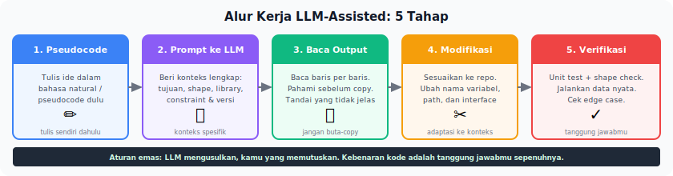
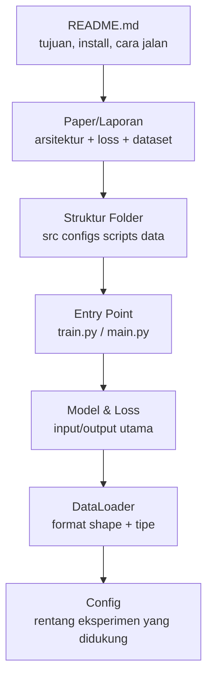
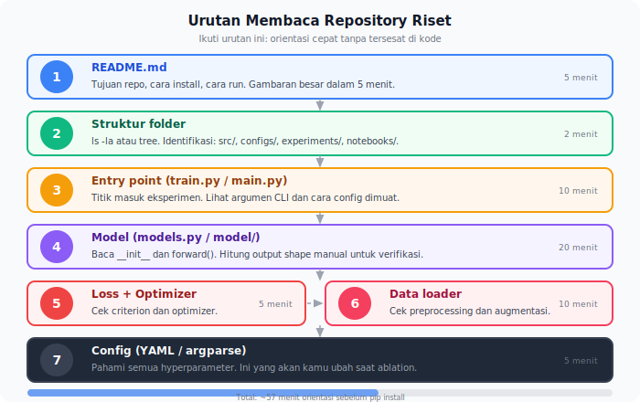
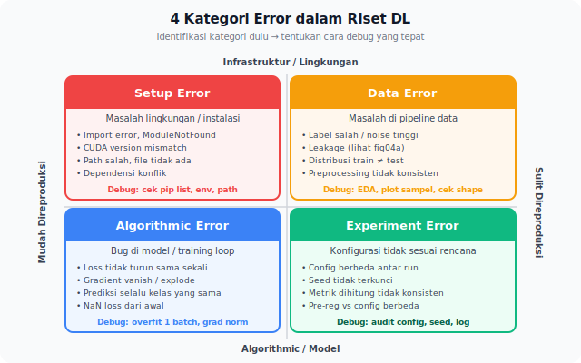

<details>
<summary>📂 Navigasi Modul (klik untuk buka)</summary>

| # | Modul | Minggu |
|---|-------|--------|
| 00 | [Pendahuluan](00_Pendahuluan.md) | 1 |
| 01 | [W1 - Tabular & Output Heads](01_W1_Tabular_Output_Heads.md) | 1 |
| 02 | [W2 - Images, CNN & Smoke Test](02_W2_Images_CNN_Smoke_Test.md) | 2 |
| 03 | [W3 - Loss, Optimizer & Evaluasi](03_W3_Loss_Optimizer_Evaluasi.md) | 3 |
| 04 | [W4 - Reproducibility & Experiment Matrix](04_W4_Reproducibility_Experiment_Matrix.md) | 4 |
| 05 | [W5 - Sequences: RNN & LSTM](05_W5_Sequences_RNN_LSTM.md) | 5 |
| 06 | [W6 - Representations & Temporal Leakage](06_W6_Representations_Temporal_Leakage.md) | 6 |
| ▶ 07 | W7 - Text, Transformers & Repo Adoption | 7 |
| 08 | [W8 - Foundation Models](08_W8_Foundation_Models.md) | 8 |
| 09 | [W9 - Multimodal Reasoning](09_W9_Multimodal_Reasoning.md) | 9 |
| 10 | [W10 - Paper Reading & Implementation](10_W10_Paper_Reading.md) | 10 |
| 11 | [W11 - Research Framing](11_W11_Research_Framing.md) | 11 |
| 12 | [Capstone - Proyek Riset](12_Capstone.md) | 12-15 |
| 13 | [Rubrik Penilaian](13_Rubrik_Penilaian.md) | – |
| 14 | [Lampiran](14_Lampiran.md) | – |
| 15 | [Panduan Instruktur](15_Panduan_Instruktur.md) | – |

</details>

---

# 07 · W7 - Text, Transformers & Repo Adoption

> *TF-IDF menunjukkan kata apa yang ada. Contextual embeddings menunjukkan apa yang dimaksud kata itu di konteks spesifik ini. Transformers mengubah teks bukan menjadi fitur, melainkan menjadi makna yang bisa dibandingkan.*

**Baris peta besar:** `(T,) -> (N,)`, `(1,)`, `(T, N)`
**Kebiasaan riset:** Verifikasi kode dari AI, inspeksi tokenisasi, petakan repositori eksternal
**Dataset:** Dataset teks Indonesia (IndoNLU SmSA)
**Lab utama:** Lab 5b (`lab_w7_text_classification.ipynb`) + Lab 6 repo adoption (`lab_w7_repo_adoption.ipynb`)

---

## 0. Peta Bab

W7 menggabungkan tiga tema yang saling memperkuat:

- **1. Text & Transformers** - dari TF-IDF ke contextual embeddings, tokenization, cara kerja attention (QKV, Transformer block), frozen vs fine-tune, [CLS] vs mean pool
- **2. Alat AI sebagai Pendukung** - verifikasi kode AI, protokol synthesis, kapan trust copilot
- **3. Pengantar Adopsi Repo** - membaca repo yang belum dikenal, `repo_map.md`, modifikasi seminimal mungkin

Ketiga tema bertemu dalam satu alur kerja: mengadopsi repo HuggingFace, memakai alat AI untuk memahami bagian yang belum dikenal, dan membuat `repo_map.md` sebagai dokumentasi pemahaman Anda.

---

## 1. Text dengan Pretrained Transformers

### 1.1 Mengapa Contextual Embeddings?

TF-IDF adalah baseline yang kuat dan sering diabaikan. Bukan tanpa alasan - ia cepat, interpretable, dan sering efektif pada dataset kecil. Tapi ia punya dua kelemahan fundamental:

**Polisemi.** Kata "bank" dalam "bank sungai" dan "bank uang" mendapat vektor yang identik. TF-IDF tidak bisa membedakannya.

**Ketergantungan antar kata hilang.** "Tidak buruk" dan "tidak baik" memiliki representasi yang sepenuhnya berbeda dari "baik" dan "buruk" dalam TF-IDF, padahal sebenarnya kita ingin model memahami bahwa negasi mengubah polaritas.

Contextual embeddings (BERT, RoBERTa, IndoBERT) menghasilkan representasi yang berbeda untuk kata yang sama tergantung konteksnya. Setiap token mendapat embedding yang dipengaruhi oleh seluruh sequence di sekitarnya via self-attention.

Pertanyaan yang sering muncul: mengapa model yang dilatih pada miliaran token teks Wikipedia dan Common Crawl bisa membantu klasifikasi sentimen teks Indonesia?

Jawabannya ada pada struktur lapisan. Layer-layer awal Transformer mempelajari pola yang bersifat umum dan berlaku lintas domain - semantik subkata ("##nya" menandai akhiran), pola sintaksis dasar (hubungan subjek-verba), dan cara negasi mengubah makna. Pola-pola ini muncul hampir di semua teks manusia, tidak bergantung pada topik. Layer-layer yang lebih dalam baru belajar hal yang lebih spesifik domain. Ketika Anda memuat bobot pretrained, layer awal sudah "paham bahasa" - tugas Anda tinggal melatih layer akhir agar memetakan pemahaman itu ke label yang diinginkan. Ini juga yang mendasari pilihan freeze vs fine-tune di §1.4: seberapa banyak lapisan yang perlu beradaptasi ke domain Anda?

### 1.2 Tokenization: Sebelum Pelatihan Dimulai

**Apa itu tokenizer?** Pretrained Transformer tidak melihat string mentah; ia melihat urutan integer (token ID). **Tokenizer** adalah fungsi yang memetakan string ke urutan integer dan sebaliknya. Tiga gaya tokenisasi utama:

- **Word-level** - satu token per kata (whitespace-split). Sederhana, tetapi vocab besar dan rentan OOV (out-of-vocabulary) untuk kata baru.
- **Character-level** - satu token per karakter. Vocab kecil, tetapi sequence sangat panjang.
- **Subword (BPE / WordPiece / SentencePiece)** - kompromi: kata umum jadi 1 token; kata jarang dipecah jadi sub-unit. Pakai oleh BERT, GPT, IndoBERT, modern Transformer hampir semuanya. Kata "tidak" mungkin 1 token; kata "tertangkap" mungkin terpisah jadi `["ter", "tangkap"]`.

Setiap pretrained model punya tokenizer spesifik (vocab + algoritma). Bug paling umum saat memakai pretrained model adalah perbedaan antara tokenizer model dan cara Anda memproses teks. Memakai tokenizer yang salah menghasilkan input yang tidak cocok dengan apa yang dilihat model saat pretraining.

```python
from transformers import AutoTokenizer

tokenizer = AutoTokenizer.from_pretrained("indobenchmark/indobert-base-p1")

# Inspeksi: lihat apa yang tokenizer lakukan pada teks
text = "Produk ini sangat bagus!"
tokens = tokenizer(text, return_tensors="pt")
print(tokenizer.convert_ids_to_tokens(tokens['input_ids'][0]))
# ['[CLS]', 'produk', 'ini', 'sangat', 'bagus', '!', '[SEP]']
```

Tugas penting W7: inspeksi tokenizer pada 5-10 sampel dari dataset Anda sebelum pelatihan. Cek:
- Apakah kata domain-spesifik ditokenisasi dengan benar (tidak terlalu di-split)?
- Apakah panjang sequence setelah tokenisasi masuk dalam batas max_length model?
- Apakah ada subword splits yang mungkin kehilangan makna?

### 1.3 Cara Kerja Attention

Pada W5, Anda sudah melihat mengapa RNN kesulitan menangani sekuens yang panjang. Masalah utamanya adalah **bottleneck informasi**: seluruh makna dari token-token sebelumnya harus dipadatkan ke dalam satu *hidden state* berukuran tetap sebelum memproses langkah berikutnya. LSTM menambahkan *gate* untuk mengelola ini, tetapi *bottleneck* itu sendiri tidak pernah hilang. Informasi tetap harus melewati setiap langkah perantara untuk mencapai akhir.

**Attention menghilangkan bottleneck tersebut sepenuhnya.** Pertimbangkan kalimat berikut: **"Buku itu tidak muat di dalam tas karena ukurannya terlalu besar."** Untuk mengetahui benda apa yang dirujuk oleh "ukurannya" (yakni buku, bukan tas), Anda tidak membaca ulang dari awal, tetapi langsung mencari kandidat yang relevan. Attention melakukan hal yang persis sama. Setiap token dapat membaca dari semua token lain dalam satu langkah, yang dibobot berdasarkan relevansinya. Tidak ada serah terima informasi secara sekuensial.

Untuk menghitung bobot relevansi ini, setiap token diproyeksikan menjadi tiga vektor dengan peran berbeda: **Query** ("apa yang saya cari?"), **Key** ("apa yang saya miliki?"), dan **Value** ("apa yang sebenarnya saya berikan?"). Skor relevansi antara dua posisi adalah *dot product* dari Query suatu token dengan Key token lainnya. *Dot product* yang besar berarti kecocokan yang kuat. Proyeksi ini dihasilkan oleh tiga matriks bobot yang dipelajari, yaitu $W_Q$, $W_K$, dan $W_V$. Ketiga matriks ini adalah satu-satunya parameter permanen di dalam layer, dan parameter inilah yang disimpan ke dalam *checkpoint* Anda.

Jika digabungkan:

$$\text{Attention}(Q, K, V) = \text{softmax}\!\left(\frac{Q K^T}{\sqrt{d_k}}\right) V$$


$QK^T$ menghasilkan matriks $(T \times T)$ yang berisi semua skor berpasangan untuk sekuens sepanjang $T$ token. Pembagian dengan $\sqrt{d_k}$ sifatnya wajib. Tanpa pembagian ini, *dot product* akan membesar seiring bertambahnya dimensi, mendorong *softmax* ke titik jenuh dan mematikan *gradient*. Ini adalah bentuk baru dari masalah *vanishing gradient* yang dibahas di W5. *Softmax* mengubah setiap baris menjadi distribusi probabilitas atas posisi (bobot attention), dan perkalian dengan $V$ menghasilkan *output*: rata-rata berbobot dari semua vektor Value, satu untuk setiap token.

Dalam kode, tanpa abstraksi *library*:

```python
import torch
import torch.nn.functional as F

X   = torch.randn(5, 16)       # 5 token, 16-dim embeddings
W_Q = torch.randn(16, 16)
W_K = torch.randn(16, 16)
W_V = torch.randn(16, 16)

Q, K, V = X @ W_Q, X @ W_K, X @ W_V

scores  = Q @ K.T / Q.shape[-1] ** 0.5  # (5, 5)
weights = F.softmax(scores, dim=-1)      # (5, 5) - jumlah tiap baris adalah 1
output  = weights @ V                   # (5, 16) - dimensi sama seperti input
```

Cetak `weights`. Baris *i* adalah distribusi probabilitas yang menunjukkan seberapa besar perhatian token *i* ke setiap posisi saat membentuk *output*-nya.

**Posisi attention dalam arsitektur penuh.** Satu layer attention adalah satu komponen di dalam blok Transformer:

```
Input (T, d_model)
      |
 [ LayerNorm ]
      |
 [ Self-Attention ]   <- satu-satunya tempat token berinteraksi satu sama lain
      |
 [ Residual Add ]     <- skip connection, perannya sama seperti di ResNet (W2)
      |
 [ LayerNorm ]
      |
 [ Feed-Forward ]     <- dua linear layer, diterapkan secara mandiri per token
      |
 [ Residual Add ]
      |
Output (T, d_model)
```

Dimensi input dan *output* selalu sama, itulah sebabnya blok ini dapat ditumpuk hingga 12 atau 24 lapis tanpa memerlukan perubahan di antaranya. Perhatikan bahwa layer *feed-forward* tidak mencampur token, hanya layer attention yang melakukannya. Dalam praktiknya, model menjalankan operasi attention paralel sebanyak $h$ kali (*multi-head attention*). Masing-masing berjalan pada subruang representasi dengan dimensi yang lebih rendah, kemudian menggabungkan dan memproyeksikan hasilnya. Setiap *head* dapat menangkap pola struktural yang berbeda, meskipun spesialisasi yang rapi tidak secara otomatis dijamin oleh rancangannya. Saat satu sekuens memperhatikan sekuens lain (misalnya Q dari satu sekuens, lalu K dan V dari sekuens lainnya), proses ini disebut *cross-attention*. Anda akan melihat penerapannya di W9 untuk fusi multimodal.

**Mengapa Transformer memerlukan *positional encoding*.** Perhatikan apa yang tidak dilakukan attention: ia tidak memiliki konsep urutan. Skor antara token *i* dan token *j* hanya bergantung pada vektor Q dan K keduanya, bukan pada posisi mereka dalam sekuens. Artinya, "anjing menggigit orang" dan "orang menggigit anjing" menghasilkan input attention yang identik - himpunan token yang sama, tanpa urutan. RNN tidak pernah menghadapi masalah ini karena ia memproses token satu langkah demi satu langkah dan secara implisit mengetahui posisi. Karena Transformer memproses semua token secara paralel, informasi posisi harus disuntikkan secara eksplisit. *Positional encoding* menambahkan vektor yang bergantung pada posisi ke setiap *token embedding* sebelum masuk ke blok pertama, sehingga model mendapatkan informasi urutan sekuens yang tidak bisa diperoleh dari attention saja.

**Dampak saat Anda melakukan freeze atau fine-tune.** Melakukan *freeze* pada model berarti mengunci $W_Q, W_K, W_V$ (beserta parameter lainnya). Proyeksi yang menghasilkan Q, K, dan V terkunci, sehingga kalkulasi attention tetap berjalan tetapi tidak bisa beradaptasi dengan domain Anda. Sebaliknya, *fine-tune* memungkinkan matriks-matriks ini beradaptasi agar bobot attention bisa menangkap hubungan yang dibutuhkan oleh tugas Anda. Matematika di balik attention tidak pernah berubah, hanya matriks proyeksinya saja yang berubah.

Lab 6b (`lab_w7_transformer_mini.ipynb`) menugaskan Anda untuk menerapkan `scaled_dot_product_attention` dari awal dan memverifikasinya terhadap `nn.TransformerEncoderLayer`. *Notebook* tersebut merupakan praktik langsung yang mendampingi bagian ini.

### 1.4 Frozen vs Fine-tuned: Eksperimen 2x2

Dua keputusan yang perlu dibandingkan:

**Frozen backbone** - hanya head kecil yang dilatih memakai embedding tetap. Cepat, murah, stabil. Cocok untuk dataset kecil atau ketika domain sangat mirip dengan pretraining.

**Fine-tuned** - seluruh model (atau sebagian) dilatih bersama head. Lebih lambat, lebih fleksibel, sering lebih baik pada dataset cukup besar.

> [!TIP]
> **Contoh waktu/biaya konkret (IndoBERT-base, ~110M parameter, dataset SmSA ~12k sampel, GPU T4):**
> - **Frozen + Linear head** - training ~2-3 menit (1 epoch), val macro-F1 ~0.78-0.82. Inference ~5 ms/sample (forward pass tetap full BERT, tetapi tidak perlu backward).
> - **Fine-tune full** - training ~15-25 menit (3 epoch), val macro-F1 ~0.85-0.89. Memori GPU ~3-4× lebih besar (perlu simpan gradient untuk semua parameter).
> 
> Aturan praktis: kalau dataset < 5k sampel atau Anda butuh prototype cepat, **frozen** dulu. Kalau dataset > 20k atau butuh squeeze last 3-5% performa, **fine-tune**. Antara keduanya: PEFT seperti LoRA (W8) sebagai jalan tengah.

**[CLS] pooling** - menggunakan token `[CLS]` sebagai representasi seluruh sequence. Ini token spesial yang ditambahkan otomatis di awal setiap input oleh tokenizer keluarga BERT. Selama pretraining BERT, model belajar menaruh ringkasan global di posisi ini lewat objective next-sentence prediction; itu sebabnya `[CLS]` jadi pilihan natural untuk classification head.

**Mean pooling** - rata-rata embedding semua token (kecuali padding). Sering lebih robust untuk sentence similarity tasks (representasi tidak terlalu "berat sebelah" ke satu posisi), tetapi bisa kehilangan ketegasan kalau cuma sebagian token yang relevan untuk task. Untuk classification, [CLS] dan mean pool biasanya beda 1-3 poin F1; mana yang menang bergantung dataset. Lab 5b membuat 2×2 ini eksplisit supaya Anda bisa lihat sendiri pada dataset Indonesia.

Lab 5b menjalankan 2×2 ini secara eksplisit:

| | frozen | fine-tuned |
|---|---|---|
| [CLS] | kondisi A | kondisi B |
| mean pool | kondisi C | kondisi D |

### 1.5 Big Map untuk Teks

Tiga formulasi umum di domain teks:

| Tugas | Input | Output | Contoh |
|---|---|---|---|
| Sentence classification | `(T,)` tokens | `(N,)` | Sentimen, topik |
| Token classification | `(T,)` tokens | `(T, N)` | NER, POS tagging |
| Regression dari teks | `(T,)` tokens | `(1,)` | Scoring, rating |

---

## 2. Alat AI sebagai Pendukung (Ringkasan Protokol)

Modul ini tidak melarang AI coding tools. Ia mewajibkan **protokol verifikasi** dan **synthesis sebelum eksekusi**.

### 2.1 Aturan Verifikasi

Setiap kode yang dihasilkan AI harus diverifikasi sebelum dipakai:

1. **Verifikasi bentuk tensor** - apakah input/output shape yang diklaim cocok dengan kode?
2. **Uji kasus tepi** - jalankan dengan satu sampel dan periksa hasilnya secara manual.
3. **Baris-per-baris read** - Anda harus bisa menjelaskan fungsi setiap baris.

Jika tidak bisa menjelaskan baris tertentu setelah membacanya dua kali, itu bukan kode yang harus dikumpulkan dengan nama Anda.

### 2.2 Aturan Sintesis: Dua Sumber Sebelum Eksekusi

Sebelum mengeksekusi pendekatan penting (pemilihan model, arsitektur, strategi fine-tuning), kumpulkan setidaknya dua sumber berbeda:

- Dua respons AI dengan prompt berbeda, **atau**
- Satu respons AI + satu sumber dokumentasi/paper, **atau**
- Satu respons AI + satu peer review

Tulis satu paragraf synthesis: "Sumber A menyarankan X karena P. Sumber B menyarankan Y karena Q. Saya memilih Z karena R." Paragraf ini bukan overhead - ia adalah bukti Anda berpikir sebelum eksekusi.

### 2.3 AI untuk Non-Kode

Alat AI berguna melampaui kode:
- **Membaca paper** - "tolong rangkum bagian 3.2 dan identifikasi asumsi yang tidak diucapkan eksplisit"
- **Mendiskusikan hipotesis** - "diberikan bahwa distribusi kelas sangat tidak seimbang, apakah ada alasan untuk tidak memakai focal loss?"
- **Navigasi repo** - "bagaimana alur data dari DataLoader ke model dalam repo ini?" (dengan memberikan struktur folder sebagai konteks)



---

## 3. Pengantar Adopsi Repo

Konten repo adoption dari bab ini (urutan membaca, environment setup, modifikasi seminimal mungkin) tersedia pada bagian ini dari file asli. Ringkasan kebiasaan utama:

**Urutan baca:** README → paper/laporan → struktur folder → entry point (`train.py`) → model & loss → DataLoader

**repo_map.md template:** Dokumentasikan pemahaman Anda tentang repo baru dalam file `repo_map.md`. Template tersedia di [Lampiran C.12](14_Lampiran.md#c12-template-repo-map). Anda akan membuat `repo_map.md` dua kali: satu di W7 (repo teks/transformer), satu di W9 (repo multimodal).

**Modifikasi seminimal mungkin:** Buat branch baru, buat perubahan sekecil mungkin untuk menjalankan eksperimen Anda, dokumentasikan diff. Ini memudahkan merge kembali dan memudahkan debugging saat sesuatu rusak.

---

## 4. Lab

### Lab 5b - Text Classification IndoNLU (lab utama W7)

Buka `notebooks/lab_w7_text_classification.ipynb`.

**Tugas:**
1. Muat dataset IndoNLU SmSA (sentimen Bahasa Indonesia).
2. Inspeksi tokenizer IndoBERT pada 10 sampel: screenshot atau print output.
3. Jalankan 2×2 experiment (frozen/fine-tune × [CLS]/mean-pool).
4. Bandingkan macro-F1 keempat kondisi. Mana yang terbaik? Mengapa?
5. Buat synthesis note: dua alasan memilih IndoBERT vs alternatif lain.

**Checklist:**
- [ ] Tokenization inspection dengan 10+ sampel.
- [ ] 4 kondisi trained, macro-F1 tersimpan.
- [ ] 2×2 tabel dalam notebook.
- [ ] Synthesis note (2 AI views atau 1 AI + 1 dokumentasi).
- [ ] **Lab 6b (Transformer-mini, breadth)** dijalankan selesai - WAJIB untuk Breadth Check Transformer (lihat Kontrak Belajar §6 Pendahuluan dan §D5 di bab ini).

### Lab 6 - Pengantar Adopsi Repo

Buka `notebooks/lab_w7_repo_adoption.ipynb`.

**Tugas:**
1. Clone satu repositori riset publik (daftar pilihan disediakan di lab).
2. Tulis `repo_map.md`: entry point, model, loss, config, DataLoader.
3. Modifikasi minimal satu komponen (ganti config, tambah logging).
4. Buat branch git, commit diff, inspeksi diff sebelum merge.

---

## 5. Komponen Mandiri

Format: [Lampiran C.9](14_Lampiran.md#c9-template-komponen-mandiri).

| Jalur | Tugas |
|---|---|
| **Implementasi** | Implementasikan Lab 6b (Transformer-mini from-scratch). Breadth check untuk keluarga Transformer. |
| **Analisis** | Analisis attention weights pada Lab 5b: token apa yang paling diperhatikan model saat memprediksi sentimen positif vs negatif? |
| **Desain** | Rancang eksperimen: IndoBERT vs mBERT vs XLM-R untuk sentimen Indonesia. Apa hipotesis Anda? |
| **Arsitektur Baru** | Lab 6b (Transformer-mini) - jika belum dikerjakan. |

---

## 6. Refleksi

1. Anda mendapat dataset teks medis dalam Bahasa Indonesia (10.000 sampel, 5 kelas). IndoBERT atau BioBERT yang akan Anda coba pertama? Tulis justifikasi satu paragraf menggunakan framework dari W8 Foundation Models yang akan datang.
2. AI tool memberikan kode tokenisasi yang "terlihat benar". Setelah inspeksi, Anda menemukan ia menghilangkan token [CLS] sebelum pooling. Apakah ini selalu salah? Kapan bisa diterima?
3. `repo_map.md` yang Anda tulis di W7: seberapa berbeda dari yang akan Anda tulis di W9 (repo multimodal)? Apa yang berubah dalam cara Anda membaca repo saat ada lebih dari satu modalitas?

---

## 7. Bacaan Lanjutan

- **Devlin et al. - *BERT: Pre-training of Deep Bidirectional Transformers*** (2018). Baca Abstract + bagian 3 (pretraining) + bagian 4.1 (fine-tuning). Lewati appendix.
- **HuggingFace - *Course Chapter 2: Using Transformers***. Tutorial interaktif untuk tokenizer dan pipeline HuggingFace.
- **Khoirunisa et al. - *IndoNLU: Benchmark and Resources for Evaluating Indonesian NLP*** (2020). Konteks untuk Lab 5b dataset.

---

# Pendalaman W7 - Repo Adoption Deep Dive

Bagian sebelumnya memperkenalkan tiga tema W7 secara ringkas. Pendalaman berikut khusus untuk tema Repo Adoption - tema dengan kurva belajar paling curam dan dampak paling besar pada produktivitas riset Anda di semester berikutnya. Anda boleh membaca bagian ini di W7, atau menundanya sebagai referensi saat Capstone (W12-W15) ketika harus mengadopsi repo orang lain.

---

## D1. Motivasi: Dua Minggu yang Seharusnya Empat Jam

Seorang asisten baru di lab menerima tugas: "reproduksi hasil paper X, lalu coba ganti encoder-nya dengan ViT". Link repo dilampirkan. Mahasiswa itu meng-clone, menjalankan `pip install -r requirements.txt`, error. Melacak error, menemukan versi CUDA tidak cocok; reinstall PyTorch. Error lagi, kali ini library `mmcv` minta versi spesifik. Setelah tiga hari gulat dengan setup, akhirnya `python train.py` jalan - tetapi dataset tidak terunduh otomatis, dokumentasi tentang lokasi data tidak ada, mahasiswa harus membaca 400 baris kode data loader untuk melihat path yang diharapkan. Hari ketujuh, eksperimen baseline akhirnya jalan. Dua minggu berlalu sebelum modifikasi pertama bisa dicoba.

Mahasiswa kedua dapat tugas sama. Ia meluangkan empat jam pertama *tidak menjalankan apa-apa*: membaca README, memeriksa struktur folder, menelusuri `train.py` dari entry point, mencari bagian konfigurasi, memetakan bagaimana data di-load. Ia mencatat pertanyaan-pertanyaan terbuka. Setelah pemahaman peta terbentuk, ia setup environment secara sistematis, menjalankan smoke test dengan dummy data, dan baru mengunduh dataset penuh. Dua hari berikutnya, modifikasi encoder sudah bisa dicoba.

Perbedaan kecepatan tujuh kali lipat bukan karena bakat. Perbedaannya adalah *strategi membaca* sebelum menjalankan. Bab ini memberi Anda strategi yang sama.

---

## D2. Konsep Inti

### 2.1 Urutan Membaca: Dari Luar ke Dalam

Ketika membuka repo baru, tahan godaan untuk langsung menjalankan. Baca dulu, dengan urutan yang dipikirkan:



**1. README.md.** Baca seluruhnya, bahkan jika pendek. Fokus pada: tujuan proyek, cara install, cara jalan, format data yang diharapkan, link ke paper atau dokumentasi tambahan. Catat apa yang tidak jelas.

**2. Paper atau laporan terkait.** Jika repo adalah hasil paper, baca abstrak + bagian *method*. Anda tidak perlu paham semua detail; tujuan baca adalah mengetahui *apa yang harus ada di kode*: arsitektur utama, loss utama, dataset utama.

**3. Struktur folder.** Dari root, buka file dan direktori satu level. Konvensi umum:

- `src/` atau folder nama proyek: kode inti.
- `configs/`: hyperparameter dan setting.
- `scripts/`: entry point untuk training/evaluasi.
- `data/`: dataset (sering tidak di-commit, hanya skrip download).
- `experiments/` atau `runs/`: hasil eksperimen.
- `tests/`: unit test.
- `notebooks/`: eksplorasi.
- `requirements.txt` atau `environment.yml` atau `pyproject.toml`: dependency.

**4. Entry point.** File yang dijalankan user pertama kali - biasanya `train.py`, `main.py`, atau `scripts/train.sh`. Baca dari atas ke bawah. Cari: parsing argumen, pembuatan model, pembuatan dataset, training loop. Catat panggilan ke file lain.

**5. File model dan loss.** Dari entry point, ikuti jejak ke `models/` dan `losses/`. Baca definisi kelas utama, *jangan* dulu setiap fungsi helper. Cukup tahu input dan output-nya.

**6. Data loader.** Biasanya file yang paling kompleks. Baca sampai Anda mengerti format input (shape, tipe) yang diharapkan model.

**7. Konfigurasi.** Buka satu file config; pahami struktur. Ini memberitahu Anda rentang eksperimen yang didukung repo.

Alokasi waktu tipikal untuk repo ukuran sedang (10-30 file Python): 30-60 menit membaca sebelum `pip install`.



### 2.2 Memetakan Struktur dalam 15 Menit

Setelah langkah 1-3 di atas, Anda bisa menggambar peta singkat. Contoh untuk repo hipotetis:

```
repo/
├── src/
│   ├── data.py          (CIFAR10Dataset, load_cifar)
│   ├── models/
│   │   ├── resnet.py    (ResNet18, dari torchvision)
│   │   └── vit.py       (ViTCustom, kontribusi paper)
│   ├── losses.py        (FocalLoss, SupConLoss)
│   ├── train.py         (ENTRY POINT)
│   └── utils.py         (set_seed, logging helper)
├── configs/
│   ├── baseline.yaml    (ResNet18 + CE)
│   ├── focal.yaml       (ResNet18 + Focal)
│   └── vit.yaml         (ViTCustom + CE)
├── scripts/
│   └── download_data.sh
└── README.md
```

Peta seperti ini memberi Anda jawaban cepat untuk pertanyaan:

- "Di mana saya mengubah loss?" → `losses.py` dan `configs/*.yaml`.
- "Bagaimana saya ganti backbone jadi ViT?" → `models/vit.py` sudah ada; cek `configs/vit.yaml`.
- "Dataset apa yang dipakai?" → `data.py` + `scripts/download_data.sh`.

Gambarkan peta di kertas atau `notes.md`. Peta ini akan dirujuk berulang.

### 2.3 Smoke Test Sebelum Pelatihan Penuh

Setelah environment terpasang, *jangan* langsung training dengan dataset penuh. Jalankan *smoke test* - versi minimal yang memverifikasi seluruh pipeline jalan tanpa error.

Tiga tingkat smoke test:

#### Level 1 - Import test

```bash
python -c "from src.models import ResNet18; from src.losses import FocalLoss"
```

Jika error di sini, masalah dependency atau path, bukan logika.

#### Level 2 - Forward pass dengan dummy data

```python
import torch
from src.models import ResNet18

model = ResNet18(num_classes=10)
x = torch.randn(2, 3, 32, 32)   # batch 2 dummy
y = model(x)
assert y.shape == (2, 10)
```

Menangkap bug dimensi atau mismatch input/output.

#### Level 3 - Satu iterasi training

Modifikasi entry point untuk menjalankan satu batch, satu backward pass, lalu exit. Banyak repo punya flag `--dry-run` atau `--overfit-one-batch`. Jika tidak ada, tambahkan sendiri:

```python
# Di awal training loop:
if args.dry_run:
    xb, yb = next(iter(loader))
    out = model(xb)
    loss = criterion(out, yb)
    loss.backward()
    optimizer.step()
    print(f"Dry run OK. loss={loss.item():.4f}")
    sys.exit(0)
```

Teknik "overfit one batch" (Karpathy, 2019) lebih kuat: training loop biasa tetapi selalu pada satu batch kecil. Dalam beberapa epoch, loss harus turun ke nol (atau sangat kecil). Jika tidak, ada bug fundamental - bukan di tuning, tetapi di kode.

### 2.4 Menavigasi Kode dengan Cepat

Beberapa teknik pragmatis untuk memahami kode tanpa membaca semuanya:

**`grep`** / **`rg`** untuk menemukan definisi:

```bash
rg "class ResNet18" src/
rg "def forward" src/models/
rg "CrossEntropyLoss|FocalLoss" src/
```

**Pohon panggilan dengan `grep`:**

```bash
# Siapa yang memanggil build_model?
rg "build_model\(" src/
```

**Search IDE (VS Code: `Ctrl+T`).** Jauh lebih cepat daripada `grep` untuk simbol Python.

**Type checker (`pyright` atau `mypy`):**

```bash
pyright src/
```

Walau kode tidak punya type hints, pyright sering menunjukkan inkonsistensi yang memberi petunjuk tentang niat.

**Git log untuk memahami evolusi:**

```bash
git log --oneline src/models/vit.py
git log --follow src/losses.py
```

Commit history memberitahu *mengapa* kode menjadi bentuk sekarang - sering jawaban atas "kenapa ada fungsi aneh ini".

**`git blame`** untuk menemukan author:

```bash
git blame src/train.py
```

Jika satu bagian membingungkan, lihat siapa yang menulisnya dan commit apa yang menambahkannya. Pesan commit sering mengandung konteks.

### 2.5 Modifikasi Seminimal Mungkin

Saat Anda menambah fitur atau mengubah perilaku, pilih pola yang *tidak mengganggu* kode orang lain. Ini penting untuk:

- Memudahkan *upstream merge* jika repo berubah.
- Membuat pekerjaan Anda dapat dibalik (revert) dengan bersih.
- Membuat pull request Anda lebih mudah di-review.

**Pola 1: Tambahkan opsi, jangan ubah default.**

Buruk - mengubah perilaku fungsi yang sudah ada:

```python
# Lama:
def train_one_epoch(model, loader, criterion):
    for xb, yb in loader:
        ...

# Ubah jadi:
def train_one_epoch(model, loader, criterion):
    for xb, yb in loader:
        xb, yb = apply_mixup(xb, yb)   # SELALU mixup sekarang
        ...
```

Baik - tambah argumen dengan default yang mempertahankan perilaku lama:

```python
def train_one_epoch(model, loader, criterion, use_mixup: bool = False):
    for xb, yb in loader:
        if use_mixup:
            xb, yb = apply_mixup(xb, yb)
        ...
```

**Pola 2: Tambahkan file baru, jangan edit banyak file lama.**

Jika fitur Anda melibatkan 200 baris kode, buat `src/mixup.py` baru daripada menyebar perubahan di `train.py`, `data.py`, dan `utils.py`.

**Pola 3: Tambahkan argumen CLI, bukan hardcode.**

```python
# Di argparse:
parser.add_argument('--freeze-blocks', type=str, default='',
                    help='Comma-separated block names to freeze (e.g. "block1,block2")')

# Di main:
if args.freeze_blocks:
    for name in args.freeze_blocks.split(','):
        freeze_module(getattr(model, name.strip()))
```

Fitur yang ter-expose via CLI dapat dimatikan tanpa menyentuh kode lagi.

**Pola 4: Commit kecil dengan pesan jelas.**

Satu commit per perubahan logis. "Add mixup augmentation support" adalah satu commit; "refactor data loader to accept mixup-aware sampler" adalah commit berbeda. Commit kecil memudahkan review dan bisection.

### 2.6 Ketika Dokumentasi Minim atau Tidak Ada

Banyak repo riset hanya punya README satu paragraf. Taktik saat Anda harus memakai atau memodifikasinya:

**Baca `requirements.txt` sebagai petunjuk teknologi.** Tergantung library yang dipakai, Anda bisa menebak: `pytorch-lightning` → kode terstruktur rapi per fase; `hydra-core` → config kompleks multi-file; `wandb` → logging di cloud.

**Periksa `tests/` bila ada.** Test sering mendokumentasikan ekspektasi. Satu test yang lulus memberitahu Anda setidaknya satu cara memanggil fungsi yang benar.

**Cari issue dan PR di GitHub.** Pertanyaan dari user lain sering menjawab "bagaimana X dipakai" yang tidak ada di README.

**Coba `--help`.** Banyak repo punya argparse yang dokumentasi-dirinya sendiri. `python train.py --help` sering memberi peta yang cukup.

**Hubungi penulis.** Repo akademik biasanya punya email kontak. Satu pesan singkat dan jujur ("saya mahasiswa, mencoba mereproduksi hasil pada dataset X, stuck di Y") sering dijawab. Berikan konteks yang cukup; jangan minta bantuan generik.

### 2.7 Menyumbang Kembali

Setelah Anda memahami repo cukup baik untuk memodifikasi, Anda juga bisa menyumbang perbaikan kecil. Tiga jenis kontribusi yang hampir selalu diterima:

**Perbaikan dokumentasi.** README, docstring, komentar. Bug paling sering adalah dokumentasi yang keliru atau tidak lengkap. Anda yang baru saja mengadopsi repo paling tahu apa yang membingungkan.

**Perbaikan bug kecil.** Typo, off-by-one, import yang salah, versi library yang di-pin terlalu ketat. Satu PR per perbaikan.

**Fitur yang umum diinginkan.** Jika repo belum punya `--dry-run` atau `set_seed` yang deterministik, tambahkan. Jelaskan motivasi di deskripsi PR.

Etika kontribusi: sebelum mengirim PR besar, buka issue dulu menanyakan apakah kontribusi semacam itu akan diterima. Menghemat waktu Anda dan maintainer.

### 2.8 Kategori Error dan Cara Tesnya

Ketika adopsi repo atau eksperimen gagal, respons pertama yang paling sering adalah: "ada yang salah di suatu tempat, coba-coba sampai ketemu". Ini tidak efisien. Lebih cepat untuk mengidentifikasi *kategori* error dulu, karena tiap kategori punya diagnosis yang berbeda.

#### Kategori 1 - Setup Error

Environment, dependency, path, atau konfigurasi tidak benar.

- **Tanda:** error saat `import`, `ModuleNotFoundError`, `FileNotFoundError`, CUDA version mismatch.
- **Langkah uji:**
  1. Jalankan `python -c "import torch; print(torch.__version__)"` dan `import [nama_library]`.
  2. Bandingkan output `pip freeze` dengan `requirements.txt`.
  3. Cek apakah path dataset di config benar.

#### Kategori 2 - Data Error

Dataset tidak ada, format tidak sesuai, leakage, atau preprocessing berbeda dari yang diharapkan model.

- **Tanda:** error di DataLoader, akurasi terlalu tinggi dari awal, loss tidak wajar (terlalu kecil atau NaN langsung).
- **Langkah uji:**
  1. Print shape dan range nilai dari batch pertama.
  2. Visualisasikan 4-8 sampel - pastikan gambar/teks kelihatan wajar.
  3. Periksa label: apakah distribusinya masuk akal?

#### Kategori 3 - Algorithmic Error

Bug di forward pass, loss function, atau training loop.

- **Tanda:** loss tidak turun sama sekali, NaN loss, prediksi selalu kelas yang sama, gradient nol.
- **Langkah uji:** *overfit one batch* - ambil 4 sampel, jalankan 100-200 iterasi hanya pada itu. Model harus mencapai loss mendekati nol. Jika tidak, ada bug di model atau loss.

#### Kategori 4 - Experiment Error

Konfigurasi tidak sesuai rancangan: seed tidak di-set, variabel yang seharusnya dikontrol tidak terkontrol, metrik yang dilaporkan bukan yang direncanakan.

- **Tanda:** hasil yang tidak bisa direproduksi, metrik berbeda dari yang ada di pre-registration, kondisi ablation tidak sesuai grid.
- **Langkah uji:** baca ulang pre-registration dan bandingkan dengan config YAML yang benar-benar dipakai. Cek commit hash di checkpoint.

Tabel ringkas untuk referensi cepat:

| Gejala | Kategori Paling Mungkin | Quick Test |
| --- | --- | --- |
| `ImportError` atau `ModuleNotFoundError` | Setup | `pip list` |
| Loss NaN dari epoch pertama | Data atau Algorithmic | Print nilai batch; cek loss_fn |
| Akurasi 99% tanpa training | Data (leakage) | Cek preprocessing |
| Hasil tidak bisa direproduksi | Experiment | Bandingkan config + seed |
| Loss tidak turun sama sekali | Algorithmic atau Setup | Overfit one batch |
| Error saat membaca dataset | Data atau Setup | Print path config |



---

## D3. Worked Example: Mengadopsi Repo Hipotetis `vision-baseline`

Misalkan Anda menerima tugas: *"Gunakan repo `vision-baseline` dari lab kita. Tambahkan opsi memakai focal loss. Hasilkan baseline + ablation pada CIFAR-10."*

> **Latihan paralel di repo yang sebenarnya.** Contoh ini memakai repo hipotetis agar fokus pada pola, bukan detail library. Untuk latihan di kode yang sebenarnya, clone salah satu berikut dan ikuti langkah yang sama (pemetaan, entry point, peta panggilan, titik injeksi modifikasi) secara paralel:
>
> - **`rwightman/pytorch-image-models` (timm)** - `github.com/huggingface/pytorch-image-models`. Ratusan model klasifikasi gambar; entry point `train.py` di root. Banyak dipakai di paper visi.
> - **`huggingface/transformers`** - `github.com/huggingface/transformers`. Skala jauh lebih besar; cocok bila Capstone Anda di domain teks. Mulai dari `examples/pytorch/text-classification/run_classification.py` - itu skeleton yang paling mudah diadaptasi.
> - **`facebookresearch/moco`** - `github.com/facebookresearch/moco`. Self-supervised learning, lebih kecil dari timm, cocok bila ingin memahami pola "riset research code" yang ditulis author paper langsung.
>
> Tujuan bukan mengerti keseluruhan repo - itu akan makan berminggu-minggu. Tujuannya menerapkan kerangka 4-menit, 15-menit, 30-menit di bawah pada kode yang berbeda dari `vision-baseline` agar Anda melihat bahwa polanya memang berulang.

### 3.1 Menit 0-15: Pemetaan

Clone repo, buka di editor. Baca README:

> # vision-baseline
>
> Minimal PyTorch training pipeline for image classification.
> Supports CIFAR-10, CIFAR-100, ImageNet-100.
> Install: `pip install -e .`
> Run: `python -m vision_baseline.train --config configs/cifar10.yaml`

Periksa struktur:

```
vision-baseline/
├── vision_baseline/
│   ├── __init__.py
│   ├── data.py
│   ├── models/
│   │   ├── __init__.py
│   │   └── resnet.py
│   ├── train.py
│   └── utils.py
├── configs/
│   └── cifar10.yaml
├── pyproject.toml
└── README.md
```

Tidak ada `losses.py` - loss mungkin di `train.py`. Tidak ada `tests/`. Sepuluh menit membaca: cukup ringkas.

### 3.2 Menit 15-30: Entry Point dan Peta Panggilan

Buka `vision_baseline/train.py`:

```python
def main(cfg):
    set_seed(cfg['seed'])
    model = build_model(cfg['model'])
    train_loader, val_loader = build_dataloaders(cfg['data'])
    criterion = nn.CrossEntropyLoss()       # <-- di sini loss
    optimizer = torch.optim.AdamW(model.parameters(), **cfg['optim'])
    
    for epoch in range(cfg['training']['epochs']):
        train_loss = train_one_epoch(model, train_loader, criterion, optimizer)
        val_acc = evaluate(model, val_loader)
        ...
```

Loss hardcoded sebagai `CrossEntropyLoss`. Ini titik modifikasi.

### 3.3 Menit 30-60: Persiapan dan Smoke Test

```bash
conda create -n visionbase python=3.10 -y
conda activate visionbase
pip install -e .
```

Test level 1:

```bash
python -c "from vision_baseline.models import build_model"
# OK
```

Test level 3 (dry run):

```bash
python -m vision_baseline.train --config configs/cifar10.yaml --dry-run
```

Flag `--dry-run` tidak ada - Anda tambahkan (pola 3 di bagian 2.5):

```python
# Di argparse
parser.add_argument('--dry-run', action='store_true')

# Di training loop
if args.dry_run:
    xb, yb = next(iter(train_loader))
    loss = criterion(model(xb.to(device)), yb.to(device))
    loss.backward()
    print(f'Dry run OK. loss={loss.item():.4f}')
    return
```

Jalankan ulang: output `Dry run OK. loss=2.31`. Pipeline jalan.

### 3.4 Menit 60-120: Modifikasi Seminimal Mungkin

Tambah file baru `vision_baseline/losses.py`:

```python
import torch
import torch.nn as nn
import torch.nn.functional as F

class FocalLoss(nn.Module):
    def __init__(self, gamma: float = 2.0):
        super().__init__()
        self.gamma = gamma
    
    def forward(self, logits, targets):
        ce = F.cross_entropy(logits, targets, reduction='none')
        pt = torch.exp(-ce)
        return ((1 - pt) ** self.gamma * ce).mean()

def build_loss(cfg):
    name = cfg.get('name', 'ce')
    if name == 'ce':
        return nn.CrossEntropyLoss()
    if name == 'focal':
        return FocalLoss(gamma=cfg.get('gamma', 2.0))
    raise ValueError(f'Unknown loss: {name}')
```

Ubah `train.py` minimal:

```python
# Lama:
criterion = nn.CrossEntropyLoss()

# Baru:
from vision_baseline.losses import build_loss
criterion = build_loss(cfg.get('loss', {'name': 'ce'}))
```

Gunakan `cfg.get(...)` dengan default - config lama yang tidak punya key `loss` tetap jalan (backward-compatible).

Tambah `configs/cifar10_focal.yaml`:

```yaml
# ... baris-baris lain sama seperti cifar10.yaml
loss:
  name: focal
  gamma: 2.0
```

### 3.5 Menit 120-180: Eksperimen dan Laporan

Jalankan baseline dan focal:

```bash
python -m vision_baseline.train --config configs/cifar10.yaml
python -m vision_baseline.train --config configs/cifar10_focal.yaml
```

Ulangi dengan tiga seed masing-masing (via override CLI). Agregasi hasil. Tulis laporan.

Total: ~3 jam dari clone sampai laporan pertama. Bandingkan dengan "dua minggu" di cerita motivasi.

---

## D4. Pitfalls & Miskonsepsi

**"Saya akan jalankan dulu, baru baca kalau error."** Strategi ini membuat Anda terbiasa dengan bentrok permukaan (versi library, path, typo). Anda menghabiskan hari-hari mengatasi masalah yang sebenarnya akan hilang dengan satu jam membaca.

**"Mengedit `train.py` langsung adalah cara tercepat."** Cepat untuk eksperimen sekali, mahal untuk jangka panjang. Setiap perubahan di tengah file besar adalah utang teknis; dalam dua minggu Anda tidak akan ingat mana modifikasi Anda dan mana dari repo asli.

**"PR tidak diterima berarti pekerjaan saya sia-sia."** Tidak. Anda belajar membaca dan memodifikasi kode, yang merupakan keterampilan jangka panjang. PR yang ditolak sering kali tetap dipakai sebagai basis diskusi; maintainer kadang mengambil ide Anda dan mengimplementasi ulang sesuai standar repo.

**"Saya tidak perlu commit lokal sampai semua selesai."** Buruk. Commit kecil sepanjang proses adalah titik-simpan - jika modifikasi Anda merusak sesuatu, Anda bisa `git diff HEAD~3` untuk melihat persis apa yang berubah.

**"Saya bisa selesaikan tanpa smoke test, langsung training penuh."** Training penuh 8 jam yang gagal di menit ke-10 karena bug dimensi adalah delapan jam yang hilang. Smoke test level 3 butuh 30 detik; ia menangkap 80% bug setup.

**"Kode orang lain yang rumit pasti bagus."** Tidak selalu. Kadang kompleksitas adalah tumpukan patch atas bug lama. Jangan ragu menyederhanakan jika Anda memahami alasan aslinya.

**"Versi library yang di-pin di `requirements.txt` harus persis diikuti."** Kadang ya (untuk reproduksi hasil), kadang tidak (jika Anda bekerja di proyek downstream yang perlu versi lebih baru). Baca pin dengan kritis - apakah angka eksperimen yang Anda cari bergantung padanya?

---

## D5. Lab 6 - Mengadopsi dan Memodifikasi Repo Eksternal

Buka [Lab 6 - Adopsi dan Modifikasi Repo Eksternal](template_repo/notebooks/lab_w7_repo_adoption.ipynb).

Tugas:

1. Pilih satu repository klasifikasi image yang sederhana (pytorch/examples/mnist, atau reference implementation Fast.ai beginner). Clone ke folder Anda.
2. Ikuti urutan pembacaan (README → struktur → entry point → model → data → config). Tulis peta satu halaman di `docs/repo_map.md`.
3. Jalankan smoke test tiga level. Jika `--dry-run` tidak ada, tambahkan sendiri dan commit.
4. Tambahkan satu fitur seminimal mungkin: pilihan focal loss, atau pilihan freeze layer pertama, atau flag deterministik (set_seed + cudnn.deterministic).
5. Jalankan baseline + variasi Anda (2 kondisi × 2 seed). Laporkan hasil dalam `docs/report.md`.
6. Siapkan draft deskripsi PR (tidak perlu benar-benar dikirim kecuali Anda ingin) yang menjelaskan: motivasi, perubahan, cara pakai, cara reproduksi hasil.

**Checklist verifikasi**:

- `repo_map.md` memuat 6 bagian (tujuan, struktur, entry point, model, data, config).
- Smoke test level 3 berjalan dan keluar tanpa training penuh.
- Modifikasi dibuat di file baru atau dengan argumen opsional (tidak mengubah default lama).
- Commit history kecil dan bermakna (minimal 4 commit terpisah).
- Draft deskripsi PR mencakup motivasi, perubahan, pemakaian, reproduksi.

### Lab 6b (breadth) - Transformer-Mini dari Nol

Buka [Lab 6b - Transformer-Mini dari Nol](template_repo/notebooks/lab_w7_transformer_mini.ipynb). Setelah Anda paham cara membaca repo eksternal, langkah berikutnya adalah paham arsitektur yang paling sering Anda temui di repo riset modern: **Transformer**. Lab ini menyuruh Anda menulis ulang komponen intinya dari nol.

Fokus:

1. **Implementasi *scaled dot-product attention*** dengan tensor ops (tanpa `nn.MultiheadAttention`).
2. **Satu Transformer encoder block** dengan LayerNorm pre-norm, FFN GELU, dan *residual*.
3. **Parity check** terhadap `nn.TransformerEncoderLayer` PyTorch untuk memverifikasi shape dan skala output yang konsisten.
4. **Training ringan** pada tugas *toy sequence classification* agar block terbukti bisa belajar.

Bila Anda pernah membaca kode Transformer di Hugging Face atau `fairseq` dan merasa terhalang oleh abstraksi, lab ini membuat Anda melihat balok-balok fondasinya dalam bentuk paling minimal. Estimasi 4-5 jam.

### Lab 6c (pair) - Peer Code Review Repo Eksternal

Setelah Anda lancar membaca repo orang lain, latihan berikutnya adalah membantu orang lain membaca repo - dan dibantu balik. Bekerjalah berpasangan. Jika jumlah mahasiswa ganjil, satu kelompok berisi 3 orang dengan aturan: tiap orang tetap meninjau satu repo masing-masing (total 3 repo), tahap *tukar* dilakukan secara melingkar (A→B, B→C, C→A), dan `peer_review_log.md` mencantumkan tiga pemetaan plus tiga set temuan. Waktu kerja bertambah ~10 menit untuk diskusi tiga arah.

**Tugas per orang (30 menit):**
1. Pilih satu repository publik yang belum pernah Anda baca. Bisa dari daftar rekomendasi di bawah, atau repo riset yang Anda temukan sendiri.
2. Clone repository tersebut. Jangan membaca README lebih dari 5 menit - fokus pada kode.
3. Petakan empat komponen inti: entry point, model, loss, data loader. Catat path file dan line number untuk masing-masing.
4. Tulis satu "Issue" (tidak perlu benar-benar dikirim) yang mengidentifikasi satu area yang perlu dokumentasi tambahan, satu bug potensial, atau satu magic number yang tidak dijelaskan.

**Tugas bersama (20 menit):**
5. Tukar repository dengan pasangan. Baca mapping pasangan Anda. Apakah Anda setuju dengan pemetaannya? Ada yang terlewat?
6. Diskusikan: apa pola paling umum yang Anda berdua temukan? Apa perbedaan paling mencolok antara kedua repo?
7. Tulis `peer_review_log.md` (bersama, satu file) yang berisi:
   - Repo yang ditinjau dan siapa meninjau apa.
   - Temuan utama per orang (minimal 3).
   - Satu hal yang dipelajari dari membaca kode orang lain.
   - Satu saran konkret untuk perbaikan repo masing-masing.

**Daftar rekomendasi repo (pilih salah satu):**
- `pytorch/examples` - `mnist/main.py` (CNN sederhana, banyak komentar)
- `huggingface/transformers` - `src/transformers/models/bert/modeling_bert.py` (fokus pada `BertSelfAttention` saja, abaikan sisanya)
- Repo lab teman sendiri dari Lab 3 yang sudah direfaktor (jika ingin latihan yang lebih relevan)

**Checklist verifikasi:**
- [ ] Setiap orang selesai mapping 4 komponen dalam 30 menit.
- [ ] Satu Issue terdokumentasi di `peer_review_log.md`.
- [ ] Minimal 3 temuan konkret per orang (bukan "kode sudah rapi").
- [ ] `peer_review_log.md` di-commit ke repo masing-masing.

**Mengapa ini penting:** Di lab riset, Anda akan jauh lebih sering *mendiskusikan* kode dengan rekan daripada menulis kode sendirian. Peer review adalah keterampilan yang sama pentingnya dengan menulis kode - dan modul ini memberi Anda satu latihan formal sebelum Anda melakukannya secara informal sepanjang sisa semester.

---

## Komponen Mandiri Pendalaman (Repo Adoption)

Konsep: membaca kode orang lain dengan cepat, memetakan arsitektur repo riset, dan memodifikasi secara seminimal mungkin. Format dan kriteria: [Lampiran C.9](14_Lampiran.md#c9-template-komponen-mandiri).

| Jalur | Tugas minggu ini |
| --- | --- |
| **A - Implementasi** | Pilih satu paper di arXiv dengan repo publik (cek Papers With Code). Reproduksi satu angka dari paper itu. Laporkan berhasil atau tidak, berapa gap-nya, dan apa hambatan utamanya. |
| **B - Analisis** | Buat diagram komponen arsitektur repo Lab 6 (entry point, model, loss, optimizer, logging). Bandingkan dengan template_repo: apa yang lebih baik, apa yang kurang, apa yang hilang. |
| **C - Desain** | Tulis laporan adopsi 1 halaman untuk repo Lab 6: apa yang berhasil, apa yang gagal, dan minimal 3 perubahan konkret agar repo ini dapat dipakai tim 5 orang selama 3 bulan. |

**Luaran:** Entri portofolio Pendalaman W7 di `notebooks/portofolio_mandiri.ipynb`. Presentasi 10 menit pada sesi review berikutnya.

---

## D6. Refleksi Pendalaman

1. Anda baru menerima akses ke repo lab dengan 150 file Python. Di mana Anda akan memulai, dan apa batasan waktu yang akan Anda tetapkan untuk fase membaca sebelum menjalankan?
2. Setelah setup environment, Anda menemukan bahwa hasil reproduksi menyimpang 2% dari angka paper. Apa tiga hipotesis paling mungkin, dan bagaimana Anda menginvestigasinya tanpa menghubungi penulis paper?
3. Dosen pembimbing meminta Anda "pakai repo X untuk dataset kita". Repo tersebut didesain untuk dataset berbeda. Bagaimana Anda mengevaluasi, dalam satu hari, apakah adaptasi lebih cepat daripada menulis ulang dari template?

4. **Koneksi ke Capstone.** Capstone (W12-W15) kemungkinan besar akan dimulai dari repo orang lain, bukan dari nol. Pilih satu repo kandidat (misalnya `rwightman/pytorch-image-models`, `huggingface/transformers`, atau repo khusus domain lab Anda). Tulis satu paragraf "laporan bacaan pertama": entrypoint training, cara config di-load, dan di mana Anda akan menyisipkan modifikasi. Latihan ini akan menghemat satu hari penuh Capstone.

---

## D7. Bacaan Lanjutan Pendalaman

- **Peter Seibel - *Code is not literature*** (esai, 2014). Argumen mengapa kode dibaca secara berbeda dari teks naratif; implikasinya untuk strategi membaca.
- **Michael Feathers - *Working Effectively with Legacy Code*** (buku). Walaupun ditujukan untuk software engineering, Bab 1-3 relevan untuk siapa saja yang akan sering bekerja dengan kode warisan.
- **Greg Wilson et al. - *Good Enough Practices in Scientific Computing*** (PLOS Comp Biol, 2017). Standar minimal yang bisa Anda harapkan - atau ikuti saat menulis repo sendiri nanti.
- **GitHub - *About Pull Requests*** (docs.github.com). Panduan teknis untuk memahami alur kerja kontribusi.

---

## Lanjut ke W8

Anda sudah bisa memakai pretrained transformer, mengadopsi repo yang belum dikenal, dan menggunakan alat AI dengan protokol yang bertanggung jawab. W8 memperluas pemahaman ke lanskap foundation model: bukan hanya text, tetapi vision, audio, time series, dan multimodal - serta bagaimana memilih strategi adaptasi yang tepat.

Buka [W8 - Foundation Models](08_W8_Foundation_Models.md) ketika siap.
