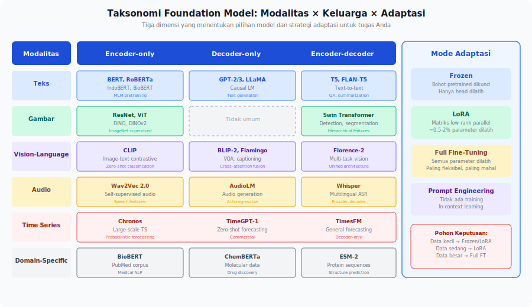

<details>
<summary>📂 Navigasi Modul (klik untuk buka)</summary>

| # | Modul | Minggu |
|---|-------|--------|
| 00 | [Pendahuluan](00_Pendahuluan.md) | 1 |
| 00a | [Prasyarat Modul](00a_Prasyarat.md) | – |
| 01 | [W1 - Tabular & Output Heads](01_W1_Tabular_Output_Heads.md) | 1 |
| 02 | [W2 - Images, CNN & Smoke Test](02_W2_Images_CNN_Smoke_Test.md) | 2 |
| 03 | [W3 - Loss, Optimizer & Evaluasi](03_W3_Loss_Optimizer_Evaluasi.md) | 3 |
| 04 | [W4 - Reproducibility & Experiment Matrix](04_W4_Reproducibility_Experiment_Matrix.md) | 4 |
| 05 | [W5 - Sequences: RNN & LSTM](05_W5_Sequences_RNN_LSTM.md) | 5 |
| 06 | [W6 - Representations & Temporal Leakage](06_W6_Representations_Temporal_Leakage.md) | 6 |
| 07 | [W7 - Text, Transformers & Repo Adoption](07_W7_Text_Transformers_Repo_Adoption.md) | 7 |
| ▶ 08 | W8 - Foundation Models | 8 |
| 09 | [W9 - Multimodal Reasoning](09_W9_Multimodal_Reasoning.md) | 9 |
| 10 | [W10 - Paper Reading & Implementation](10_W10_Paper_Reading.md) | 10 |
| 11 | [W11 - Research Framing](11_W11_Research_Framing.md) | 11 |
| 12 | [Capstone - Proyek Riset](12_Capstone.md) | 12-15 |
| 13 | [Rubrik Penilaian](13_Rubrik_Penilaian.md) | – |
| 14 | [Lampiran](14_Lampiran.md) | – |
| 15 | [Panduan Instruktur](15_Panduan_Instruktur.md) | – |

</details>

---

# 08 · W8 - Foundation Models

> *Foundation model bukan sekadar model yang bagus. Ia sudah mempelajari representasi dari jutaan contoh sehingga Anda tidak perlu memulai dari nol. Pertanyaannya bukan "apakah saya boleh memakainya", melainkan "adaptasi apa yang paling masuk akal untuk skenario ini?"*

**Baris peta besar:** input apa pun yang memanfaatkan prior dari pretrained model
**Kebiasaan riset:** Literasi model card, pilihan adaptasi, baseline yang adil
**Dataset:** Pakai ulang dataset dari minggu sebelumnya untuk perbandingan langsung
**Lab utama:** Foundation Model Map + selection memo

---

## 0. Peta Bab

W8 membentuk pemahaman sistematis tentang ekosistem foundation model:

- **2.0** Dari Pretraining ke Foundation Model — bagaimana evolusi ini terjadi
- **2.1** Apa yang membuat sebuah model menjadi "foundation model"?
- **2.2** Taksonomi modalitas x keluarga model x adaptasi
- **2.3** Mengevaluasi model card
- **2.4** Pohon keputusan untuk memilih adaptasi
- **2.5** Teacher model dan training-time supervision
- **3** Worked Example: IndoBERT dengan tiga strategi adaptasi

---

## 1. Motivasi: Jangan Mulai dari Nol

Bayangkan Anda ditugaskan membangun classifier untuk teks medis Bahasa Indonesia. Pilihan:

**Dari nol:** Latih LSTM dari awal. Dataset Anda 5.000 sampel - mungkin cukup untuk pola dasar, tetapi kosakata medis sangat jarang.

**Dengan foundation model:** Mulai dari IndoBERT yang sudah memahami tata bahasa dan konteks Bahasa Indonesia dari jutaan kalimat. Fine-tune hanya 3 epoch. Hasilnya hampir pasti lebih baik dengan lebih sedikit data dan waktu.

Tapi sebelum memilih model, ada pertanyaan yang perlu dijawab:

1. Model mana yang paling cocok untuk tugas dan domain ini?
2. Adaptasi apa yang paling tepat - frozen features, LoRA, atau full fine-tuning?
3. Apakah model ini punya batasan yang perlu saya waspadai?

W8 memberi kerangka untuk menjawab ketiga pertanyaan ini.

---

### 2.0 Dari Pretraining ke Foundation Model

Sebelum masuk ke "apa itu foundation model", mari kita lihat bagaimana kita sampai di sini. Sejarah ini penting karena menunjukkan bahwa foundation model bukanlah lompatan magis — ia adalah akumulasi dari pola yang sudah terbentuk selama satu dekade.

**Fase 1: Training dari nol per tugas (sebelum 2012).** Setiap tugas dimulai dari bobot acak. Tidak ada berbagi representasi antar tugas; model untuk klasifikasi gambar tidak membantu model untuk deteksi objek. Ini seperti setiap kali belajar membaca, Anda harus belajar alfabet ulang.

**Fase 2: Pretraining supervised + fine-tuning (2012–2017).** AlexNet (2012) dilatih di ImageNet 1.2 juta gambar — terlalu mahal untuk dilatih ulang setiap kali. Pola baru muncul: ambil bobot yang sudah dilatih di ImageNet, lalu *fine-tune* di dataset yang lebih kecil. Ini bekerja karena representasi visual tingkat rendah (edge, tekstur, bentuk) bersifat universal. Pola ini menjadi standar di computer vision: tidak ada lagi training dari nol.

**Fase 3: Pretraining self-supervised pada teks (2018–2020).** BERT (Devlin et al., 2018) dan GPT (Radford et al., 2018) memindahkan paradigma ini ke NLP, dengan dua perbedaan penting. Pertama, pretraining dilakukan secara *self-supervised* — model belajar dari teks tanpa label, cukup dengan memprediksi token yang disembunyikan (masked language modeling) atau token berikutnya (causal language modeling). Kedua, skala data melonjak drastis: BERT dilatih di 3,3 miliar token dari BooksCorpus + Wikipedia; GPT-2 di 8 juta halaman web.

Hasilnya mengejutkan: satu model pretrained bisa di-fine-tune ke puluhan tugas hilir — klasifikasi teks, NER, question answering, summarization — tanpa mengubah arsitektur. Inilah momen di mana istilah *pretrained language model* mulai bergeser menjadi *foundation*.

**Fase 4: Multimodal dan general-purpose (2020–sekarang).** CLIP (Radford et al., 2021) membuktikan bahwa pretraining kontrastif pada pasangan gambar-teks 400M menghasilkan representasi yang bisa melakukan zero-shot klasifikasi gambar — tanpa pernah dilatih khusus untuk ImageNet. Whisper (2022) melakukan hal serupa untuk audio ke teks. Model-model ini bukan lagi spesialis per domain; mereka adalah infrastruktur yang bisa diadaptasi ke banyak tugas.

**Fase 5: Istilah "foundation model" lahir (2021).** Paper Bommasani et al. (2021) "*On the Opportunities and Risks of Foundation Models*" secara resmi memperkenalkan istilah ini. Definisi mereka: model yang dilatih pada data skala besar dan dapat diadaptasi ke berbagai tugas hilir. Dua properti kunci: *emergence* (kemampuan muncul dari skala, bukan dari desain eksplisit) dan *homogenization* (banyak aplikasi bertumpu pada beberapa model yang sama, menciptakan risiko dan efisiensi sekaligus).

**Apa artinya bagi Anda sebagai peneliti pemula?**

Dulu, pertanyaan pertama saat memulai riset adalah "arsitektur apa yang harus saya bangun?" Sekarang pertanyaannya: "apakah sudah ada model yang sudah mempelajari representasi yang relevan?" Inilah pergeseran mindset yang mendasari W8. Anda tidak perlu memulai dari nol. Anda tinggal mengadaptasi representasinya.

---

## 2. Konsep Inti

### 2.1 Apa Itu Foundation Model dalam Praktiknya?

Foundation model bukan definisi teknis yang ketat. Dalam konteks riset praktis, istilah ini merujuk ke model yang:

1. **Pretrained pada data besar** - teks, gambar, audio, atau multimodal pada skala yang tidak praktis untuk dilatih sendiri.
2. **Representasi yang dapat ditransfer** - hidden states atau embeddings berguna untuk banyak tugas hilir.
3. **Dapat diadaptasi tanpa training penuh** - frozen extraction, lightweight adapters (LoRA), atau fine-tuning sebagian sudah memberikan hasil kompetitif.

Konsekuensi praktis: ketika Anda mendapat tugas baru, pertanyaan pertama adalah "apakah tersedia foundation model yang relevan?" bukan "arsitektur apa yang akan saya bangun dari nol?"

### 2.2 Taksonomi Modalitas x Keluarga Model x Adaptasi



> [!IMPORTANT]
> **Tiga mode adaptasi yang dipakai berulang di tabel.** Definisi singkat di sini supaya tabel tidak terasa magis. Detail pohon keputusan ada di §2.4.
>
> - **Frozen** - bobot pretrained dikunci (`requires_grad = False`). Hanya layer tambahan kecil (linear head, classifier) yang dilatih. Inference tetap melalui seluruh model, tetapi tidak ada backward pass ke backbone. Tercepat dan paling stabil; sub-optimal kalau domain target jauh dari pretraining.
> - **LoRA** (Low-Rank Adaptation) - sisipkan matriks low-rank `A B` (mis. `r=8`) paralel dengan `W_q` dan `W_v` di setiap attention layer; kunci `W` original. Hanya `A B` dilatih. Trade-off: ~0.5-2% parameter dilatih, performa biasanya 95-99% dari full fine-tuning, training 3-5× lebih cepat. Pakai library `peft` dari HuggingFace.
> - **Full FT** (full fine-tuning) - semua parameter `requires_grad = True`. Paling fleksibel, paling mahal (memori GPU dan waktu). Risiko overfitting tinggi pada dataset kecil; biasanya butuh learning rate kecil (`1e-5`) dan early stopping.

#### Teks

| Model | Family | Pretraining | Best for | Adaptation modes |
|---|---|---|---|---|
| BERT / RoBERTa | Encoder-only | MLM | Classification, NER, similarity | Frozen, LoRA, full FT |
| IndoBERT | Encoder-only | Indonesian corpus | Indonesian NLP | Frozen, LoRA, full FT |
| GPT-2/3 | Decoder-only | Causal LM | Text generation, completion | Prompt, full FT |
| T5 / FLAN-T5 | Encoder-decoder | Text-to-text | QA, summarization, translation | Full FT |
| BioBERT / ClinicalBERT | Encoder-only | Biomedical text | Medical NLP | Full FT (domain matters) |

Aturan praktis: encoder-only untuk pemahaman, decoder-only untuk generasi, encoder-decoder untuk transformasi teks.

#### Vision

| Model | Family | Pretraining | Best for | Adaptation |
|---|---|---|---|---|
| ResNet / EfficientNet | CNN | ImageNet supervised | Image classification | Frozen, full FT |
| ViT / DeiT | Transformer | ImageNet supervised | Classification, patches | Frozen, full FT |
| CLIP (visual encoder) | Transformer | Image-text contrastive | Zero-shot, similarity | Frozen features |
| DINO / DINOv2 | Self-supervised | Unlabeled images | Dense tasks, segmentation | Frozen, linear probe |

#### Vision-Language

| Model | Pretraining | Best for |
|---|---|---|
| CLIP | Image-text contrastive | Zero-shot classification, retrieval |
| BLIP-2 | Image-text | VQA, captioning |
| Florence-2 | Multiple vision tasks | Detection, segmentation, caption |

#### Audio

| Model | Pretraining | Best for |
|---|---|---|
| Whisper | Audio transcription (multilingual) | ASR |
| Wav2Vec 2.0 | Self-supervised audio | Speech features, ASR |
| AST (Audio Spectrogram Transformer) | Supervised spectrogram | Audio classification |

#### Time Series

| Model | Pretraining | Notes |
|---|---|---|
| Chronos | Large-scale time series | Probabilistic forecasting, zero-shot |
| TimeGPT-1 | Time series | Zero-shot forecasting; commercial |
| TimesFM | Large-scale TS | General forecasting |

> [!WARNING]
> **Time series foundation models (Chronos, TimeGPT, TimesFM) adalah area riset aktif 2023-2024.** Klaim "zero-shot SOTA" sering belum direplikasi independen pada dataset di luar benchmark mereka. Untuk **capstone (W12-W15)**, gunakan ini sebagai *eksplorasi tambahan* setelah baseline LSTM/Transformer dari W5-W7 sudah jalan dan dapat dipertanggungjawabkan. Jangan jadikan time-series FM sebagai baseline tunggal di proposal capstone.

#### Domain-Specific

| Domain | Model | Catatan |
|---|---|---|
| Biomedical text | BioBERT, ClinicalBERT | Pretraining pada PubMed/clinical notes |
| Indonesian NLP | IndoBERT, mBERT, XLM-R | Pilih berdasarkan data size dan domain |
| Chemistry / proteins | ChemBERTa, ESM-2 | Molecular dan sequence data |

### 2.3 Mengevaluasi Model Card

Model card adalah dokumen yang menemani sebuah model. Tujuh pertanyaan wajib saat membaca model card:

1. **Apa dataset pretraining?** Domain, bahasa, ukuran. Relevan dengan tugas Anda?
2. **Apa evaluation benchmark yang dilaporkan?** Apakah benchmark representatif untuk tugas Anda?
3. **Apa batasan yang disebutkan eksplisit?** Biases, failure modes, out-of-scope uses.
4. **Berapa besar modelnya?** Parameter count mempengaruhi inference cost dan feasibility fine-tuning.
5. **Lisensi penggunaan?** CC-BY, Apache 2.0, atau restricted commercial - penting untuk publikasi.
6. **Apakah ada reproducibility artifacts?** Training code, eval code, atau hanya weights?
7. **Kapan model di-release dan apa data cutoff-nya?** Apakah ada model lebih baru?

> [!WARNING]
> "SOTA di benchmark X" tidak berarti "terbaik untuk tugas saya" jika domain berbeda signifikan. Selalu periksa apakah benchmark dataset punya overlap dengan domain Anda.

### 2.4 Pohon Keputusan Pemilihan Adaptasi

Pilihan adaptasi bergantung pada tiga faktor: **compute budget**, **jumlah labeled data**, dan **seberapa jauh domain target dari pretraining**.

```
Compute budget cukup untuk fine-tuning?
├── Tidak (CPU atau GPU kecil)
│   └── Frozen features + lightweight head
└── Ya
    Labeled data < 1000 sampel?
    ├── Ya
    │   └── Frozen atau LoRA (r=4-8)
    │       (full FT berisiko overfitting)
    └── Tidak (1000+ sampel)
        Domain jauh dari pretraining?
        ├── Ya (mis. medical dari general web)
        │   └── Full fine-tuning atau LoRA (r=16-32)
        └── Tidak (domain mirip)
            └── Frozen atau LoRA (r=4-8) sudah cukup
```

**Frozen features:** Extract embeddings tanpa gradient. Hanya latih linear head. Tercepat, cocok untuk proof-of-concept atau data sedikit.

**LoRA:** Tambahkan matriks low-rank parallel dengan weight original. Hanya LoRA matrices dilatih (biasanya < 1% parameter). Efficient, hasil sering sebanding dengan full fine-tuning.

**Full fine-tuning:** Semua parameter diperbarui. Paling fleksibel, paling mahal. Butuh data cukup untuk menghindari overfitting.

### 2.5 Teacher Model dalam Training-Time Supervision

Foundation model tidak selalu digunakan untuk inference. Pola penting: **teacher model yang hanya hadir saat training**.

Contoh:
- **Knowledge distillation** - model besar (teacher) melatih model kecil (student) dengan soft targets.
- **Auxiliary supervision** - embedding dari CLIP digunakan sebagai target untuk network visual lebih kecil.
- **Pseudo-label generation** - foundation model menghasilkan pseudo-labels untuk unlabeled data.

Dalam semua kasus ini, foundation model tidak ada dalam model final yang di-deploy. Model fondasi ini meningkatkan proses pelatihan. Pola ini penting karena memungkinkan manfaat dari foundation model tanpa biaya inferensinya.

#### 2.5.1 Knowledge Distillation: Contoh Numerik dengan Target Lunak

Untuk tugas klasifikasi 3 kelas (anjing/kucing/kelinci), teacher menghasilkan logits `z_T = [4.0, 1.0, 0.5]` untuk satu sampel. Student dilatih untuk mereproduksi distribusi probabilitas teacher, **bukan** label keras `[1, 0, 0]`.

**Hard target** (one-hot label asli):
```
y_hard = [1, 0, 0]
```

**Soft target** dengan temperature `T = 4` (distribusi yang halus):
```
softmax(z_T / T)[i] = exp(z_T[i] / T) / Σ_j exp(z_T[j] / T)
softmax([4.0, 1.0, 0.5] / 4) = softmax([1.0, 0.25, 0.125])
                             ≈ [0.484, 0.229, 0.202]
```

**Soft target** tanpa temperature `T = 1`:
```
softmax([4.0, 1.0, 0.5]) ≈ [0.939, 0.047, 0.014]   # hampir one-hot, info kelas non-mayoritas hilang
```

Temperature tinggi `T > 1` membuka informasi "kelas non-mayoritas yang masih masuk akal" - student belajar bahwa anjing-vs-kucing lebih mirip daripada anjing-vs-kelinci. Loss distillation:

```
L_KD = CE(softmax(z_S / T),  softmax(z_T / T)) * T²
```

Faktor `T²` mengompensasi gradient yang menyusut karena temperature. Total loss = `α * L_KD + (1 - α) * L_hard` dengan `α ≈ 0.7-0.9`. Pola ini memungkinkan model student kecil (mis. DistilBERT, ~40% parameter BERT) mencapai 95%+ performa teacher di banyak benchmark.

---

## 3. Worked Example: IndoBERT dengan Tiga Strategi Adaptasi

Dataset: IndoNLU SmSA (dari Lab 5b). Tiga strategi pada dataset yang sama untuk memperlihatkan trade-off di antara ketiganya.

**Strategi A - Frozen + Linear Head:**
```python
# Freeze BERT, hanya train head
for param in model.bert.parameters():
    param.requires_grad = False
```
Keunggulan: training selesai dalam menit, tidak butuh GPU besar.
Kelemahan: representasi frozen mungkin tidak optimal untuk sentimen.

**Strategi B - LoRA (r=8):**
```python
from peft import get_peft_model, LoraConfig, TaskType
config = LoraConfig(task_type=TaskType.SEQ_CLS, r=8, lora_alpha=16,
                    target_modules=["query", "value"])
model = get_peft_model(base_model, config)
```
Keunggulan: 10-20× lebih hemat parameter dari full FT, training 5× lebih cepat.
Kelemahan: butuh library PEFT; kurang dikenal.

**Strategi C - Full Fine-tuning:**
```python
model = AutoModelForSequenceClassification.from_pretrained(
    "indobenchmark/indobert-base-p1", num_labels=3)
# Semua parameter trainable by default
```
Keunggulan: paling fleksibel, potensi performa tertinggi.
Kelemahan: paling lama, butuh GPU, risiko overfitting pada data kecil.

**Ekspektasi perbandingan** pada 5000 sampel IndoNLU SmSA:
- Frozen: macro-F1 ≈ 68-73%. Cepat, tapi sub-optimal.
- LoRA: macro-F1 ≈ 76-81%. Tradeoff efisiensi-performa terbaik.
- Full FT: macro-F1 ≈ 80-85%. Paling lambat, paling kuat.

---

## 4. Pitfalls & Miskonsepsi

**"Foundation model selalu lebih baik."** Pada dataset kecil dengan distribusi sangat berbeda dari pretraining, model kecil yang di-fine-tune khusus kadang mengungguli foundation model besar.

**"Frozen features cukup untuk domain shift besar."** Representasi frozen BERT pada teks klinik sangat spesifik mungkin jauh lebih buruk dari fine-tuned model kecil yang lebih relevan.

**"LoRA rank besar lebih baik."** Tidak linier. r=4 atau r=8 sering sudah cukup. Rank lebih besar menambah parameter tapi tidak selalu performa.

**"Model Card selalu jujur dan lengkap."** Baca bagian "Limitations" dengan skeptis - sering kurang detail dibanding bagian "Performance".

---

## 5. Tugas: Foundation Model Map (W8)

Buat **Foundation Model Map** untuk 3-4 model yang relevan dengan domain riset Anda:

| Model | Modalitas | Pretraining | Downstream role | Adaptation | Teacher-only? | Pilihan karena |
|---|---|---|---|---|---|---|
| ... | ... | ... | ... | ... | ... | ... |

Tambahkan **selection memo** (satu paragraf per model): mengapa model ini, asumsi apa yang dibawanya, apa batasannya.

**File output:** `foundation_model_map.md` di folder eksperimen W8.

---

## 6. Komponen Mandiri

Format: [Lampiran C.9](14_Lampiran.md#c9-template-komponen-mandiri).

| Jalur | Tugas |
|---|---|
| **Implementasi** | Implementasikan frozen CLIP visual encoder sebagai feature extractor untuk dataset citra. Bandingkan dengan fine-tuned ResNet dari W2. |
| **Analisis** | Unduh 3 model card dari HuggingFace. Jawab 7 pertanyaan evaluasi §2.3 untuk masing-masing. |
| **Desain** | Rancang eksperimen untuk menentukan kapan domain-specific model lebih baik dari general model pada satu domain spesifik. |
| **Arsitektur Baru** | Eksplorasi LoRA: implementasikan LoRA sederhana dari scratch untuk satu linear layer, verifikasi parity dengan library PEFT. |

---

## 7. Refleksi

1. Anda mendapat task baru: deteksi emosi dari rekaman suara Bahasa Indonesia. Dari taksonomi §2.2, identifikasi dua kandidat foundation model. Untuk masing-masing, tulis dua argumen mendukung dan satu risiko utama.
2. Seorang kolaborator mengklaim "model X mencapai SOTA di benchmark Y, jadi kita pakai ini". Apa tiga pertanyaan yang akan Anda tanyakan sebelum menyetujui?
3. Alur Representation Choice: frozen features adalah "extracted", full FT adalah "learned". Di mana LoRA berada dalam taksonomi W3 ini? Mengapa perbedaan ini penting untuk keputusan adaptasi?

---

## 8. Bacaan Lanjutan

- **Bommasani et al. - *On the Opportunities and Risks of Foundation Models*** (2021). Paper definitif. Baca bagian 1 (Introduction) dan 3 (Capabilities).
- **Hu et al. - *LoRA: Low-Rank Adaptation of Large Language Models*** (2021). Baca bagian 4 (main experiments).
- **Mitchell et al. - *Model Cards for Model Reporting*** (2019). Template model card yang digunakan industri.

---

## Lanjut ke W9

W8 membentuk pemahaman foundation model untuk satu modalitas. W9 memperluas ke wilayah yang lebih kompleks: bagaimana menggabungkan dua atau lebih modalitas, bagaimana mendeteksi apakah model benar-benar menggunakan semua modalitas, dan bagaimana menangani situasi ketika satu modalitas hilang.

Buka [W9 - Multimodal Reasoning](09_W9_Multimodal_Reasoning.md) ketika siap.
