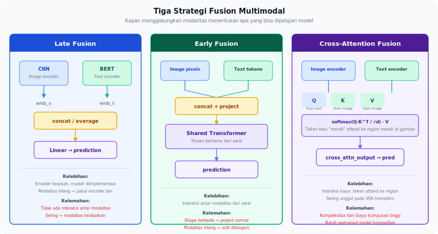
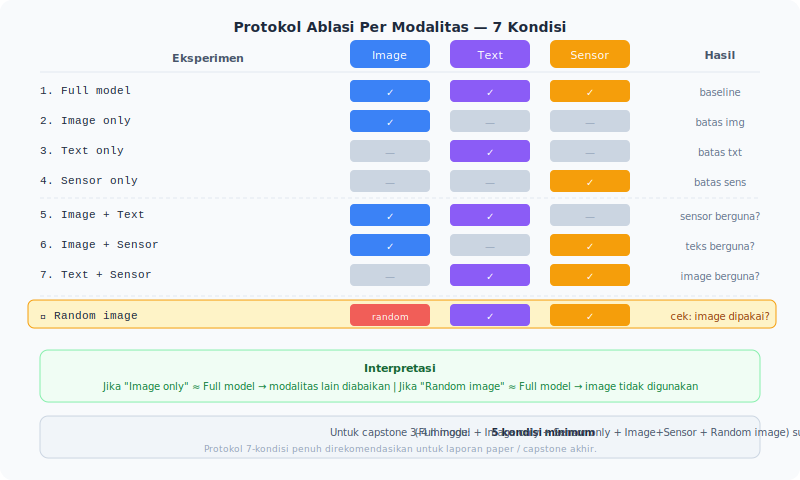

<details>
<summary>📂 Navigasi Modul (klik untuk buka)</summary>

| # | Modul | Minggu |
|---|-------|--------|
| 00 | [Pendahuluan](00_Pendahuluan.md) | 1 |
| 01 | [W1 - Tabular & Output Heads](01_W1_Tabular_Output_Heads.md) | 1 |
| 02 | [W2 - Images, CNN & Smoke Test](02_W2_Images_CNN_Smoke_Test.md) | 2 |
| 03 | [W3 - Loss, Optimizer & Evaluasi](03_W3_Loss_Optimizer_Evaluasi.md) | 3 |
| 04 | [W4 - Reproducibility & Experiment Matrix](04_W4_Reproducibility_Experiment_Matrix.md) | 4 |
| 05 | [W5 - Sequences: RNN & LSTM](05_W5_Sequences_RNN_LSTM.md) | 5 |
| 06 | [W6 - Representations & Temporal Leakage](06_W6_Representations_Temporal_Leakage.md) | 6 |
| 07 | [W7 - Text, Transformers & Repo Adoption](07_W7_Text_Transformers_Repo_Adoption.md) | 7 |
| 08 | [W8 - Foundation Models](08_W8_Foundation_Models.md) | 8 |
| ▶ 09 | W9 - Multimodal Reasoning | 9 |
| 10 | [W10 - Paper Reading & Implementation](10_W10_Paper_Reading.md) | 10 |
| 11 | [W11 - Research Framing](11_W11_Research_Framing.md) | 11 |
| 12 | [Capstone - Proyek Riset](12_Capstone.md) | 12-15 |
| 13 | [Rubrik Penilaian](13_Rubrik_Penilaian.md) | – |
| 14 | [Lampiran](14_Lampiran.md) | – |
| 15 | [Panduan Instruktur](15_Panduan_Instruktur.md) | – |

</details>

---

# 09 · W9 - Multimodal Reasoning

> *Ketika dua aliran data tersedia, apakah model benar-benar menggunakan keduanya? Pertanyaan ini paling sering diabaikan dalam riset multimodal - dan jawabannya sering mengejutkan.*

**Baris peta besar:** beberapa tensor -> prediksi bersama
**Kebiasaan riset:** Ablasi per modalitas dan analisis kegagalan multimodal
**Dataset:** Dataset multimodal dengan minimal dua modalitas (sensor + image, atau audio + text)
**Lab utama:** Lab W9 - Multimodal Ablation (`lab_w9_multimodal_ablation.ipynb`)

---

## 0. Peta Bab

W9 adalah tentang berpikir secara sistematis tentang banyak aliran data sekaligus:

- **2.1** Strategi fusion: late, early, cross-attention
- **2.2** Kegagalan karena modalitas diabaikan
- **2.3** Modalitas hilang: strategi fallback yang rapi
- **2.4** Temporal alignment: aliran data yang tidak sinkron
- **2.5** Protokol ablasi per modalitas
- **2.6** Repo adoption pada codebase multimodal

---

## 1. Motivasi: Apakah Model Ini Benar-Benar Melihat Keduanya?

Anda membangun model untuk memprediksi nyeri pasien menggunakan dua input: ekspresi wajah (gambar) dan sensor pergelangan tangan (accelerometer). Training berjalan lancar. Validation F1 = 0.79. Terlihat bagus.

Lalu Anda coba satu eksperimen: hapus seluruh input sensor, hanya berikan gambar. F1 = 0.78.

Hampir sama. Artinya: model pada dasarnya tidak menggunakan data sensor sama sekali. Dua minggu implementasi model fusion menghasilkan performa yang identik dengan model satu modalitas. Ini adalah **failure mode modalitas terabaikan**.

Sebelum melaporkan hasil multimodal, Anda harus menjalankan ablasi per modalitas. W9 mengajarkan bagaimana dan mengapa.

---

## 2. Konsep Inti

### 2.1 Strategi Fusion: Tiga Cara Menggabungkan Modalitas



#### Late Fusion

Setiap modalitas diproses secara mandiri oleh encodernya masing-masing. Output (embedding atau logits) digabungkan di ujung, biasanya dengan concatenation atau averaging.

```
Image → CNN → embedding_v
Text  → BERT → embedding_t
                           ↓
               concat([embedding_v, embedding_t]) → Linear → prediction
```

**Kelebihan:**
- Mudah diimplementasikan.
- Setiap encoder bisa di-pretrain secara terpisah.
- Jika satu modalitas hilang, prediksi masih bisa menggunakan encoder lainnya.

**Kelemahan:**
- Tidak ada interaksi antar modalitas sebelum penggabungan. Model tidak bisa belajar bahwa "kata ini relevan ketika gambar menunjukkan X".
- Sering menghasilkan kegagalan modalitas terabaikan (satu aliran data mendominasi karena lebih mudah dioptimasi).

#### Early Fusion

Input dari berbagai modalitas digabungkan di level representasi awal, sebelum diproses oleh model bersama.

```
Image pixels + Text tokens → concat/project → Shared Transformer → prediction
```

**Kelebihan:**
- Model bisa belajar interaksi antar modalitas dari awal.

**Kelemahan:**
- Shape yang sangat berbeda antar modalitas butuh projection yang cermat.
- Training lebih kompleks; lebih sulit untuk pretrained model.
- Kehilangan satu modalitas saat inference sulit ditangani.

#### Cross-Attention Fusion (Interaction-Based)

Satu modalitas digunakan sebagai query dan yang lain sebagai key/value dalam attention mechanism. Model secara eksplisit belajar "bagian mana dari modalitas A yang relevan untuk setiap elemen modalitas B?"

> [!NOTE]
> **Q/K/V primer.** Untuk recap konsep `Q`, `K`, `V` dan rumus `softmax(QK^T/√d)V`, lihat W7 §1 dan Lab `lab_w7_transformer_mini.ipynb`. Ringkasan 3-step:
>
> 1. **Q (Query)** dari modalitas A shape `(B, T_A, d)` - "apa yang sedang saya cari?"
> 2. **K (Key)** dan **V (Value)** dari modalitas B shape `(B, T_B, d)` - "apa yang tersedia untuk dicocokkan, dan apa nilai aktualnya?"
> 3. **Attention scores** `Q @ K^T / √d` shape `(B, T_A, T_B)` - matriks "seberapa relevan tiap elemen B untuk tiap elemen A". Softmax di sumbu `T_B` menghasilkan distribusi probabilitas. Output `softmax(...) @ V` shape `(B, T_A, d)` - rerata berbobot dari V, satu vektor per query.
>
> Pembagian `√d` mencegah dot product membesar saat `d` besar (tanpa scaling, softmax jadi terlalu runcing - gradient menyempit).

```
Text queries:        Q = W_q @ text_embedding       # (B, T_text, d)
Image keys/values:   K = W_k @ image_features       # (B, T_image, d)
                     V = W_v @ image_features       # (B, T_image, d)
attention_weights  = softmax(Q @ K.transpose(-2, -1) / sqrt(d), dim=-1)
cross_attn_output  = attention_weights @ V          # (B, T_text, d)
```

Ini yang digunakan oleh BLIP-2, Flamingo, dan model vision-language modern.

**Kelebihan:**
- Memungkinkan interaksi pada level yang lebih halus — token teks "merah" dapat memberi perhatian pada region merah di gambar.
- Sering mengungguli late dan early fusion pada tugas VQA yang kompleks.

**Kelemahan:**
- Kompleksitas implementasi dan biaya komputasi lebih tinggi.
- Butuh pretrained model yang kompatibel untuk kedua modalitas.

### 2.2 Failure Mode Modalitas Terabaikan

Ini adalah failure mode paling umum dan paling sering tidak terdeteksi dalam penelitian multimodal.

**Mekanisme:** Ketika training multimodal, optimizer menemukan jalur gradient yang paling mudah. Jika satu modalitas lebih "informatif" atau lebih mudah dioptimasi (mis. gambar lebih bersih dibanding sensor yang *noisy*), model belajar mengabaikan modalitas lainnya. Loss tetap turun, performa tampak bagus - tapi model sebenarnya *single-modal*.

**Cara mendeteksi:**

1. **Ablation per modalitas:** Hapus satu modalitas sekaligus. Jika F1 tidak turun signifikan, modalitas itu diabaikan.
2. **Modalitas acak:** Ganti satu modalitas dengan noise acak. Jika performa tidak memburuk, modalitas itu tidak digunakan.
3. **Gradient magnitude check:** Hitung gradient norm terhadap setiap encoder. Jika satu encoder konsisten punya gradient kecil, ia tidak berkontribusi.

```python
# Gradient magnitude check per modalitas
def check_gradient_flow(model, batch):
    loss = compute_loss(model, batch)
    loss.backward()

    grads = {}
    for name, param in model.named_parameters():
        if param.grad is not None:
            grads[name] = param.grad.norm().item()

    # Compare gradient norms between image_encoder vs text_encoder
    img_grads = {k: v for k, v in grads.items() if 'image_encoder' in k}
    txt_grads = {k: v for k, v in grads.items() if 'text_encoder' in k}
    print(f"Image encoder avg grad: {sum(img_grads.values())/len(img_grads):.6f}")
    print(f"Text encoder avg grad: {sum(txt_grads.values())/len(txt_grads):.6f}")
```

**Solusi umum:**

- ***Modality dropout*** - saat training, secara acak "matikan" setiap modalitas dengan probabilitas tertentu. Memaksa model belajar dari setiap modalitas secara mandiri.
- **Separate loss terms** - tambahkan auxiliary loss per modalitas agar setiap encoder mendapat gradient yang jelas.
- **Gradient balancing** - scale learning rate setiap modalitas berdasarkan gradient magnitude.

### 2.3 Modalitas Hilang: Penanganan Saat Input Tidak Lengkap

Dalam produksi, satu atau lebih modalitas sering tidak tersedia: sensor rusak, gambar kabur tidak layak dipakai, teks tidak terisi. Sistem multimodal yang baik harus menangani ini secara rapi.

#### Strategi 1: *Modality Dropout* Saat Training

Saat training, kosongkan satu modalitas secara acak dengan probabilitas `p_drop`:

```python
class MultimodalModel(nn.Module):
    def forward(self, image, text, modality_mask=None):
        if modality_mask is None and self.training:
            # Random dropout saat training
            modality_mask = torch.bernoulli(
                torch.ones(2) * 0.15  # 15% chance tiap modalitas di-drop
            )

        img_feat = self.image_encoder(image) if modality_mask[0] > 0 else torch.zeros(...)
        txt_feat = self.text_encoder(text) if modality_mask[1] > 0 else torch.zeros(...)
        return self.fusion(img_feat, txt_feat)
```

Dengan ini model belajar prediksi yang lebih tahan gangguan bahkan ketika satu modalitas hilang.

> [!NOTE]
> **Kenapa `p_drop = 0.15`?** Bukan angka magis - aturan praktis dari literatur regularisasi (mirip dropout neuron 10-30%, mask language modeling BERT 15%). Rentang yang masuk akal: `p_drop ∈ [0.10, 0.25]`. Lebih kecil → *modality dropout* tidak cukup kuat untuk mencegah modalitas terabaikan. Lebih besar → model jarang melihat sampel multimodal lengkap, performa dengan modalitas lengkap menurun. Untuk dataset dengan satu modalitas yang jauh lebih dominan (mis. image jauh lebih informatif dari sensor), naikkan `p_drop` modalitas dominan ke 0.30-0.40 agar model dipaksa belajar dari sensor lebih sering. Ini hyperparameter yang layak dieksplorasi untuk sweep di Komponen Mandiri Jalur Analisis.

#### Strategi 2: Learnable Null Token

Gantikan modalitas yang hilang dengan **learnable null embedding** - parameter yang dioptimasi selama training untuk merepresentasikan "tidak ada modalitas ini".

```python
self.null_image_token = nn.Parameter(torch.randn(1, embed_dim))

def encode_image(self, image, available=True):
    if available:
        return self.image_encoder(image)
    else:
        return self.null_image_token.expand(batch_size, -1)
```

Ini lebih baik dari zero padding karena null token belajar merepresentasikan distribusi "tidak ada", bukan noise nol.

#### Strategi 3: Fallback Single-Modal Mode

Untuk sistem yang kritis di produksi, desain model sebagai ensemble:

- Default: gunakan semua modalitas yang tersedia.
- Jika satu modalitas hilang: fallback ke model unimodal untuk modalitas yang tersedia.

Sederhana tapi efektif untuk kasus penggunaan di mana keandalan lebih penting daripada performa maksimal.

### 2.4 Temporal Alignment: Ketika Aliran Data Tidak Sinkron

Banyak dataset multimodal dari dunia nyata punya masalah temporal alignment:

- Video frame pada 25 fps, audio pada 44100 Hz - bagaimana menyinkronkan?
- Sensor IMU pada 100 Hz, kamera pada 30 fps, label pada 1 Hz.
- Event-based data (heartbeat spikes) vs continuous time series.

**Masalah alignment tanpa sinkronisasi:**
Model mungkin mengasosiasikan event dari waktu yang salah. Jika audio dan video tidak di-align dengan benar, cross-attention akan belajar korelasi yang semu.

**Tiga pendekatan:**

1. **Resampling/interpolasi** - downsample semua stream ke resolusi temporal terendah. Kehilangan detail tapi mudah.
2. **Event-to-window mapping** - untuk event-based data, petakan setiap event ke window dari stream kontinu terdekat.
3. **Temporal position encoding** - encode waktu absolut sebagai feature eksplisit; biarkan model belajar alignment sendiri (lebih fleksibel tapi butuh data lebih banyak).

#### Worked Example: Sensor Timestamp Misalignment

Anggap kita punya dataset pergerakan robot dengan dua stream:
- **IMU (accelerometer):** 100 Hz, satu sample setiap 10 ms.
- **Kamera:** 30 fps, satu frame setiap 33 ms.

Label kejadian (misalnya "tabrakan") dianotasi oleh manusia dengan presisi ~100 ms.

**Skenario misalignment:** sistem logging menggunakan clock yang berbeda untuk kedua sensor. Setelah satu jam, clock IMU sudah drift +250 ms dari clock kamera. Artinya, frame kamera t=3600.000s sebenarnya berkorespondensi dengan data IMU di t=3600.250s - beda ~25 sample IMU.

**Apa yang terjadi tanpa koreksi:** model cross-attention belajar mencocokkan visual "robot hampir tabrakan" dengan data IMU dari 250 ms sebelumnya - saat robot masih bergerak normal. Model mungkin tetap bisa prediksi dengan baik di training set (karena drift konsisten), tetapi gagal pada sensor baru dengan drift berbeda.

**Cara deteksi drift:**
```python
# Cek apakah ada sistem logging mencatat timestamp keduanya
# Atau: plot korelasi antara event di IMU dan kamera
# Jika korelasi puncak ada di lag != 0, itu tanda drift
import numpy as np
# Hitung cross-correlation sinyal IMU dan estimasi motion dari kamera
lags = np.arange(-50, 51)  # ±500 ms dalam unit 10 ms
# Puncak korelasi di lag=25 → drift 250 ms
```

**Koreksi sederhana:** simpan offset drift dan geser satu stream:
```python
imu_timestamps = imu_timestamps - 0.250  # koreksi drift 250 ms
```

**Pelajaran:** selalu catat timestamp dari sumber waktu yang sama (tersinkronisasi NTP) untuk semua sensor. Jika sudah terlanjur, sertakan koreksi drift sebagai bagian preprocessing yang terdokumentasi - bukan perbaikan diam-diam.

### 2.5 Protokol Ablation Per Modalitas



Setiap paper dan laporan multimodal harus menjalankan ablation ini sebelum klaim apapun:

| Eksperimen | Input | Temuan yang diharapkan |
|---|---|---|
| Full model | image + text + sensor | Performa baseline |
| Image only | image (text+sensor dimasking) | Batas single-modal |
| Text only | text (image+sensor dimasking) | Batas single-modal |
| Sensor only | sensor (image+text dimasking) | Batas single-modal |
| Image + Text | image + text | Apakah sensor berkontribusi? |
| Image + Sensor | image + sensor | Apakah text berkontribusi? |
| Text + Sensor | text + sensor | Apakah image berkontribusi? |
| Random image | noise acak (text+sensor asli) | Pengecekan modalitas yang diabaikan |

Template protokol ini tersedia di [Lampiran C.14](14_Lampiran.md#c14-per-modalitas-ablation-protocol).

> [!NOTE]
> **Kelayakan untuk capstone 3-4 minggu.** 7 kondisi sebelumnya adalah protokol penuh (rekomendasi untuk paper atau laporan akhir). Jika waktu terbatas, **5 kondisi minimum** sudah informatif:
> 1. Full model (semua modalitas)
> 2. Image only
> 3. Sensor only
> 4. Image + Sensor
> 5. Random image (cek modalitas terabaikan)
>
> Kondisi text-only dan text+sensor boleh jadi stretch goal jika pipeline masih punya kapasitas. Yang tidak boleh dilewati adalah kondisi #5 (random image): tanpa itu Anda tidak bisa membuktikan model benar-benar memakai image.

> [!IMPORTANT]
> Jika "Image only" performanya hampir sama dengan "Full model", Anda punya masalah modalitas terabaikan. Selesaikan ini sebelum mengklaim bahwa sistem Anda multimodal.

### 2.6 Repo Adoption pada Codebase Multimodal

Codebase multimodal sering lebih kompleks dari codebase single-modal: banyak encoder, beberapa DataLoader, modul fusion yang abstrak. Strategi tambahan untuk membaca repo multimodal:

1. **Identifikasi titik fusion** - di mana embedding dari berbagai modalitas digabungkan? Ini adalah jantung arsitektur.
2. **Telusuri satu forward pass** - ikuti satu batch dari tiap modalitas dari DataLoader sampai prediction, catat shape di setiap titik.
3. **Buat repo_map.md kedua** - gunakan template [Lampiran C.12](14_Lampiran.md#c12-template-repo-map), tapi tambahkan kolom "modalitas".

---

## 3. Worked Example: Fusion untuk Pain Estimation

**Task:** Prediksi skala nyeri (0-10) dari dua input: ekspresi wajah (gambar 64×64) dan sensor accelerometer tangan (sequence 30 timestep, 3 axis).

**Setup Late Fusion:**

```python
class PainEstimator(nn.Module):
    def __init__(self):
        super().__init__()
        # Face encoder: CNN → embedding (128-dim)
        self.face_encoder = nn.Sequential(
            nn.Conv2d(3, 32, 3, padding=1), nn.ReLU(), nn.MaxPool2d(2),
            nn.Conv2d(32, 64, 3, padding=1), nn.ReLU(), nn.MaxPool2d(2),
            nn.AdaptiveAvgPool2d(4), nn.Flatten(),
            nn.Linear(64*4*4, 128), nn.ReLU()
        )
        # Sensor encoder: LSTM → last hidden (64-dim)
        self.sensor_encoder = nn.LSTM(3, 64, batch_first=True)
        # Fusion + prediction head
        self.head = nn.Sequential(
            nn.Linear(128 + 64, 64), nn.ReLU(),
            nn.Linear(64, 1)
        )

    def forward(self, face, sensor, face_available=True, sensor_available=True):
        if face_available:
            face_feat = self.face_encoder(face)
        else:
            face_feat = torch.zeros(face.shape[0], 128, device=face.device)

        if sensor_available:
            _, (h_n, _) = self.sensor_encoder(sensor)
            sensor_feat = h_n[-1]
        else:
            sensor_feat = torch.zeros(sensor.shape[0], 64, device=sensor.device)

        fused = torch.cat([face_feat, sensor_feat], dim=1)
        return self.head(fused).squeeze(-1)
```

**Ablation results (expected):**

| Condition | Val MAE |
|---|---|
| Face only | 1.82 |
| Sensor only | 2.15 |
| Late fusion (both) | 1.61 |
| Random face | 2.09 |  ← jika hasilnya ~ sensor only, face diabaikan!
| Random sensor | 1.80 |  ← jika hasilnya ~ face only, sensor diabaikan!

---

## 4. Pitfalls & Miskonsepsi

**"Late fusion cukup untuk semua kasus."** Late fusion mudah diimplementasikan tapi sering menghasilkan masalah modalitas terabaikan. Coba cross-attention jika tugas butuh interaksi antar modalitas.

**"Hasil yang meningkat belum tentu berarti model memakai semua modalitas."** Tidak. Model bisa mencapai peningkatan kecil dari satu modalitas saja, sementara modalitas lain diabaikan. Jalankan ablation!

**"Temporal alignment otomatis ditangani oleh DataLoader."** Tidak. Anda bertanggung jawab memverifikasi bahwa timestamp dari setiap modalitas benar-benar disinkronkan sebelum dimasukkan ke model.

**"Modalitas hilang = zero padding."** Zero padding memberikan sinyal yang ambigu (apakah nol berarti "missing" atau "nilai sebenarnya nol"?). Gunakan learnable null token atau *modality dropout* saat training.

---

## 5. Lab W9 - Multimodal Ablation

Buka `template_repo/notebooks/lab_w9_multimodal_ablation.ipynb`.

**Tugas:**

1. Muat dataset multimodal (disediakan: synthetic sensor + image, atau adopsi repositori multimodal publik).
2. Implementasikan late fusion baseline.
3. Jalankan protokol ablasi per modalitas §2.5 (7 kondisi + random check).
4. Tulis diagnosis: apakah masalah modalitas terabaikan ditemukan?
5. Jika ya, implementasikan satu solusi (*modality dropout* atau null token).
6. Buat `repo_map.md` kedua jika mengadopsi repo publik.

**Checklist:**
- [ ] Late fusion baseline dengan smoke test.
- [ ] 7 ablation conditions dengan tabel hasil.
- [ ] Uji modalitas acak untuk mendeteksi modalitas yang diabaikan.
- [ ] Diagnosis: apakah ada modalitas yang diabaikan?
- [ ] Satu solusi diimplementasikan jika masalah ditemukan.
- [ ] `repo_map.md` untuk codebase multimodal.

---

## Komponen Mandiri (W9)

Format: [Lampiran C.9](14_Lampiran.md#c9-template-komponen-mandiri).

| Jalur | Tugas |
|---|---|
| **Implementasi** | Implementasikan cross-attention fusion sebagai alternatif late fusion. Bandingkan hasil ablasi per modalitas keduanya. |
| **Analisis** | Ambil 2 paper multimodal dari arXiv. Apakah mereka melaporkan ablasi per modalitas? Jika ya, apakah ada tanda modalitas terabaikan? |
| **Desain** | Rancang sistem untuk mendeteksi modalitas yang hilang secara otomatis saat inference, dan pilih strategi fallback yang tepat. |
| **Arsitektur Baru** | Implementasikan *modality dropout* saat training. Bandingkan performa pada semua 7 kondisi ablation vs model tanpa *modality dropout*. |

---

## 6. Refleksi

1. Anda mendapatkan dataset multimodal dengan image, audio, dan text. Full fusion mencapai F1 = 0.81. Bagaimana urutan ablation yang akan Anda jalankan, dan apa yang harus terjadi agar Anda yakin ketiga modalitas benar-benar berkontribusi?
2. Sensor di lab Anda kadang hilang karena koneksi putus. Dari tiga strategi modalitas hilang (§2.3), mana yang paling sesuai untuk skenario ini? Apa trade-off masing-masing?
3. Alur Representation Choice sampai W9: engineered features (W6), extracted (W7-W8), cross-modal (W9). Bagaimana pilihan representasi untuk satu modalitas bisa dipengaruhi oleh ada atau tidaknya modalitas lain?

---

## 7. Bacaan Lanjutan

- **Baltrusaitis et al. - *Multimodal Machine Learning: A Survey and Taxonomy*** (TPAMI, 2019). Survey komprehensif fusion strategies. Baca bagian 3 (Fusion) dan bagian 5 (Co-learning) untuk konteks W9.
- **Wang et al. - *What Makes Training Multi-Modal Classification Networks Hard?*** (CVPR, 2020). Tentang masalah modalitas terabaikan dan solusinya. Sangat relevan dengan §2.2.
- **Li et al. - *BLIP: Bootstrapping Language-Image Pre-training*** (2022). Contoh cross-attention fusion dalam praktik yang bisa dibaca sebagai case study.
- **Lampiran C.14** - template protokol ablation per modalitas untuk dipakai langsung di Lab W9.

---

## Lanjut ke W10

Dengan W9, Anda sudah menjelajahi seluruh lanskap Big Map: tabular, images, sequences, text, foundation models, dan multimodal. W10 fokus pada keterampilan yang mengikat semuanya: membaca paper secara terstruktur dan menerjemahkannya menjadi kode yang bisa dijalankan.

Buka [W10 - Paper Reading & Implementation](10_W10_Paper_Reading.md) ketika siap.
