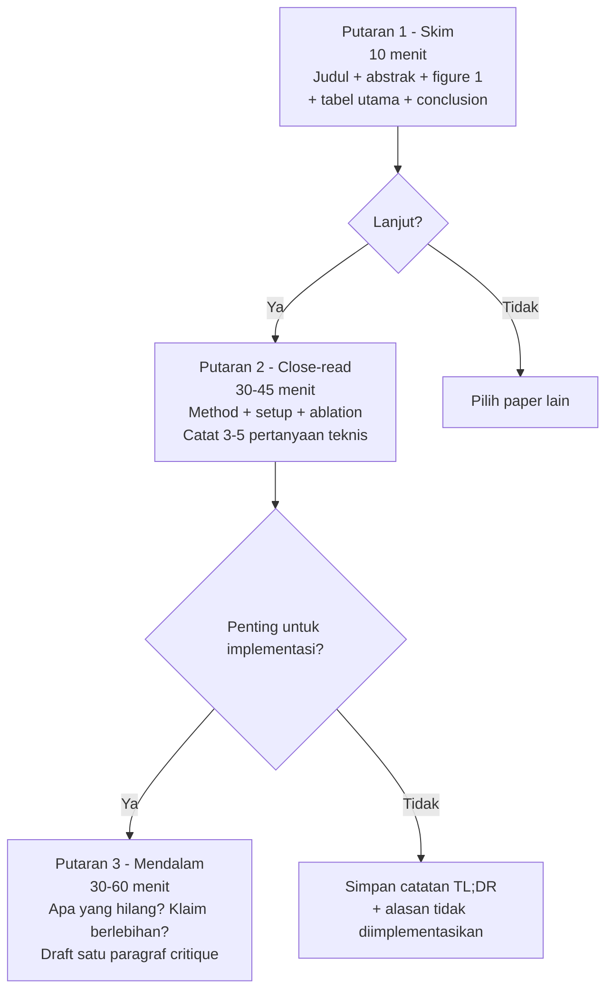

<details>
<summary>📂 Navigasi Modul (klik untuk buka)</summary>

| # | Modul | Minggu |
|---|-------|--------|
| 00 | [Pendahuluan](00_Pendahuluan.md) | 1 |
| 00a | [Prasyarat Modul](00a_Prasyarat.md) | – |
| 01 | [W1 - Tabular & Output Heads](01_W1_Tabular_Output_Heads.md) | 1 |
| 02 | [W2 - Images, CNN & Smoke Test](02_W2_Images_CNN_Smoke_Test.md) | 2 |
| 03 | [W3 - Loss, Optimizer & Evaluasi](03_W3_Loss_Optimizer_Evaluasi.md) | 3 |
| 04 | [W4 - Reproducibility & Experiment Matrix](04_W4_Reproducibility_Experiment_Matrix.md) | 4 |
| 05 | [W5 - Sequences: RNN & LSTM](05_W5_Sequences_RNN_LSTM.md) | 5 |
| 06 | [W6 - Representations & Temporal Leakage](06_W6_Representations_Temporal_Leakage.md) | 6 |
| 07 | [W7 - Text, Transformers & Repo Adoption](07_W7_Text_Transformers_Repo_Adoption.md) | 7 |
| 08 | [W8 - Foundation Models](08_W8_Foundation_Models.md) | 8 |
| 09 | [W9 - Multimodal Reasoning](09_W9_Multimodal_Reasoning.md) | 9 |
| ▶ 10 | W10 - Paper Reading & Implementation | 10 |
| 11 | [W11 - Research Framing](11_W11_Research_Framing.md) | 11 |
| 12 | [Capstone - Proyek Riset](12_Capstone.md) | 12-15 |
| 13 | [Rubrik Penilaian](13_Rubrik_Penilaian.md) | – |
| 14 | [Lampiran](14_Lampiran.md) | – |
| 15 | [Panduan Instruktur](15_Panduan_Instruktur.md) | – |

</details>

---

# 10 · W10 - Paper Reading & Implementasi Paper

> *Riset tidak berakhir ketika semester selesai. Keterampilan membaca paper secara terstruktur dan menerjemahkannya menjadi kode yang bisa dijalankan adalah yang memisahkan peneliti pemula dari peneliti yang terus berkembang.*

**Baris peta besar:** sintesis melalui artefak riset
**Kebiasaan riset:** Membaca paper tiga putaran dan menerjemahkan paper ke kode
**Lab utama:** Lab W10 - Paper to Code ([lab_w10_paper_to_code.ipynb](https://colab.research.google.com/github/muhammad-zainal-muttaqin/ModulePembelajaran/blob/main/ModulePembelajaran/template_repo/notebooks/lab_w10_paper_to_code.ipynb))

---

## 0. Peta Bab

W10 fokus pada satu keterampilan besar yang sering diasumsikan ada tapi jarang diajarkan eksplisit: membaca paper ML secara teknis dan menerjemahkannya menjadi implementasi kecil yang bisa diuji.

- **2.1** Peta kanal publikasi ML: preprint, workshop, conference, journal
- **2.2** Kurasi paper: dari banjir ke aliran kecil
- **2.3** Metode membaca paper tiga putaran (Keshav 2007) - eksplisit dengan template
- **2.4** Catatan paper yang berguna untuk implementasi
- **2.5** Alur paper-to-code - 6 langkah dari abstract ke kode minimal yang bisa dijalankan
- **2.6** Menjalankan satu ablation kecil untuk memahami kontribusi paper
- **2.7** Rutinitas mingguan untuk menjaga keterampilan paper-to-code
- **2.8** Peta keluarga model generatif (referensi kosakata)

Setelah W10, Anda bisa mengambil paper dari arXiv, membacanya secara terstruktur, dan menjalankan implementasi metode intinya dalam satu minggu.

---

## 1. Motivasi: Satu Tahun Setelah Kelas

Bayangkan setahun dari sekarang. Anda sudah lulus atau sedang menjadi TA semester akhir. Tidak ada lagi silabus, tidak ada lagi dosen yang mengirim email "minggu ini coba ini". Anda tertarik pada satu bidang - katakanlah *medical image segmentation* - dan ingin menjadi kompeten di dalamnya.

Dua mahasiswa menghadapi situasi yang sama dengan dua strategi.

Mahasiswa pertama membuka arXiv, melihat 50 paper baru di bidang itu minggu ini, merasa kewalahan, lalu memilih satu paper yang judulnya paling menarik. Ia membaca dari depan ke belakang, tidak sepenuhnya paham, tutup. Pekan depan, paper lain. Setelah tiga bulan, ia tahu banyak istilah tetapi belum pernah mengubah satu metode paper menjadi kode yang berjalan. Pekerjaannya adalah *mengonsumsi*, bukan *membangun*.

Mahasiswa kedua menyiapkan rutinitas. Setiap Senin pagi, 30 menit: baca daftar paper baru di arXiv dengan filter ketat (dua kata kunci + kategori). Pilih 5 teratas berdasarkan abstrak saja. Setiap Selasa-Jumat, 30 menit pagi: baca satu dari 5 teratas dengan metode tiga putaran. Setiap Sabtu, 60 menit: pilih satu komponen kecil dari paper dan tulis versi minimalnya di template repo. Setelah tiga bulan, ia sudah mengimplementasikan beberapa loss, layer, metric, atau trik training dari paper. Ia mulai memahami paper sebagai spesifikasi teknis, bukan bacaan pasif.

Perbedaan bukan bakat. Perbedaannya adalah sistem: filter paper, metode membaca, catatan yang bisa dipakai ulang, dan kebiasaan mengubah klaim paper menjadi kode serta ablation kecil. Bab ini memberi kerangka itu.

---

## 2. Konsep Inti

### 2.1 Peta Kanal Publikasi ML: Preprint, Workshop, Conference, Journal

Sebelum membaca paper, Anda perlu tahu status publikasinya. Di ML modern, ide sering beredar lebih cepat daripada proses peer-review - baik untuk belajar cepat, tetapi berbahaya jika semua PDF diperlakukan seolah punya otoritas yang sama. Tabel lengkap kanal publikasi (preprint, workshop, conference, journal) beserta kekuatan dan keterbatasan masing-masing tersedia di [Lampiran C.23](14_Lampiran.md#c23-peta-kanal-publikasi-ml).

**arXiv adalah alat akses, bukan sumber otoritas.** Banyak paper penting muncul di arXiv sebelum atau bersamaan dengan versi konferensi/jurnal. Itu sebabnya arXiv sangat berguna: Anda melihat riset saat masih segar. Tetapi tidak ada peer-review di titik unggah, sehingga paper lemah, eksperimen kurang kuat, atau klaim yang terlalu besar juga masuk. Karena itu W10 memakai arXiv sebagai tempat latihan skeptisisme: cepat menemukan ide, lalu lambat dan hati-hati saat menilai bukti.

Saat mencatat paper arXiv, tulis statusnya:

```markdown
Status publikasi: arXiv preprint v2; belum menemukan versi peer-reviewed.
Catatan skeptis: klaim utama bergantung pada satu dataset; belum ada ablation untuk komponen X.
```

### 2.2 Kurasi Paper: Dari Banjir ke Aliran Kecil

**Navigasi arXiv.** Tiga kategori paling relevan untuk ML/DL: `cs.LG` (Machine Learning), `cs.CV` (Computer Vision), `cs.CL` (NLP/LLM). Untuk medical imaging: `eess.IV`. Cari via `arxiv.org/search` dengan filter kategori + kata kunci. ID paper `2312.01234` berarti Desember 2023, urutan 01234; URL PDF: `arxiv.org/pdf/2312.01234`. Simpan ID, bukan judul. Saat mengutip, gunakan versi yang Anda baca (`v1`, `v2`, dst) karena beda versi bisa punya perbedaan substansial. Papers With Code (`paperswithcode.com`) menghubungkan paper ke kode resmi dan benchmark.

arXiv menerbitkan ratusan paper ML per hari. Membaca semua mustahil. Tujuan kurasi: saring menjadi 5-10 paper per minggu yang layak 30 menit waktu Anda.

Empat tingkat filter, dari kasar ke halus:

**Filter 1 - Kategori + kata kunci.** Di arXiv, berlangganan kategori spesifik (`cs.CV`, `cs.LG`, `eess.IV` untuk medical imaging). Tambahkan filter kata kunci dari minat spesifik. Alat: Google Scholar Alerts, arxiv-sanity, Papers with Code RSS.

**Filter 2 - Judul.** 80% paper dapat Anda tolak dari judul: bukan bidang Anda, bukan tipe pertanyaan yang Anda cari. Proses 50 judul dalam 5 menit; yang tersisa mungkin 10.

**Filter 3 - Abstrak.** Baca abstrak dari 10 paper. Tanya: apakah *klaim* mereka menarik bagi saya? Apakah *metodenya* memberi sesuatu yang bisa dipelajari, atau sekadar mengikuti arus utama? Pilih top 5.

**Filter 4 - Baca cepat.** Baca introduction + figure pertama + tabel hasil dari 5 paper. Sekarang Anda tahu: mana yang layak dibaca mendalam, mana yang cukup diingat sebagai "ada di luar sana".

Dari 500 paper/minggu → 5 paper dibaca cepat → 1-2 paper dibaca penuh. Rasio 1:250. Awalnya terasa membuang, sebenarnya itu efisiensi.


### 2.3 Membaca Paper dalam Tiga Putaran

Paper akademik tidak dirancang untuk dibaca linear. Tiga putaran membantu menyerap dengan energi yang masuk akal:



**Putaran 1 - Peta (10 menit).** Baca: judul, abstrak, introduction pertama paragraf, headings sections, figure 1, tabel hasil utama, conclusion. Target: jawab tiga pertanyaan - (a) apa yang mereka *klaim* mereka lakukan? (b) apa yang mereka ukur? (c) apakah hasilnya meyakinkan dari tabel saja?

Bila setelah 10 menit Anda tidak bisa menjawab ketiganya, paper mungkin tidak ditulis dengan baik - atau bidangnya terlalu jauh dari Anda. Putuskan: lanjut putaran 2, atau berhenti dan pilih paper lain.

**Putaran 2 - Detail (30-45 menit).** Baca linear tetapi *aktif*: catat pertanyaan di margin. Fokus: method section (bagaimana tepatnya mereka melakukannya?), experimental setup (dataset, baseline, metrik, ablation), dan figure/tabel satu per satu. Lewati related work kecuali bidangnya baru bagi Anda.

Catat 3-5 pertanyaan teknis yang Anda punya: detail yang tidak jelas, pilihan yang aneh, baseline yang kurang, asumsi yang tidak diuji, atau bagian yang perlu dicek di kode resmi. Pertanyaan-pertanyaan ini bernilai lebih dari ringkasan paper-nya sendiri karena langsung mengarahkan implementasi.

**Putaran 3 - Mendalam (30-60 menit, opsional).** Hanya untuk paper yang benar-benar penting. Cari: apa yang paper *tidak* bahas? Apakah klaim melampaui data? Apa yang Anda minta untuk rebuttal jika mereview di konferensi? Output: satu paragraf critique yang bisa Anda kirim ke rekan satu grup riset.

### 2.4 Catatan Paper yang Berguna

Catatan yang Anda tidak pernah buka lagi tidak berguna. Empat bagian yang cukup untuk setiap paper yang Anda putar-2:

```markdown
# <judul ringkas> (authors, venue, year)

## TL;DR (1-2 kalimat)
Apa yang paper ini klaim, dalam kalimat Anda sendiri.

## Metode (3-5 kalimat)
Bagaimana mereka melakukannya. Sisipkan sketsa atau rumus penting.

## Bukti (2-3 kalimat)
Dataset + metrik + hasil utama. Sebut angka konkret.

## Pertanyaan / Kritik Teknis (3-5 poin)
Detail implementasi yang tidak jelas, baseline yang kurang, ablation yang hilang, atau klaim yang perlu dicek ulang.

## Rencana Implementasi Minimal
Komponen mana yang akan diimplementasikan, input/output tensor-nya, dan ablation kecil yang akan dijalankan.
```

Simpan di `docs/papers/<short_title>.md`. Setelah 20 paper, Anda punya literatur pribadi yang bisa dicari dengan `grep`/`rg`. Dalam tiga bulan, pencarian ulang seperti ini akan sering terpakai.

### 2.5 Alur Paper-to-Code

Enam langkah dari abstrak paper ke kode minimal yang bisa dijalankan:

1. **Identifikasi kontribusi inti.** Apa satu inovasi terpenting paper ini? Bukan seluruh arsitektur - satu komponen kunci. Tulis dalam satu kalimat.
2. **Cari input/output shape.** Apa tensor yang masuk ke metode baru, dan apa yang keluar? Bila tidak eksplisit di paper, cek pseudocode atau codebase.
3. **Pisahkan inti dari detail rekayasa.** Banyak paper punya banyak trik tambahan. Identifikasi mana yang inti untuk kontribusi inti, mana yang optimisasi sekunder.
4. **Buat versi minimal yang bisa dijalankan.** Implementasikan hanya kontribusi inti pada dataset kecil atau toy dataset. Smoke test dulu.
5. **Verifikasi kecocokan angka.** Apakah ada angka di paper yang bisa direproduksi dengan implementasi Anda pada konfigurasi yang sama? Jika paper punya kode resmi, bandingkan.
6. **Satu ablation.** Hapus atau modifikasi satu komponen kontribusi inti. Apakah performa turun seperti yang diklaim paper?

**Estimasi waktu training per arsitektur (referensi cepat):**

| Arsitektur | Dataset | GPU (RTX 3060) | CPU (laptop) |
|---|---|---|---|
| ResNet-18 / SimpleCNN | CIFAR-10, 50 epoch | ~20-30 menit | ~3-4 jam |
| MLP 3-layer | MNIST/Tabular | ~5 menit | ~15-30 menit |
| SimpleLSTM, 100 epoch | sine sequence (10k) | ~5-10 menit | ~20-40 menit |
| BERT-tiny fine-tune | SST-2, 3 epoch | ~15-25 menit | tidak praktis |
| IndoBERT-base fine-tune | SmSA, 3 epoch | ~30-45 menit | tidak praktis |
| Autoencoder CIFAR-10 | 30 epoch | ~15-20 menit | ~1-2 jam |

Angka-angka ini adalah patokan "apakah pipeline saya terlalu lambat?" - bukan angka pasti. Jika training ResNet Anda 10× lebih lambat dari tabel, periksa: data loading bottleneck, batch size terlalu kecil, atau model yang tidak sengaja dipindah ke CPU. Gunakan `nvidia-smi` untuk memastikan GPU benar-benar dipakai.

> [!TIP]
> Paper sering menyembunyikan detail penting di appendix atau code repository. Selalu cek keduanya. Juga perhatikan "detail implementasi" section - sering ada hyperparameter penting yang tidak ada di teks utama.

### 2.6 Ablation Kecil: Cara Menguji Klaim Metode

Ablation bukan eksperimen besar. Untuk W10, ablation berarti satu perubahan terkontrol yang menjawab: "apakah komponen yang diklaim penting memang berdampak?"

Contoh ablation yang realistis:

| Paper/metode | Kontribusi inti | Ablation kecil |
| --- | --- | --- |
| Focal Loss | Faktor `(1 - p_t)^γ` menurunkan bobot contoh mudah | Bandingkan `γ=0` (cross-entropy) vs `γ=2` pada dataset kecil |
| DropBlock | Dropout blok spasial untuk CNN | Bandingkan dropout biasa vs DropBlock dengan keep_prob sama |
| Mixup | Interpolasi input dan label | Bandingkan `alpha=0` vs `alpha=0.2` dengan seed sama |
| Label smoothing | Target tidak one-hot penuh | Bandingkan smoothing `0.0` vs `0.1` |

Ablation yang baik punya baseline jelas, satu variabel berubah, metrik sama, dan log yang cukup untuk diulang. Jika hasil tidak cocok dengan klaim paper, itu bukan kegagalan otomatis. Catat gap-nya: dataset berbeda, skala model berbeda, hyperparameter belum sama, atau implementasi belum parity dengan paper.

### 2.7 Rutinitas Mingguan yang Tahan Lama

> [!NOTE]
> Rutinitas ini dirancang sebagai bekal mandiri **setelah modul berakhir**, bukan sebagai kewajiban tambahan di tengah semester. Selama kelas berjalan, Anda sudah punya lab, Komponen Mandiri, dan capstone sebagai latihan terjadwal. Gunakan bagian ini sebagai referensi untuk membangun kebiasaan jangka panjang setelah lulus atau setelah bootcamp selesai.

Rutinitas praktis yang dapat Anda pakai sendiri setelah kelas berakhir:

| Hari | Aktivitas | Durasi |
|---|---|---|
| Senin pagi | Kurasi arXiv: 50 judul → top 5 abstrak | 30 menit |
| Selasa pagi | Baca paper #1 putaran 1+2 | 45 menit |
| Rabu pagi | Baca paper #2 putaran 1+2 | 45 menit |
| Kamis pagi | Eksekusi: implementasi minimal atau ablation kecil (< 2 jam) | 2 jam |
| Jumat pagi | Baca paper #3 putaran 1+2 | 45 menit |
| Sabtu | Rapikan catatan, commit kode, dan tulis pelajaran yang dipetik | 60 menit |
| Minggu | Istirahat (serius - peneliti yang burn-out tidak produktif) | - |

Total: ~6 jam/minggu. Dalam setahun: ~300 jam fokus = ~40 paper dibaca dalam, ~40 implementasi/ablation kecil, satu atau dua mini-proyek matang. Itu cukup untuk menjadi kompeten secara teknis di satu sub-bidang.

Rutinitas ini sederhana karena sederhana yang bertahan. Yang rumit ditinggalkan dalam dua minggu.

### 2.8 Peta Keluarga Model Generatif

Modul ini membahas arsitektur diskriminatif secara hands-on (MLP di Lab 1c, CNN di Lab 1, LSTM di Lab 3b, Transformer encoder di Lab 6b, Autoencoder di Lab 7b). Satu keluarga besar yang tidak masuk jadwal hands-on adalah **model generatif** - model yang belajar menghasilkan sampel baru dari distribusi data. Alasannya bukan kurang penting, justru sebaliknya: sekitar sepertiga paper ML modern melibatkan komponen generatif. Alasan praktisnya adalah ongkos latihan dan *tuning*: model generatif yang stabil butuh compute, dataset, dan keterampilan diagnostik yang melebihi cakupan semester ini.

Karena itu, bagian ini memberi Anda **peta mental** agar Anda bisa membaca paper generatif dengan struktur - tahu apa yang sedang dilakukan paper, apa pertanyaan standar yang wajib Anda ajukan, dan kapan harus waspada.


| Keluarga | Ide inti | Training signal | Kapan dipakai | Failure mode khas | Paper pembuka |
| --- | --- | --- | --- | --- | --- |
| VAE | Encoder ke distribusi Gaussian, decoder dari sampel | Rekonstruksi + KL terhadap prior | Ketika butuh representasi kontinu yang bisa di-sampel; *conditional generation* | *Posterior collapse*: decoder mengabaikan z dan hanya mengandalkan decoder prior - terjadi saat KL term terlalu mendominasi loss, menyebabkan representasi latent tidak informatif | Kingma & Welling 2013 (*Auto-Encoding Variational Bayes*) |
| GAN | Generator vs discriminator, permainan minimax | Discriminator mengklasifikasi real/fake | Generasi gambar tajam, *style transfer*, *image-to-image* | *Mode collapse*: generator hanya menghasilkan subset kecil dari distribusi data (misalnya hanya wajah dengan ekspresi datar, bukan seluruh variasi) meski training loss terlihat stabil | Goodfellow et al. 2014 (*Generative Adversarial Nets*) |
| Diffusion | Tambah noise bertahap, belajar un-noise | Prediksi noise pada setiap langkah | State-of-the-art image/video generation, kontrol *conditioning* | Inference lambat (banyak step), butuh compute besar | Ho et al. 2020 (*Denoising Diffusion Probabilistic Models*) |
| Normalizing Flow | Transformasi bijeksi yang dibalik dari noise ke data | Likelihood eksak | Ketika butuh likelihood eksak (deteksi anomali, kompresi) | Arsitektur terbatas (harus invertible), kapasitas lebih kecil | Rezende & Mohamed 2015 (*Variational Inference with Normalizing Flows*) |


**Lab 7b sudah memberi Anda pijakan.** Autoencoder standar di Lab 7b adalah langkah pertama menuju VAE: encoder, decoder, bottleneck, dan reconstruction loss semua ada. VAE hanya menambah tiga hal: encoder mengeluarkan `(μ, σ)` bukan `z` langsung, sampling dengan *reparameterization trick*, dan loss KL terhadap prior. Jalur praktisnya: fork Lab 7b, tambah tiga modifikasi itu - ini adalah jalur yang cocok untuk **Komponen Mandiri Jalur 4 (Arsitektur Baru)**.

Ketika PI Anda menyebutkan "coba diffusion untuk data kita", Anda harus bisa mengenali dari abstrak: apakah paper pakai generator sebagai *augmentation*, *imputation*, atau *end-to-end task*. Tabel sebelumnya memberi Anda kosakata yang cukup untuk percakapan pertama. Tiga paper pembuka di tabel adalah kandidat kuat untuk *slot bacaan paper* di rutinitas mingguan Anda di Lab W10.

---

## 3. Worked Example: Dari Paper ke Implementasi Minimal dalam Satu Minggu

Skenario dari seorang mahasiswa fiktif, Rani, yang ingin belajar teknik *focal loss* dari paper Lin et al. (2017).

**Senin - kurasi.** Rani mencari paper dengan kata kunci "class imbalance", "dense detection", dan "loss function". Ia menemukan paper Focal Loss di arXiv dan mengecek statusnya: ada versi conference di ICCV 2017, jadi arXiv dipakai sebagai akses PDF, bukan sebagai satu-satunya otoritas.

**Selasa - three-pass.** Putaran 1: klaim utama paper adalah cross-entropy terlalu didominasi contoh mudah pada deteksi objek yang sangat imbalanced. Putaran 2: Rani membaca bagian loss dan mendapatkan bentuk inti: `FL(p_t) = -(1 - p_t)^γ log(p_t)`. Putaran 3 hanya fokus ke ablation `γ`, bukan seluruh RetinaNet.

**Rabu - paper-to-code.** Rani menulis catatan input/output: input loss adalah logits dan target class; output adalah scalar loss. Ia memisahkan inti dari detail rekayasa: tidak perlu implement RetinaNet, anchor matching, atau FPN. Untuk Lab W10, cukup implement focal loss pada classifier kecil dengan dataset imbalanced.

**Kamis - implementasi.** Rani menambahkan `FocalLoss` di `src/losses.py`, membuat smoke test:

```python
gamma = 0.0  # should match cross-entropy
gamma = 2.0  # focal loss setting from the paper
```

Jika `gamma=0` tidak identik dengan cross-entropy dalam toleransi numerik, implementasi belum boleh dipakai untuk training.

**Jumat - ablation.** Rani menjalankan baseline cross-entropy (`γ=0`) dan focal loss (`γ=2`) pada dataset kecil yang sengaja dibuat imbalanced. Ia memakai seed sama, model sama, augmentasi sama, dan metrik yang sama.

**Sabtu - laporan.** Hasil focal loss sedikit lebih baik pada kelas minoritas tetapi akurasi total turun tipis. Rani menulis gap-nya: paper asli mengevaluasi object detection dengan extreme foreground/background imbalance, sedangkan lab memakai klasifikasi kecil. Ini bukan reproduksi penuh, tetapi cukup untuk memahami mekanisme loss dan batas transfer klaimnya.

Rani telah melakukan keterampilan W10: memilih paper, membaca secara teknis, mengekstrak komponen inti, mengimplementasikan versi minimal, menjalankan ablation, dan menulis batas klaim dengan jujur.

---

## 4. Pitfalls & Miskonsepsi

**Pitfall 1 - Menganggap arXiv sebagai cap otoritas.** Paper di arXiv bisa sangat penting, tetapi status "ada di arXiv" tidak berarti klaimnya benar. *Cara deteksi:* catatan paper tidak menyebut venue, versi, baseline, atau ablation yang hilang.

**Pitfall 2 - Membaca untuk merasa pintar, bukan untuk membangun sesuatu.** Anda mengonsumsi paper sebanyak 5/minggu tetapi tidak pernah menjalankan kode dari satu pun paper. *Cara deteksi:* buka `src/`, notebook, atau laporan eksperimen. Jika tidak ada implementasi kecil, Anda sedang mengonsumsi.

**Pitfall 3 - Paper baru dikejar, paper fondasi dilewat.** Hanya membaca paper 2024-2025 tanpa paper 2015-2018 yang membangun field. *Cara deteksi:* saat membaca related work paper baru, perhatikan rujukan yang sering muncul di banyak paper modern - itu paper fondasi; sisakan satu slot/bulan untuknya.

**Pitfall 4 - Mengimplementasikan seluruh paper sekaligus.** Paper modern berisi banyak komponen: backbone, loss, scheduler, augmentasi, dataset cleaning, dan training trick. *Cara deteksi:* Anda belum bisa menjelaskan satu kontribusi inti dalam satu kalimat sebelum menulis kode.

**Pitfall 5 - Rutinitas yang tidak proporsional dengan hidup Anda.** 6 jam/minggu adalah rekomendasi mahasiswa dengan beban kuliah normal. Pekerja full-time mungkin hanya 3 jam. *Cara deteksi:* jika setelah sebulan rutinitas terhenti, masalahnya mungkin bukan kemalasan, melainkan target yang terlalu tinggi. Pangkas 50%; apa yang bertahan lebih berharga daripada rencana sempurna di atas kertas.

---

## 5. Lab W10 - Implementasi Paper

Buka [lab_w10_paper_to_code.ipynb](https://colab.research.google.com/github/muhammad-zainal-muttaqin/ModulePembelajaran/blob/main/ModulePembelajaran/template_repo/notebooks/lab_w10_paper_to_code.ipynb).

**Menu Paper (pilih satu):**
- Paper A: Focal Loss (Lin et al., 2017) - implementasi dari nol pada CIFAR-10.
- Paper B: DropBlock (Ghiasi et al., 2018) - dropout terstruktur untuk CNN.
- Paper C: Satu paper dari area riset Anda sendiri (konsultasikan dengan dosen).

**Tugas:**

1. Baca tiga putaran - tulis catatan dengan template §2.4.
2. Langkah paper-to-code 1-6 dari §2.5.
3. Implementasi metode inti dalam `src/` atau notebook.
4. Smoke test pada dataset kecil.
5. Parity check: apakah angka utama paper bisa direproduksi?
6. Satu ablation: hapus atau modifikasi satu komponen.
7. Tulis `experiment_report.md`: apa yang lebih sulit dari yang tampak di paper?

**Checklist:**
- [ ] Catatan tiga putaran tersimpan di `docs/papers/`.
- [ ] Metode inti terimplementasi dan smoke test lulus.
- [ ] Satu angka dari paper terproduksi (atau selisih < 2% dengan alasan).
- [ ] Ablation menunjukkan dampak kontribusi inti.
- [ ] `experiment_report.md` mencatat "apa yang lebih sulit dari yang tampak".

Target waktu: 6-8 jam.

---

## 6. Komponen Mandiri

Konsep: membaca paper secara terarah, mengubah paper menjadi implementasi kecil, dan menilai klaim melalui ablation. Ini entri portofolio terakhir sebelum capstone - setelah mengisinya, kerjakan juga sel "Refleksi Portofolio" di notebook: lihat kembali semua entri Anda dan tuliskan satu paragraf perjalanan belajar. Format dan kriteria: [Lampiran C.9](14_Lampiran.md#c9-template-komponen-mandiri).

| Jalur | Tugas minggu ini |
| --- | --- |
| **A - Implementasi** | Dari paper Lab W10, implementasikan satu teknik pendukung yang belum ada di template_repo (LR scheduler, metrik evaluasi tambahan, atau augmentasi di appendix). Laporkan apakah hasilnya sesuai klaim paper. |
| **B - Analisis** | Pilih satu paper yang klaim utamanya terasa "terlalu bagus". Lakukan analisis mendalam 1 halaman: klaim apa yang dibuat, bukti apa yang ditunjukkan, apa yang tidak ditunjukkan, dan apa yang perlu diverifikasi sebelum mengutipnya. |
| **C - Reproduksi Ringan** | Pilih paper dengan kode resmi. Jalankan konfigurasi terkecil yang tersedia, catat dependency yang dibutuhkan, command yang berhasil, gap hasil terhadap klaim paper, dan penyebab gap yang paling mungkin. |
| **D - Arsitektur Baru** | Implementasikan satu paper tentang arsitektur yang belum dibahas di modul (mis. ResNeXt, MobileNet, DETR). Forward pass + learning curve + 1 paragraf perbedaan vs arsitektur yang sudah dipelajari. |

**Luaran:** Entri portofolio W10 + sel Refleksi Portofolio di `notebooks/portofolio_mandiri.ipynb`. Presentasi sorotan portofolio 10 menit di awal W11.

---

## 7. Refleksi

1. Bagian paper mana yang paling sulit diterjemahkan menjadi kode: notasi matematika, detail implementasi, hyperparameter, atau setup eksperimen?
2. Apa satu klaim paper yang menjadi lebih jelas setelah Anda menjalankan ablation? Apa satu klaim yang justru terasa lebih lemah?
3. Ketika memakai arXiv, bukti apa yang membuat Anda percaya atau tidak percaya pada klaim paper sebelum ada versi peer-reviewed?
4. Setelah kelas ini berakhir, apa rutinitas mingguan paling kecil yang realistis untuk menjaga keterampilan paper-to-code tetap hidup?

---

## 8. Bacaan Lanjutan

- **"How to Read a Paper"** oleh S. Keshav (2007, 3 halaman). Memperkenalkan metode tiga tahap (The Three-Pass Approach); sumber populer dari teknik yang diadaptasi di bab ini. Baca sekali seumur hidup, cetak, dan tempel di dekat meja kerja Anda.
- **arxiv-sanity-lite** (Andrej Karpathy). Alat kurasi *paper* sederhana yang bisa Anda *host* sendiri. Sangat menghemat waktu jika Anda suka mengkurasi literatur dengan preferensi yang spesifik dan unik.
- **"A Recipe for Training Neural Networks"** oleh Andrej Karpathy (karpathy.github.io, 2019). Memang bukan tentang membaca *paper*, tetapi sangat mewakili sikap ilmiah harian yang diajarkan di bab ini: cek unit, bangun *baseline* yang kuat, dan percayai apa yang bisa diukur.
- **OpenReview.net**. Baca ulasan (*review*) publik dari konferensi besar seperti ICLR atau NeurIPS untuk *paper* yang Anda suka. Melihat bagaimana *reviewer* profesional mengkritik sebuah *paper* adalah salah satu cara terbaik untuk mempertajam intuisi (*taste*) riset Anda.

---

## Lanjut ke W11

Semua keterampilan bootcamp sudah dibangun. W11 menggabungkan semuanya untuk satu tujuan: menyusun framing riset yang siap dipertahankan di W12. Kerangka Input → Middle → Output, menu framing, dan triage literatur.

Buka [W11 - Research Framing](11_W11_Research_Framing.md) ketika siap.
