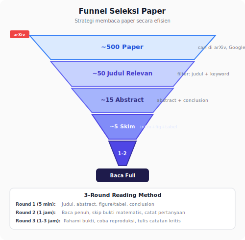
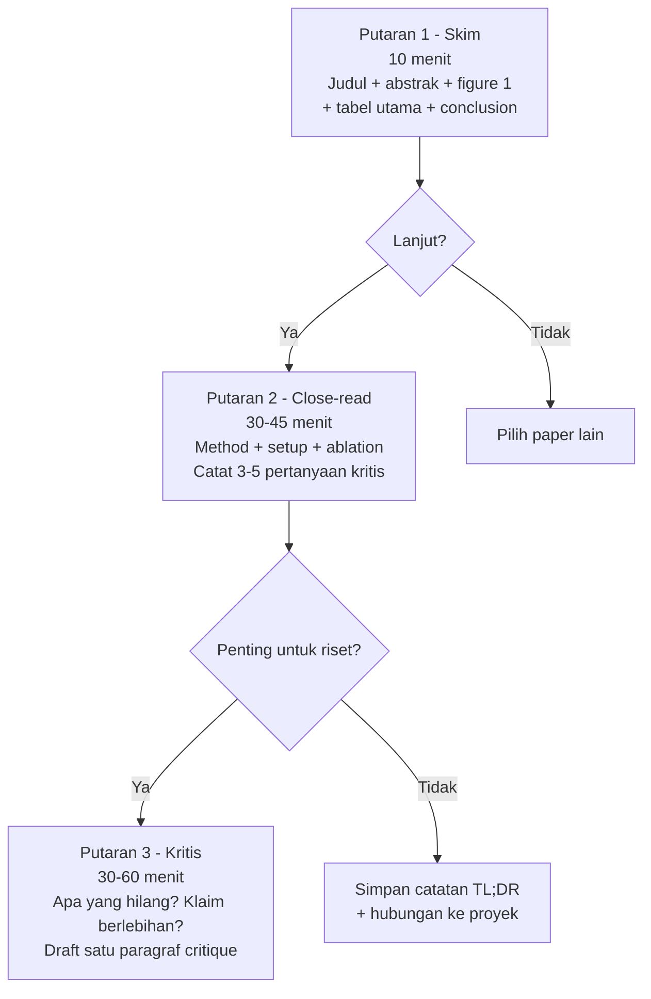

<details>
<summary>📂 Navigasi Modul (klik untuk buka)</summary>

| # | Modul | Minggu |
|---|-------|--------|
| 00 | [Pendahuluan](00_Pendahuluan.md) | 1 |
| 01 | [W1 - Tabular & Output Heads](01_W1_Tabular_Output_Heads.md) | 1 |
| 02 | [W2 - Images, CNN & Smoke Test](02_W2_Images_CNN_Smoke_Test.md) | 2 |
| 03 | [W3 - Loss, Optimizer & Evaluasi](03_W3_Loss_Optimizer_Evaluasi.md) | 3 |
| 04 | [W4 - Reproducibility & Experiment Matrix](04_W4_Reproducibility_Experiment_Matrix.md) | 4 |
| 05 | [W5 - Sequences: RNN & LSTM](05_W5_Sequences_RNN_LSTM.md) | 5 |
| 06 | [W6 - Representations & Temporal Leakage](06_W6_Representations_Temporal_Leakage.md) | 6 |
| 07 | [W7 - Text, Transformers & Repo Adoption](07_W7_Text_Transformers_Repo_Adoption.md) | 7 |
| 08 | [W8 - Foundation Models](08_W8_Foundation_Models.md) | 8 |
| 09 | [W9 - Multimodal Reasoning](09_W9_Multimodal_Reasoning.md) | 9 |
| ▶ 10 | W10 - Paper Reading & Implementation | 10 |
| 11 | [W11 - Research Framing & Capstone Proposal](11_W11_Research_Framing.md) | 11 |
| 12 | [Capstone 3 Minggu](12_Capstone_3_Minggu.md) | 12-14 |
| 13 | [Rubrik Penilaian](13_Rubrik_Penilaian.md) | – |
| 14 | [Lampiran](14_Lampiran.md) | – |
| 15 | [Panduan Dosen](15_Panduan_Dosen.md) | – |

</details>

---

# 10 · W10 - Paper Reading & Paper Implementation

> *Riset tidak berakhir ketika semester selesai. Keterampilan membaca paper secara terstruktur dan menerjemahkannya menjadi kode yang bisa dijalankan adalah yang memisahkan peneliti pemula dari peneliti yang terus berkembang.*

**Big Map row:** sintesis melalui research artifacts
**Rigor habit:** Three-pass paper reading dan paper-to-code translation
**Lab utama:** Lab 9 - Paper Implementation (`lab9_paper_implementation.ipynb`)

---

## 0. Peta Bab

W10 fokus pada dua skill yang sering diasumsikan ada tapi jarang diajarkan eksplisit:

- **2.1** Kurasi paper: dari banjir ke aliran kecil
- **2.2** Three-pass paper reading method (Keshav 2007) - eksplisit dengan template
- **2.3** Paper-to-code translation workflow - 6 langkah dari abstract ke minimal runnable
- **2.4** Menjalankan satu ablation kecil untuk memahami kontribusi paper
- **2.5** Peta keluarga model generatif (vocab reference)

Setelah W10, Anda bisa mengambil paper dari arXiv, membacanya secara terstruktur, dan menjalankan implementasi core method-nya dalam satu minggu.

---

## 1. Motivasi: Satu Tahun Setelah Kelas

Bayangkan setahun dari sekarang. Anda sudah lulus atau sedang TA semester akhir. Tidak ada lagi silabus, tidak ada lagi dosen yang mengirim email "minggu ini coba ini". Anda tertarik pada satu bidang - katakanlah *medical image segmentation* - dan ingin menjadi kompeten di dalamnya.

Dua mahasiswa menghadapi situasi yang sama dengan dua strategi.

Mahasiswa pertama membuka arXiv, melihat 50 paper baru di bidang itu minggu ini, merasa kewalahan, lalu memilih satu paper yang judulnya paling menarik. Ia membaca dari depan ke belakang, tidak sepenuhnya paham, tutup. Pekan depan, paper lain. Setelah tiga bulan, ia tahu banyak istilah tetapi tidak punya satu pertanyaan sendiri. Pekerjaannya adalah *mengonsumsi*, bukan *berkembang*.

Mahasiswa kedua menyiapkan rutinitas. Setiap Senin pagi, 30 menit: baca daftar paper baru di arXiv dengan filter ketat (dua kata kunci + kategori). Pilih top-5 berdasarkan abstrak saja. Setiap Selasa-Jumat, 30 menit pagi: baca satu dari top-5 dengan metode tiga putaran. Setiap Sabtu, 60 menit: refleksi mingguan - apa satu pertanyaan baru yang muncul? Bisakah aku membuktikan atau membantahnya dengan eksperimen kecil? Setelah tiga bulan, ia sudah menjalankan dua mini-eksperimen sendiri, menolak lima hipotesis awal, mempertajam pertanyaannya. Ia sudah menjadi peneliti.

Perbedaan bukan bakat. Perbedaannya adalah sistem: filter paper, metode membaca, ritme refleksi, dan *jurnal pertanyaan sendiri*. Bab ini memberimu kerangka itu.

---

## 2. Konsep Inti

### 2.1 Kurasi Paper: Dari Banjir ke Aliran Kecil

**Navigasi arXiv.** Tiga kategori paling relevan untuk ML/DL: `cs.LG` (Machine Learning), `cs.CV` (Computer Vision), `cs.CL` (NLP/LLM). Untuk medical imaging: `eess.IV`. Cari via `arxiv.org/search` dengan filter kategori + kata kunci. ID paper `2312.01234` berarti Desember 2023, urutan 01234; URL PDF: `arxiv.org/pdf/2312.01234`. Simpan ID, bukan judul. Saat mengutip, gunakan versi yang Anda baca (`v1`, `v2`, dst) karena beda versi bisa punya perbedaan substansial. Papers With Code (`paperswithcode.com`) menghubungkan paper ke kode resmi dan benchmark.

arXiv menerbitkan ratusan paper ML per hari. Membaca semua mustahil. Tujuan kurasi: saring menjadi 5-10 paper per minggu yang layak 30 menit waktumu.

Empat tingkat filter, dari kasar ke halus:

**Filter 1 - Kategori + kata kunci.** Di arXiv, berlangganan kategori spesifik (`cs.CV`, `cs.LG`, `eess.IV` untuk medical imaging). Tambahkan filter kata kunci dari minat spesifik. Alat: Google Scholar Alerts, arxiv-sanity, Papers with Code RSS.

**Filter 2 - Judul.** 80% paper dapat Anda tolak dari judul: bukan bidangmu, bukan tipe pertanyaan yang Anda cari. Proses 50 judul dalam 5 menit; yang tersisa mungkin 10.

**Filter 3 - Abstrak.** Baca abstrak dari 10 paper. Tanya: apakah *klaim* mereka menarik bagiku? Apakah *metodenya* terasa belajar atau mainstream? Pilih top 5.

**Filter 4 - Pembaca cepat.** Baca introduction + figure pertama + tabel hasil dari 5 paper. Sekarang Anda tahu: mana yang worth deep-dive, mana yang cukup diingat sebagai "ada di luar sana".

Dari 500 paper/minggu → 5 paper dibaca cepat → 1-2 paper dibaca penuh. Rasio 1:250. Awalnya terasa membuang, sebenarnya itu efisiensi.



### 2.2 Membaca Paper dalam Tiga Putaran

Paper akademik tidak dirancang untuk dibaca linear. Tiga putaran membantu menyerap dengan energi yang masuk akal:



**Putaran 1 - Peta (10 menit).** Baca: judul, abstrak, introduction pertama paragraf, headings sections, figure 1, tabel hasil utama, conclusion. Target: jawab tiga pertanyaan - (a) apa yang mereka *klaim* mereka lakukan? (b) apa yang mereka ukur? (c) apakah hasilnya meyakinkan dari tabel saja?

Bila setelah 10 menit Anda tidak bisa menjawab ketiganya, paper mungkin tidak ditulis dengan baik - atau bidangnya terlalu jauh dari Anda. Putuskan: lanjut putaran 2, atau berhenti dan pilih paper lain.

**Putaran 2 - Detail (30-45 menit).** Baca linear tetapi *aktif*: catat pertanyaan di margin. Fokus: method section (bagaimana tepatnya mereka melakukannya?), experimental setup (dataset, baseline, metrik, ablation), dan figure/tabel satu per satu. Lewati related work kecuali bidangnya baru bagimu.

Catat 3-5 pertanyaan yang Anda punya: detail yang tidak jelas, pilihan yang aneh, baseline yang kurang, asumsi yang tidak diuji. Pertanyaan-pertanyaan ini bernilai lebih dari ringkasan paper-nya sendiri; simpan di jurnal pribadimu.

**Putaran 3 - Kritis (30-60 menit, opsional).** Hanya untuk paper yang benar-benar penting. Cari: apa yang paper *tidak* bahas? Apakah klaim melampaui data? Apa yang Anda minta untuk rebuttal jika mereview di konferensi? Output: satu paragraf critique yang bisa Anda kirim ke rekan satu grup riset.

### 2.3 Catatan Paper yang Berguna

Catatan yang Anda tidak pernah buka lagi tidak berguna. Empat bagian yang cukup untuk setiap paper yang Anda putar-2:

```markdown
# <judul ringkas> (authors, venue, year)

## TL;DR (1-2 kalimat)
Apa yang paper ini klaim, dalam kalimatmu sendiri.

## Metode (3-5 kalimat)
Bagaimana mereka melakukannya. Sisipkan sketsa atau rumus penting.

## Bukti (2-3 kalimat)
Dataset + metrik + hasil utama. Sebut angka konkret.

## Pertanyaan / Kritik (3-5 poin)
Yang mengganggumu atau yang ingin Anda gali.

## Hubungan dengan proyek saya
Satu kalimat: mengapa paper ini relevan (atau tidak).
```

Simpan di `docs/papers/<short_title>.md`. Setelah 20 paper, Anda punya literatur pribadi yang bisa di-grep. Dalam tiga bulan, Anda akan terkejut seberapa sering Anda mencari kembali.

### 2.4 5 Whys: Dari Minat ke Pertanyaan yang Dapat Dikerjakan

"Saya tertarik pada medical imaging" bukan pertanyaan riset. Terlalu lebar untuk diubah jadi eksperimen. Teknik *5 Whys* - bertanya "mengapa" lima kali - menajamkannya.

Contoh:

1. Aku tertarik pada medical imaging. *Mengapa?*
2. Karena modelnya sering gagal di rumah sakit berbeda. *Mengapa?*
3. Karena distribusi gambar antar rumah sakit berbeda. *Mengapa?*
4. Karena protokol akuisisi dan peralatan berbeda. *Mengapa?*
5. Dan mengapa itu penting bagiku sekarang?
6. Karena aku ingin menguji apakah augmentasi gaya-transfer mengurangi gap antar institusi.

Setelah 5 langkah, pertanyaan berubah dari "aku tertarik X" menjadi "apakah gaya-transfer augmentasi mengurangi domain gap antar rumah sakit pada tugas segmentasi?". Ini sudah dapat diubah menjadi eksperimen: dataset dua rumah sakit (HAM10000 subset + MedMNIST mirip), baseline tanpa augmentasi, varian dengan augmentasi, metrik Dice atau IoU di test yang institusi berbeda. Itu proposal riset mini.

5 Whys tidak selalu perlu lima; kadang tiga cukup, kadang butuh tujuh. Intinya adalah turun dari *motivasi* ke *variabel yang bisa diukur*.

### 2.5 Pre-Registration Ringan

Pre-registration berarti menulis *apa yang akan Anda lakukan dan apa yang akan Anda anggap sebagai sukses* **sebelum** Anda menjalankan eksperimen. Ini kebiasaan yang lazim di bidang yang lebih tua (psikologi, kedokteran) untuk mencegah *outcome switching* - mengganti metrik ketika hasil tidak sesuai harapan.

Di ML, pre-reg ringan adalah dokumen satu halaman dengan lima bagian:

```markdown
# Pre-Registration: <judul eksperimen>
Tanggal: <YYYY-MM-DD>   Rencana oleh: <nama>

## 1. Motivasi (2-3 kalimat)
Mengapa pertanyaan ini layak dijawab sekarang.

## 2. Hipotesis (satu kalimat falsifiable)
"Aku memprediksi metode X akan menghasilkan Y lebih tinggi dari baseline B pada dataset D, dengan perbedaan >Δ."

## 3. Protokol
- Dataset: ...
- Baseline: ...
- Intervensi (variabel yang diubah): ...
- Metrik utama: ... (tetapkan SATU metrik utama; sekunder boleh dicatat)
- Seed: ... (minimum 3)
- Kriteria sukses: Δ >... dengan |metrik ablation| <...

## 4. Hasil yang diharapkan (satu paragraf)
Tulis apa yang Anda tebak hasilnya. Ini menjaga kejujuran intuisi.

## 5. Kapan aku akan menganggap hipotesis gagal
Kondisi konkret yang membuatmu menyatakan H nol benar.
```

Setelah eksperimen selesai, buka pre-reg, bandingkan dengan hasil aktual, tulis *amendment* bila ada deviasi. Sering kali Anda akan menemukan diri sendiri tergoda mengubah metrik atau menambah baseline baru - pre-reg menjaga disiplin untuk melaporkan *ketika itu terjadi*, bukan menyembunyikannya.

Jangan jadikan pre-reg birokrasi. Tujuannya bukan dokumen sempurna; tujuannya adalah Anda-tiga-jam-kemudian tidak bisa menipu Anda-sekarang.

### 2.6 Rutinitas Mingguan: Sistem yang Bertahan

Rutinitas praktis yang dapat Anda pakai sendiri setelah kelas berakhir:

| Hari | Aktivitas | Durasi |
|---|---|---|
| Senin pagi | Kurasi arXiv: 50 judul → top 5 abstrak | 30 menit |
| Selasa pagi | Baca paper #1 putaran 1+2 | 45 menit |
| Rabu pagi | Baca paper #2 putaran 1+2 | 45 menit |
| Kamis pagi | Eksekusi: satu mini-eksperimen (< 2 jam) | 2 jam |
| Jumat pagi | Baca paper #3 putaran 1+2 | 45 menit |
| Sabtu | Refleksi mingguan + update jurnal pertanyaan | 60 menit |
| Minggu | Istirahat (serius - peneliti yang burn-out tidak produktif) | - |

Total: ~6 jam/minggu. Dalam setahun: ~300 jam fokus = ~40 paper dibaca dalam, ~40 mini-eksperimen, satu atau dua mini-proyek matang. Itu cukup untuk menjadi kompeten di satu sub-bidang.

Rutinitas ini sederhana karena sederhana yang bertahan. Yang rumit ditinggalkan dalam dua minggu.

### 2.7 Peta Keluarga Model Generatif

Modul ini men-*cover* arsitektur diskriminatif secara hands-on (MLP di Lab 1c, CNN di Lab 1, LSTM di Lab 3b, Transformer encoder di Lab 6b, Autoencoder di Lab 7b). Satu keluarga besar yang tidak masuk jadwal hands-on adalah **model generatif** - model yang belajar menghasilkan sampel baru dari distribusi data. Alasannya bukan kurang penting - justru sebaliknya: sekitar sepertiga paper ML modern melibatkan komponen generatif. Alasan praktisnya adalah ongkos latihan dan *tuning*: model generatif yang stabil butuh compute, dataset, dan keterampilan diagnostik yang melebihi scope semester ini.

Karena itu, bagian ini memberi Anda **peta mental** agar Anda bisa membaca paper generatif dengan struktur - tahu apa yang sedang dilakukan paper, apa pertanyaan standar yang wajib Anda ajukan, dan kapan harus waspada.


| Keluarga | Ide inti | Training signal | Kapan dipakai | Failure mode khas | Paper pembuka |
| --- | --- | --- | --- | --- | --- |
| VAE | Encoder ke distribusi Gaussian, decoder dari sampel | Rekonstruksi + KL terhadap prior | Ketika butuh representasi kontinu yang bisa di-sampel; *conditional generation* | Rekonstruksi kabur, *posterior collapse* (decoder abaikan z) | Kingma & Welling 2013 (*Auto-Encoding Variational Bayes*) |
| GAN | Generator vs discriminator, permainan minimax | Discriminator mengklasifikasi real/fake | Generasi gambar tajam, *style transfer*, *image-to-image* | Mode collapse, training tidak stabil, sulit dievaluasi | Goodfellow et al. 2014 (*Generative Adversarial Nets*) |
| Diffusion | Tambah noise bertahap, belajar un-noise | Prediksi noise pada setiap langkah | State-of-the-art image/video generation, kontrol *conditioning* | Inference lambat (banyak step), butuh compute besar | Ho et al. 2020 (*Denoising Diffusion Probabilistic Models*) |
| Normalizing Flow | Transformasi bijeksi yang dibalik dari noise ke data | Likelihood eksak | Ketika butuh likelihood eksak (deteksi anomali, kompresi) | Arsitektur terbatas (harus invertible), kapasitas lebih kecil | Rezende & Mohamed 2015 (*Variational Inference with Normalizing Flows*) |


**Lab 7b sudah memberi Anda pijakan.** Autoencoder standar di Lab 7b adalah langkah pertama menuju VAE: encoder, decoder, bottleneck, dan reconstruction loss semua ada. VAE hanya menambah tiga hal: encoder mengeluarkan `(μ, σ)` bukan `z` langsung, sampling dengan *reparameterization trick*, dan loss KL terhadap prior. Jalur praktisnya: fork Lab 7b, tambah tiga modifikasi itu - ini adalah jalur yang cocok untuk **Komponen Mandiri Jalur 4 (Arsitektur Baru)**.

Ketika PI Anda menyebutkan "coba diffusion untuk data kita", Anda harus bisa mengenali dari abstrak: apakah paper pakai generator sebagai *augmentation*, *imputation*, atau *end-to-end task*. Tabel di atas memberi Anda vocab yang cukup untuk percakapan pertama. Tiga paper pembuka di tabel adalah kandidat kuat untuk *paper slot* di rutinitas mingguan Anda di Lab 9.

---

## 3. Worked Example: Dari Minat ke Mini-Eksperimen dalam Satu Minggu

Skenario nyata dari seorang mahasiswa fiktif, Rani, yang tertarik pada *label noise robustness*.

**Senin.** Rani berlangganan `cs.LG` dengan filter kata "label noise", "noisy labels". Minggu ini: 47 judul baru. 10 abstrak dibaca; 3 paper terkumpul sebagai top.

**Selasa.** Paper #1: "Early Learning Regularization" (Liu et al., NeurIPS). Putaran 1 dan 2, 45 menit. Catatan: metode regularisasi yang mencegah model menghafal label salah di epoch awal; hasil bagus di CIFAR-10 dengan 40% noise. *Pertanyaan Rani:* apakah berlaku juga untuk noise non-uniform (mis. dua kelas mirip selalu tertukar)?

**Rabu.** Paper #2: paper tentang *confident learning*. Putaran 1 saja; Rani memutuskan paper ini lebih tentang dataset cleaning, bukan robust training - simpan tapi tidak deep-dive.

**Kamis - 5 Whys dan pre-reg:**

1. Aku tertarik robust training di bawah label noise. *Mengapa?*
2. Karena real-world noise sering non-uniform dan pendekatan mainstream menguji uniform. *Mengapa penting?*
3. Karena pilihan loss yang robust di uniform bisa gagal di structured noise. *Mengapa aku bisa menjawab?*
4. Karena aku punya template CIFAR-10 dan dapat men-generate structured noise mudah.

Pertanyaan: "Apakah Early Learning Regularization yang unggul di uniform noise 40% tetap unggul ketika noise terstruktur (20% pasangan kelas mirip ditukar)?"

Rani menulis pre-reg:

```markdown
# Pre-Reg: ELR di structured noise
## Hipotesis: ELR akan kehilangan margin keunggulannya terhadap cross-entropy baseline
##   ketika noise adalah pasangan-spesifik (cat↔dog, deer↔horse) alih-alih uniform.
## Protokol: CIFAR-10, 3 seed, noise 20% structured vs 20% uniform, metrik: test acc clean-label.
## Hasil diharapkan: ELR unggul ~3-5% di uniform, ~0-1% di structured.
## Fail-state: ELR tetap unggul >3% di structured → aku keliru, ELR lebih general dari kuduga.
```

**Jumat - eksekusi.** Template Rani sudah mendukung varian loss. Menambahkan flag `--noise_mode=[uniform|structured]` butuh 20 menit. Jalankan 2×3=6 training 30-menit di laptop (CIFAR-10 kecil). Total 3 jam.

**Sabtu - refleksi.** Hasil: ELR unggul 4.1% di uniform, 1.3% di structured. Prediksi Rani benar - pattern loss structured noise berbeda. Tetapi perbedaan 1.3% belum nol, jadi ELR *masih* membantu sedikit.

Apa yang Rani tulis di jurnal pertanyaan:

> ELR masih membantu di structured noise tetapi margin menyusut. Pertanyaan baru: apakah teknik yang secara eksplisit memodelkan pair-wise transition (seperti noise-adaptation layer) akan lebih besar marginnya di structured? Kandidat paper minggu depan: Sukhbaatar et al. 2015, Patrini et al. 2017.

Rani telah menjadi peneliti aktif. Dalam satu minggu - tanpa pembimbing memberi instruksi - ia memilih paper, memformulasikan pertanyaan yang dapat diuji, menjalankan eksperimen kecil, menemukan pola, dan punya pertanyaan berikutnya. Sistem yang berputar sendiri.

---

## 4. Pitfalls & Miskonsepsi

**Pitfall 1 - Membaca untuk merasa pintar, bukan untuk membangun sesuatu.** Anda mengonsumsi paper sebanyak 5/minggu tetapi tidak pernah menjalankan eksperimen sendiri. *Cara deteksi:* buka jurnal pertanyaanmu. Jika semua poin berupa ringkasan paper, bukan pertanyaanmu sendiri yang diuji atau akan diuji, Anda sedang mengonsumsi.

**Pitfall 2 - Paper baru dikejar, paper fondasi dilewat.** Hanya membaca paper 2024-2025 tanpa paper 2015-2018 yang membangun field. *Cara deteksi:* saat membaca related work paper baru, perhatikan rujukan yang muncul berulang di banyak paper modern - itu paper fondasi; sisakan satu slot/bulan untuknya.

**Pitfall 3 - Pre-reg ditulis setelah melihat hasil.** "Oh ternyata hasilnya begini - biar saya tulis pre-reg yang cocok." Ini mengalahkan tujuan. *Cara deteksi:* tanggal file pre-reg harus lebih tua dari tanggal commit pertama kode eksperimen. Bila tidak, Anda sedang membohongi diri.

**Pitfall 4 - 5 Whys berhenti di "karena menarik".** Lima whys yang semuanya tentang *motivasi emosional* tidak pernah mendarat ke variabel yang diukur. *Cara deteksi:* di pertanyaan akhir, harus ada kata kerja konkret ("ukur", "bandingkan", "ablasi") dan variabel konkret ("loss", "augmentasi", "arsitektur"). Bila tidak ada, gali lagi satu why.

**Pitfall 5 - Rutinitas yang tidak proporsional dengan hidupmu.** 6 jam/minggu adalah rekomendasi mahasiswa dengan beban kuliah normal. Pekerja full-time mungkin hanya 3 jam. *Cara deteksi:* jika setelah sebulan rutinitas terhenti, bukan Anda yang malas - target-nya yang terlalu tinggi. Pangkas 50%; apa yang bertahan lebih berharga dari apa yang sempurna di atas kertas.

---

### 2.3 Paper-to-Code Translation Workflow

Enam langkah dari abstrak paper ke kode minimal yang bisa dijalankan:

1. **Identifikasi core contribution.** Apa satu inovasi terpenting paper ini? Bukan seluruh arsitektur - satu komponen kunci. Tulis dalam satu kalimat.
2. **Temukan input/output shape.** Apa tensor yang masuk ke metode baru, dan apa yang keluar? Bila tidak eksplisit di paper, cek pseudocode atau codebase.
3. **Pisahkan essential dari engineering detail.** Banyak paper punya banyak trick tambahan. Identifikasi mana yang essential untuk core contribution, mana yang optimisasi sekunder.
4. **Build minimal runnable version.** Implementasikan hanya core contribution pada dataset kecil/toy. Smoke test dulu.
5. **Verify parity check.** Apakah ada angka di paper yang bisa direproduksi dengan implementasi Anda pada konfigurasi yang sama? Jika paper punya official code, bandingkan.
6. **Satu ablation.** Hapus atau modifikasi satu komponen core contribution. Apakah performa drop seperti yang diklaim paper?

> [!TIP]
> Paper sering menyembunyikan detail penting di appendix atau code repository. Selalu cek keduanya. Juga perhatikan "implementation details" section - sering ada hyperparameter kritis yang tidak ada di main text.

---

## 5. Lab 9 - Paper Implementation

Buka `template_repo/notebooks/lab9_paper_implementation.ipynb`.

**Menu Paper (pilih satu):**
- Paper A: Focal Loss (Lin et al., 2017) - implementasi dari scratch pada CIFAR-10.
- Paper B: DropBlock (Ghiasi et al., 2018) - structured dropout untuk CNN.
- Paper C: Satu paper dari area riset Anda sendiri (konsultasikan dengan dosen).

**Tugas:**

1. Three-pass read - tulis catatan dengan template §2.2.
2. Paper-to-code translation steps 1-6 dari §2.3.
3. Implementasi core method dalam `src/` atau notebook.
4. Smoke test pada dataset kecil.
5. Parity check: apakah angka utama paper bisa direproduksi?
6. Satu ablation: hapus atau modifikasi satu komponen.
7. Tulis `experiment_report.md`: apa yang lebih sulit dari yang tampak di paper?

**Checklist:**
- [ ] Three-pass notes tersimpan di `docs/papers/`.
- [ ] Core method terimplementasi dan smoke test lulus.
- [ ] Satu angka dari paper terproduksi (atau selisih < 2% dengan alasan).
- [ ] Ablation menunjukkan dampak core contribution.
- [ ] `experiment_report.md` mencatat "apa yang lebih sulit dari yang tampak".

Target waktu: 6-8 jam.

---

## Komponen Mandiri (W10)

Format: [Lampiran C.9](14_Lampiran.md#c9-template-komponen-mandiri).

| Jalur | Tugas |
|---|---|
| **Implementasi** | Implementasikan satu teknik pendukung dari paper Lab 9 yang belum ada di template_repo. |
| **Analisis** | Pilih satu paper dengan klaim "terlalu bagus". Analisis kritis 1 halaman: klaim apa, bukti apa, apa yang tidak ditunjukkan. |
| **Desain** | Pre-registration untuk ide riset dari pengalaman Anda sendiri sepanjang semester. |
| **Arsitektur Baru** | Implementasikan satu paper tentang arsitektur yang belum dibahas di modul (mis. ResNeXt, MobileNet, DETR). |

---

## Komponen Mandiri (Pekan 12)

Konsep: membaca paper secara terarah, merumuskan pertanyaan falsifiable, merancang eksperimen lanjutan. Ini entri portofolio terakhir - setelah mengisinya, kerjakan juga sel "Refleksi Portofolio" di notebook: lihat kembali semua 8 entri dan tuliskan satu paragraf trajektori belajar. Di awal Pekan 13, presentasi diperpanjang - tampilkan *highlight* portofolio, bukan hanya Pekan 12. Format dan kriteria: [Lampiran C.9](14_Lampiran.md#c9-template-komponen-mandiri).

| Jalur | Tugas minggu ini |
| --- | --- |
| **A - Implementasi** | Dari paper Lab 9, implementasikan satu teknik pendukung yang belum ada di template_repo (LR scheduler, metrik evaluasi tambahan, atau augmentasi di appendix). Laporkan apakah hasilnya sesuai klaim paper. |
| **B - Analisis** | Pilih satu paper yang klaim utamanya terasa "terlalu bagus". Lakukan analisis kritis 1 halaman: klaim apa yang dibuat, bukti apa yang ditunjukkan, apa yang tidak ditunjukkan, dan apa yang perlu diverifikasi sebelum mengutipnya. |
| **C - Desain** | Tulis pre-registration untuk ide riset yang muncul dari pengalaman Anda sendiri sepanjang semester (bukan dari paper orang lain). Minimal: motivasi, hipotesis falsifiable, protokol, dan kondisi kegagalan. |

**Deliverable:** Entri portofolio Pekan 12 + sel Refleksi Portofolio di `notebooks/portofolio_mandiri.ipynb`. Presentasi highlight portofolio 10 menit di awal Pekan 13.

---

## 6. Refleksi

1. Apa satu pertanyaan riset yang *hanya Anda* yang menanyakan di lingkunganmu saat ini? Jika jawabannya "tidak ada", apa yang perlu Anda kerjakan untuk menemukannya - lebih banyak paper yang dibaca, lebih banyak orang yang diajak bicara, atau lebih banyak eksperimen untuk menyingkap celah?
2. Setelah menjalankan Lab 9, bandingkan pre-reg dengan experiment report. Di mana Anda paling tergoda menyimpang? Apa yang bisa Anda ubah di pre-reg berikutnya agar godaan itu lebih sulit dilakukan?
3. Setelah kelas ini berakhir, apa yang menjadi satu kalimat komitmen belajar mingguanmu - yang realistis dengan jadwalmu dan masih menantang? Tulis, tempel di tempat yang Anda lihat setiap hari. Kembali enam bulan lagi, evaluasi.

4. **Koneksi ke Capstone.** Anda sudah membaca 9 bab dan mengisi 8 entri portofolio mandiri. Tulis satu paragraf "proposal Capstone draft 0": satu kalimat pertanyaan riset, satu paragraf justifikasi mengapa Anda yang paling cocok mengerjakannya (berdasar entri portofolio mana), dan daftar 3 bab modul yang paling sering akan Anda rujuk saat mengerjakannya. Paragraf ini akan jadi batu loncatan masuk Bab 10.

---

## 7. Bacaan Lanjutan

- **"How to Read a Paper"** oleh S. Keshav (2007, 3 halaman). Metode tiga-pass original; sumber populer dari teknik yang diadaptasi di bab ini. Baca sekali dalam hidupmu, tempel di dekat meja.
- **"The Researcher's Bible"** oleh Alan Bundy (University of Edinburgh notes). Bab tentang memformulasikan pertanyaan dan menulis proposal. Tidak spesifik ML tetapi aplicable.
- **arxiv-sanity-lite** (Andrej Karpathy). Alat kurasi paper sederhana yang Anda host sendiri. Kalau Anda suka mengkurasi dengan preferensi unik, ini menghemat waktu.
- **Andrej Karpathy - "A Recipe for Training Neural Networks"** (karpathy.github.io, 2019). Bukan tentang membaca paper, tetapi mewakili sikap ilmiah-harian yang diajarkan bab ini: cek unit, bangun baseline yang keras, percaya yang terukur.
- **OpenReview.net** - baca review publik dari ICLR/NeurIPS untuk paper yang Anda suka. Melihat bagaimana reviewer profesional mengkritik paper adalah satu dari sedikit cara terbaik mempertajam *taste* riset.

---

## Lanjut ke W11

Semua skill bootcamp sudah dibangun. W11 menggabungkan semuanya untuk satu tujuan: menyusun proposal capstone yang bisa dipertahankan. Research framing, 5 Whys, literature-to-experiment synthesis, dan oral proposal defense.

Buka [W11 - Research Framing & Capstone Proposal](11_W11_Research_Framing.md) ketika siap.
