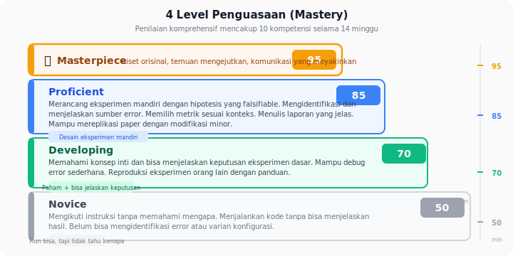

📂 Navigasi Modul (klik untuk buka)

| # | Modul | Minggu |
|---|-------|--------|
| 00 | [Pendahuluan](00_Pendahuluan.md) | 1 |
| 01 | [W1 - Tabular & Output Heads](01_W1_Tabular_Output_Heads.md) | 1 |
| 02 | [W2 - Images, CNN & Smoke Test](02_W2_Images_CNN_Smoke_Test.md) | 2 |
| 03 | [W3 - Loss, Optimizer & Evaluasi](03_W3_Loss_Optimizer_Evaluasi.md) | 3 |
| 04 | [W4 - Reproducibility & Experiment Matrix](04_W4_Reproducibility_Experiment_Matrix.md) | 4 |
| 05 | [W5 - Sequences: RNN & LSTM](05_W5_Sequences_RNN_LSTM.md) | 5 |
| 06 | [W6 - Representations & Temporal Leakage](06_W6_Representations_Temporal_Leakage.md) | 6 |
| 07 | [W7 - Text, Transformers & Repo Adoption](07_W7_Text_Transformers_Repo_Adoption.md) | 7 |
| 08 | [W8 - Foundation Models](08_W8_Foundation_Models.md) | 8 |
| 09 | [W9 - Multimodal Reasoning](09_W9_Multimodal_Reasoning.md) | 9 |
| 10 | [W10 - Paper Reading & Implementation](10_W10_Paper_Reading.md) | 10 |
| 11 | [W11 - Research Framing](11_W11_Research_Framing.md) | 11 |
| 12 | [Capstone - Proyek Riset](12_Capstone.md) | 12-15 |
| ▶ 13 | Rubrik Penilaian | – |
| 14 | [Lampiran](14_Lampiran.md) | – |
| 15 | [Panduan Instruktur](15_Panduan_Instruktur.md) | – |

---

# 13 · Rubrik Penilaian

> *Rubrik yang baik bukan alat menghakimi, melainkan cermin yang memantulkan arah. Tiap level menggambarkan kebiasaan yang dapat diamati - bukan nilai yang harus dicapai dengan cara apapun.*

---

## 0. Peta Bab

Rubrik ini memetakan sembilan kompetensi ke empat level penguasaan dengan deskriptor yang dapat diobservasi, memberikan bobot nilai yang dapat disesuaikan dosen, dan menjelaskan cara rubrik dipakai sepanjang semester. Bagian akhir menyatukan rubrik dengan proyek capstone agar penilaian akhir bersandar pada bukti konkret, bukan kesan.

---

## 1. Empat Level Penguasaan

Empat level berlaku untuk semua kompetensi. Deskriptor spesifik diberikan per kompetensi di bagian 3.

| Level           | Inti deskriptor                                                                                                                                                   |
| --------------- | ----------------------------------------------------------------------------------------------------------------------------------------------------------------- |
| **Novice**      | Bisa menjalankan prosedur saat diberi contoh langkah demi langkah; belum bisa menjelaskan pilihan desain.                                                         |
| **Developing**  | Bisa menjalankan prosedur secara mandiri pada kasus yang mirip contoh; mengenali nama pitfall tetapi belum sigap mendeteksinya.                                   |
| **Proficient**  | Bisa menerapkan kompetensi pada kasus baru; menjelaskan pilihan desain dengan alasan; mendeteksi pitfall umum sebelum menjadi masalah.                            |
| **Masterpiece** | Mampu menurunkan prinsip ke kasus yang belum pernah dilihat; menyusun penjelasan yang membantu orang lain belajar; melihat trade-off yang tidak disebut di modul. |

Level *Masterpiece* tidak diharapkan tercapai di semua kompetensi pada akhir semester. Ia dicantumkan sebagai arah, bukan target minimum.

---

## 2. Bobot Rekomendasi

Bobot berikut adalah saran yang dapat disesuaikan dosen menurut fokus kelas. Total 100%.

| #   | Kompetensi                           | Bobot |
| --- | ------------------------------------ | ----- |
| 1   | Memahami sistem ML/DL praktis        | 14%   |
| 2   | Menerjemahkan ide menjadi eksperimen | 12%   |
| 3   | Eksperimen reproduksibel             | 14%   |
| 4   | Validasi data & pra-pemrosesan       | 12%   |
| 5   | AI tools sebagai pendukung           | 8%    |
| 6   | Adopsi repository riset              | 10%   |
| 7   | Alat pendukung ringan                | 4%    |
| 8   | Platform & tool baru                 | 6%    |
| 9   | Pengembangan mandiri                 | 10%   |
| –   | **Proyek capstone**                  | 10%   |
| 10  | Eksplorasi Mandiri & Komunikasi      | 10% (*) |

Catatan: capstone dinilai **menggunakan rubrik yang sama**, tetapi dengan bobot tersendiri karena ia adalah integrasi lintas kompetensi. Rinciannya di bagian 5.

(*) Kompetensi 10 bersifat opsional. Jika diaktifkan, dosen mendistribusikan ulang bobot agar total tetap 100% - misalnya mengurangi Capstone dari 10% ke 5% dan mengurangi dua kompetensi lain masing-masing 1%.

Skor per kompetensi dihitung dari level yang dicapai: Novice = 50, Developing = 70, Proficient = 85, Masterpiece = 95. Nilai akhir = Σ(bobot × skor) ÷ 100.

---

## 3. Rubrik Per Kompetensi

Setiap baris di bawah adalah kompetensi; setiap kolom adalah level. Deskriptor ditulis sebagai perilaku yang dapat diobservasi dosen saat mengevaluasi lab, laporan, atau diskusi.

### Kompetensi 1 - Memahami Sistem ML/DL Praktis

> [!NOTE]
> **Breadth Check Policy.** Untuk mencapai level *Proficient* pada Kompetensi 1, mahasiswa wajib menyelesaikan **4 dari 5 keluarga arsitektur** berikut:
> - **MLP:** Lab 1c (numpy manual) - **wajib**
> - **CNN:** Lab 1 (CIFAR-10 baseline) - **wajib**
> - **RNN/LSTM:** Lab 3b (`lab_w5_lstm_sequence.ipynb`) - **wajib**
> - **Transformer:** Lab 6b (`lab_w7_transformer_mini.ipynb`) - **wajib** untuk breadth check; bukan opsional
> - **Autoencoder:** Lab 7b (`lab_breadth_autoencoder.ipynb`) - opsional; dapat diganti dengan arsitektur baru di Komponen Mandiri Jalur D
>
> Konten di dalam `

Pendalaman
` (misalnya derivasi backprop, GRU equations, D1-D7 repo adoption) adalah **opsional** dan tidak masuk syarat minimum breadth check - tetapi dapat dipakai sebagai bukti untuk level *Masterpiece*.

| Level       | Deskriptor                                                                                                                                                            |
| ----------- | --------------------------------------------------------------------------------------------------------------------------------------------------------------------- |
| Novice      | Menyebut nama arsitektur dan loss, tetapi ragu saat diminta memilih untuk kasus tertentu. Mengenali CNN dan MLP dari *worked example*, tidak bisa mengimplementasinya secara manual, dan belum pernah menjalankan forward pass untuk keluarga RNN, Transformer, atau Autoencoder. |
| Developing  | Memilih arsitektur/loss yang umum untuk jenis data tertentu (CNN untuk gambar, cross-entropy untuk klasifikasi), menjelaskan alasan singkat. Bisa mengimplementasi forward pass MLP **atau** CNN dari nol (salah satu, tidak keduanya). Mengenali arsitektur RNN/LSTM dan Transformer ketika membaca kode, tetapi belum bisa menulis sendiri blok intinya. |
| Proficient  | Membaca pasangan tensor input → output langsung dari kode atau deskripsi arsitektur yang belum dikenal dalam beberapa menit. Membandingkan dua pilihan arsitektur/loss untuk satu kasus, menjelaskan trade-off (mis. focal loss pada kelas imbalance). Menjelaskan peran layer dalam representasi dan membedakan tiga strategi representasi (engineered / extracted / learned) dengan alasan pemilihan yang jelas. **Breadth arsitektur (minimum 4 dari 5):** mengimplementasi *forward + backward* MLP 2-layer manual (Lab 1c), memakai RNN/LSTM (Lab 3b) dan Transformer encoder block (Lab 6b - **wajib untuk breadth**) dari library dengan memahami parameter-nya, memvisualisasikan embedding autoencoder dan membaca cluster t-SNE (Lab 7b). |
| Masterpiece | Merumuskan pilihan arsitektur, loss, atau strategi representasi yang tidak standar untuk dataset atau constraint yang tidak biasa, menjelaskan mengapa pilihan umum tidak cocok, dan mengargumentasikan kombinasi representasi (mis. engineered + extracted sebagai ansambel) yang tidak disebut eksplisit di modul. **Breadth arsitektur:** mengimplementasi *scaled dot-product attention* dari nol, menjelaskan trade-off MLP vs CNN vs RNN vs Transformer untuk jenis data yang belum pernah dijumpai modul, membaca paper dari keluarga generatif (VAE/GAN/Diffusion) dan meringkas arsitekturnya dalam 5 menit. |

### Kompetensi 2 - Menerjemahkan Ide Menjadi Eksperimen

| Level       | Deskriptor                                                                                                                                |
| ----------- | ----------------------------------------------------------------------------------------------------------------------------------------- |
| Novice      | Menjalankan instruksi "tambahkan focal loss" secara literal, tanpa menyiapkan baseline pembanding.                                        |
| Developing  | Mengidentifikasi variabel yang berubah dan menentukan satu baseline, tetapi belum merumuskan hipotesis yang dapat dipalsukan.             |
| Proficient  | Menyusun variabel, baseline, hipotesis (yang dapat dipalsukan), metrik sukses, dan protokol singkat sebelum menjalankan kode.             |
| Masterpiece | Mengantisipasi hasil alternatif ("jika akurasi naik > 2%, itu mungkin karena …"), merancang ablation pendukung untuk membedakan penyebab. |

### Kompetensi 3 - Eksperimen Reproduksibel

| Level       | Deskriptor                                                                                                                                                                                |
| ----------- | ----------------------------------------------------------------------------------------------------------------------------------------------------------------------------------------- |
| Novice      | Menjalankan training tanpa seed tetap; konfigurasi tersebar antara kode dan argumen CLI.                                                                                                  |
| Developing  | Memakai seed tetap, menyimpan konfigurasi YAML, dan mencatat hasil utama. Log tidak selalu terhubung ke konfigurasi.                                                                      |
| Proficient  | Checkpoint menyertakan konfigurasi, seed, dan git commit hash. Hasil ablation tersimpan dalam format yang dapat dibaca ulang (CSV). Orang lain dapat mereproduksi run utama.              |
| Masterpiece | Merancang kerangka eksperimen yang mencegah eksekusi tanpa metadata (mis. validator pra-training), menulis dokumentasi yang cukup agar tim baru menjalankan eksperimen pada hari pertama. |

### Kompetensi 4 - Validasi Data & Pra-pemrosesan

| Level       | Deskriptor                                                                                                                                              |
| ----------- | ------------------------------------------------------------------------------------------------------------------------------------------------------- |
| Novice      | Langsung memakai dataset apa adanya; melihat distribusi label hanya ketika diingatkan.                                                                  |
| Developing  | Melakukan EDA dasar, memeriksa distribusi kelas, menyadari imbalance dan kebutuhan normalisasi.                                                         |
| Proficient  | Mendeteksi *leakage* temporal atau ID, memverifikasi pipeline hanya fit pada data training, mengaudit sampel individual untuk label salah.              |
| Masterpiece | Menemukan bentuk *leakage* yang tidak dibahas modul (mis. fitur turunan yang memuat target), mendokumentasikan protokol audit yang dapat dipakai ulang. |

### Kompetensi 5 - AI Tools Sebagai Pendukung

| Level       | Deskriptor                                                                                                                                                                   |
| ----------- | ---------------------------------------------------------------------------------------------------------------------------------------------------------------------------- |
| Novice      | Menyalin output LLM tanpa modifikasi; tidak dapat menjelaskan kode yang ditempel.                                                                                            |
| Developing  | Memakai LLM untuk boilerplate, lalu membaca dan memodifikasi kodenya. Mencatat prompt tetapi tidak rutin.                                                                    |
| Proficient  | Menjalankan protokol verifikasi pada output LLM (baca baris per baris, uji kasus batas, uji minimal). Memisahkan tugas yang cocok untuk LLM dari yang tidak.                 |
| Masterpiece | Mengajarkan rekan cara memakai LLM sebagai *rubber duck*; merancang prompt yang menghasilkan kode ringkas dan dapat diverifikasi, bukan kode panjang yang tampak meyakinkan. |

### Kompetensi 6 - Adopsi Repository Riset

| Level       | Deskriptor                                                                                                                                                                     |
| ----------- | ------------------------------------------------------------------------------------------------------------------------------------------------------------------------------ |
| Novice      | Clone repo, mengikuti README, berhenti saat ada error setup yang tidak terduga.                                                                                                |
| Developing  | Mengatasi setup umum (dependency conflict, path), menemukan file model dan loss dengan bantuan `grep`.                                                                         |
| Proficient  | Memetakan entry point → model → loss → config dalam satu jam; menambahkan argumen CLI atau loss baru dengan modifikasi minimal-invasif.                                        |
| Masterpiece | Memperbaiki repo orang lain (dokumentasi kecil, perbaikan bug, arg baru) dan men-submit pull request yang diterima; menjelaskan arsitektur repo kepada rekan dalam < 15 menit. |

### Kompetensi 7 - Alat Pendukung Ringan

| Level       | Deskriptor                                                                                                                                        |
| ----------- | ------------------------------------------------------------------------------------------------------------------------------------------------- |
| Novice      | Membuat demo yang hanya menampilkan output mentah tanpa konteks interpretasi.                                                                     |
| Developing  | Demo Streamlit/Gradio berfungsi; visualisasi loss/accuracy dapat dibaca.                                                                          |
| Proficient  | Tool dirancang agar dosen/rekan bisa mengeksplorasi hasil tanpa harus bertanya; demo menunjukkan *confusion* atau *failure case* yang informatif. |
| Masterpiece | Tool membantu menemukan insight baru tentang data atau model yang tidak terlihat di log; reusable lintas eksperimen.                              |

### Kompetensi 8 - Platform & Tool Baru

| Level       | Deskriptor                                                                                                                                 |
| ----------- | ------------------------------------------------------------------------------------------------------------------------------------------ |
| Novice      | Menjalankan tutorial RunPod langkah demi langkah, tersendat saat menyimpang dari tutorial.                                                 |
| Developing  | Menjalankan eksperimen sederhana di RunPod, mengatur port forwarding TensorBoard.                                                          |
| Proficient  | Mengelola biaya GPU, menyinkronkan data dan checkpoint antar mesin, memulihkan training dari checkpoint remote.                            |
| Masterpiece | Mengadopsi platform/tool baru (bukan RunPod) secara mandiri dari dokumentasinya; menulis panduan ringkas untuk rekan yang akan memakainya. |

### Kompetensi 9 - Pengembangan Mandiri

| Level       | Deskriptor                                                                                                                                                                                   |
| ----------- | -------------------------------------------------------------------------------------------------------------------------------------------------------------------------------------------- |
| Novice      | Membaca paper secara linear; ringkasan paper hanya menyatakan ulang abstrak.                                                                                                                 |
| Developing  | Membuat catatan terstruktur (masalah, kontribusi, metode, hasil, limitasi).                                                                                                                  |
| Proficient  | Merumuskan pertanyaan lanjutan yang dapat dipalsukan; menulis pre-registration singkat sebelum eksperimen.                                                                                   |
| Masterpiece | Menghubungkan dua/tiga paper untuk menemukan gap, mengusulkan eksperimen yang masuk akal untuk mengeksplorasi gap tersebut, mendiskusikan hasil yang mungkin *dan* alternatif penjelasannya. |

### Kompetensi 10 - Eksplorasi Mandiri & Komunikasi

| Level | Deskriptor |
| --- | --- |
| Novice | Mengerjakan Komponen Mandiri hanya karena diwajibkan; pilihan jalur tidak disertai alasan; presentasi hanya membacakan langkah-langkah yang dikerjakan tanpa refleksi. |
| Developing | Memilih jalur dengan alasan singkat; dapat menjelaskan temuan; koneksi antar pekan belum terlihat dalam presentasi atau entri portofolio. |
| Proficient | Pilihan jalur bermotivasi jelas (dikaitkan dengan *gap* skill atau pertanyaan riset sendiri); temuan disampaikan dengan konteks dan implikasi; portofolio menunjukkan perkembangan yang dapat dibaca orang lain. |
| Masterpiece | Koneksi lintas pekan membentuk narasi belajar yang koheren; presentasi mengundang diskusi (mengajukan pertanyaan terbuka, mengakui ketidakpastian); portofolio dapat menjadi dokumentasi awal untuk proposal riset. |

---

## 4. Cara Rubrik Dipakai Sepanjang Semester

Rubrik dievaluasi di **tiga titik**, bukan hanya akhir semester.

**Titik 1 - Minggu 6 (setelah Lab 3).** Dosen dan mahasiswa bersama-sama meninjau pencapaian awal untuk kompetensi 1–3. Tujuannya bukan memberi nilai, tetapi menentukan apakah mahasiswa siap melangkah ke kompetensi yang lebih menuntut. Jika ada kompetensi yang masih Novice, materi pendukung diberikan sebelum Bab 04.

**Titik 2 - Minggu 10 (setelah Lab 6).** Tinjauan kedua mencakup kompetensi 4–6. Pada titik ini, mahasiswa diharapkan sudah Developing atau lebih untuk kompetensi 1–3. Diskusi berfokus pada pola kerja: apakah catatan eksperimen konsisten, apakah verifikasi pipeline dilakukan rutin, dan apakah interaksi dengan LLM sudah teratur.

**Titik 3 - Akhir minggu 14 (setelah capstone).** Evaluasi menyeluruh untuk semua kompetensi, menggunakan bukti dari lab, laporan capstone, dan demo. Level akhir dicatat per kompetensi, lalu digabungkan dengan bobot menjadi nilai akhir.

---

## 5. Rubrik Capstone

Capstone menilai **integrasi** kompetensi dan penerapan sikap riset pada proyek empat minggu. Lima dimensi, masing-masing dengan empat level.

| Dimensi               | Novice                                           | Developing                                    | Proficient                                                                                                                              | Masterpiece                                                                                    |
| --------------------- | ------------------------------------------------ | --------------------------------------------- | --------------------------------------------------------------------------------------------------------------------------------------- | ---------------------------------------------------------------------------------------------- |
| **Kedalaman teknis**  | Model berjalan; evaluasi dangkal.                | Metrik utama dilaporkan; ablation terbatas.   | Multi-metrik, ≥ 2 ablation bermakna, interpretasi hasil.                                                                                | Ablation mengisolasi penyebab secara eksplisit; hasil disertai uji signifikansi.               |
| **Reproduksibilitas** | Kode ada tetapi sulit dijalankan.                | Konfigurasi dan seed lengkap; README dasar.   | Satu perintah untuk mereproduksi hasil utama; dependency terkunci.                                                                      | Ada smoke test otomatis; dokumentasi cukup untuk tim baru.                                     |
| **Kualitas data**     | Dataset dipakai apa adanya.                      | EDA ada; satu isu data dicatat.               | Audit leakage, label quality, sample inspection.                                                                                        | Menemukan isu yang mengubah arah proyek; didokumentasikan rapi.                                |
| **Komunikasi**        | Laporan deskriptif; narasi lemah.                | Struktur latar–metode–hasil–diskusi jelas.    | Narasi runtut; grafik terpilih dengan alasan; limitasi dinyatakan.                                                                      | Laporan dapat dibaca peneliti lain dalam 30 menit; diskusi membedakan bukti dari spekulasi.    |
| **Sikap riset**       | Ketergantungan tinggi pada LLM tanpa verifikasi. | Menerapkan satu sikap konsisten (mis. rigor). | Empat sikap terlihat di titik-titik yang tepat (curiosity di desain, rigor di eksekusi, skeptisisme di validasi, ownership di laporan). | Sikap tampak pada keputusan sulit - misalnya menolak hasil menggoda karena belum ter-ablation. |

Level capstone berkontribusi 10% ke nilai akhir dengan pemetaan yang sama (Novice = 50, Developing = 70, Proficient = 85, Masterpiece = 95), dirata-rata lintas lima dimensi.

### 5.1 Sub-Rubrik Per Fase Capstone (4 Minggu)

Penilaian capstone didistribusi ke empat fase untuk memastikan feedback diberikan selama proses, bukan hanya di akhir.

**W12 - Filter dan Komitmen (25% dari nilai capstone)**

| Kriteria | Novice | Developing | Proficient | Masterpiece |
|---|---|---|---|---|
| **Pertahanan framing** | Framing tidak bisa dipertahankan saat ditanya | Framing ada tapi gap tidak jelas | Gap diidentifikasi; temporal/causal check dilakukan; literatur 2-3 paper | Gap nyata; triage literatur menyeluruh; backup framing siap |
| **Pre-registration Eksperimen 1** | Tidak ada atau dibuat setelah training | Ada tapi generik, tanpa kondisi kegagalan | Hipotesis falsifiable; kondisi kegagalan eksplisit; seeds ditentukan | Pre-reg merencanakan fallback jika primary gagal; commit sebelum kode berjalan |
| **Memulai Eksperimen 1** | Eksperimen belum mulai di akhir W12 | Setup berjalan; belum ada hasil | Baseline berjalan dengan ≥1 seed; logging aktif | Baseline + condition awal; hasil pertama sudah ada |

**W13 - Pikirkan Ulang dan Iterasi (35% dari nilai capstone)**

| Kriteria | Novice | Developing | Proficient | Masterpiece |
|---|---|---|---|---|
| **Hasil Eksperimen 1** | Tidak ada hasil atau tidak bisa direproduksi | Hasil ada; 1 seed; tanpa variance | Baseline vs kondisi utama; 3 seed; tabel angka | Per-seed variance dilaporkan; hasil dikaitkan ke hipotesis |
| **Dokumen rethink** | Tidak ada atau menyalin rencana awal | Mencatat hasil tanpa perubahan arah | Perubahan arah traceable ke angka spesifik yang diamati; 2 paper baru ditemukan setelah melihat hasil | Mendiagnosis mengapa hasil berbeda dari ekspektasi; Eksperimen 2 secara eksplisit menjawab pertanyaan yang muncul dari Eksperimen 1 |
| **Pre-registration Eksperimen 2** | Tidak ada | Ada tapi identik dengan Eksperimen 1 | Eksperimen 2 berbeda dari yang direncanakan semula berdasarkan rethink; kondisi dispecifikasi | Pre-reg bisa menjawab: "kalau Eksperimen 1 arahnya terbalik, Eksperimen 2 juga berbeda?" |

**W14 - Presentasi Final (30% dari nilai capstone)**

| Kriteria | Novice | Developing | Proficient | Masterpiece |
|---|---|---|---|---|
| **Research talk (15 mnt)** | Presentasi deskriptif; tidak ada argumen | Struktur ada; rethink disebutkan tapi dangkal | Alur logis dari gap → Eks 1 → rethink → Eks 2 → kontribusi; klaim sesuai data | Q&A dijawab dengan bukti spesifik; klaim dibatasi ke kondisi eksperimen |
| **Klaim vs bukti** | Overclaiming umum; tanpa batasan scope | Klaim ada caveats tapi masih lebar | Klaim dibatasi eksplisit ke dataset dan kondisi yang diuji | Membedakan apa yang terbukti, apa yang disugestikan, dan apa yang masih spekulasi |
| **Demo (saat presentasi)** | Tidak ada demo | Demo jalan; hanya sukses cases | Demo menampilkan failure cases; bisa dicari kasus yang model gagal | Demo informatif dan memperlihatkan keterbatasan metode |

**W15 - Pengumpulan Final (10% dari nilai capstone)**

| Kriteria | Novice | Developing | Proficient | Masterpiece |
|---|---|---|---|---|
| **Laporan final** | Draf kasar; banyak bagian kosong | Semua bagian ada; penulisan kurang rapi | 6-8 halaman; narasi runtut; limitasi dinyatakan jujur; setiap angka lacak ke eksperimen | Dapat dibaca peneliti lain dalam 30 menit tanpa penjelasan tambahan |
| **Reproducibility repo** | Kode ada tapi sulit dijalankan | README ada; dependencies tercatat | Clone → setup → hasil utama dalam <30 menit; tag `v1.0` | Smoke test berjalan dari lingkungan bersih; config dan seed terdokumentasi |
| **Revisi berdasarkan feedback** | Tidak ada revisi dari feedback W14 | Revisi kosmetik saja | Perubahan substantif mengacu feedback spesifik dari sesi W14 | Semua poin Q&A W14 tercermin di laporan atau disebutkan sebagai limitasi |

---

## 6. Prinsip Penilaian

Tiga prinsip menjaga rubrik tetap adil dan konsisten.

**Bukti lebih penting daripada kesan.** Level ditetapkan berdasarkan artefak konkret - notebook, laporan, commit history, catatan eksperimen - bukan memori dari diskusi lisan.

**Kemajuan dihargai.** Mahasiswa yang memulai semester di level Novice pada banyak kompetensi dan mencapai Developing konsisten pada akhir semester telah memenuhi tujuan modul. Masterpiece tidak disyaratkan untuk nilai tertinggi kecuali pada kompetensi spesifik yang ditekankan dosen pengampu.

**Refleksi diperhitungkan.** Sebagian penilaian sikap berasal dari catatan refleksi mahasiswa sendiri. Refleksi yang jujur - termasuk mengakui kesalahan - lebih bernilai daripada refleksi yang menyajikan kesuksesan tanpa kesulitan.

---

## 7. Untuk Mahasiswa

Rubrik ini bukan kejutan di akhir semester. Setiap awal bab menunjukkan kompetensi yang sedang dilatih dan level yang wajar dicapai pada minggu itu. Jika Anda merasa tertinggal, bicarakan dengan dosen pada titik tinjauan terdekat - lebih cepat selalu lebih baik daripada menunggu akhir semester.

Baca `12_Capstone.md` di akhir modul untuk memahami bagaimana seluruh kompetensi akan diuji secara terintegrasi dalam empat fase.
